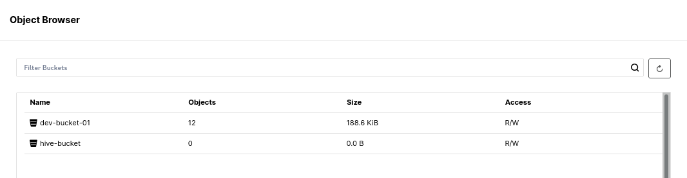

# Analytic Workloads

Watsonx.data is based on open source PrestoDB, a distributed query engine that enables querying data stored in open file formats using open table formats for optimization and performance. Some of the characteristics which you will learn and see in action include:

   * Compute processing is performed in memory and in parallel.
   * Data is pipelined between query stages and over the network reducing latency overhead that one would have if disk I/O were involved.

## Executing and analyzing analytic workloads
Let us start with some simple examples of running queries and analyze the execution. We can either use the dBeaver interface or the watsonx.data CLI. We will eventually be able to use the watsonx.data console UI as well but for the moment it is under construction.

### Connect to watsonx.data

Make sure you are the root user and change to the development directory.
```
cd /root/ibm-lh-dev/bin
```

Open the Presto CLI.

**Note**: The `workshop` schema was created as part of the introduction to Minio. If you have not run that lab, the schema will not be available. Please see the [Introduction to Minio](wxd-minio.md#creating-schemas-and-tables) section.
```
./presto-cli --catalog iceberg_data --schema workshop
```

Run a simple scan query which selects customer names and market segment.
```
select 
   name, mktsegment 
from 
   customer 
limit 3;
```
<pre style="font-size: small; color: darkgreen; overflow: auto">
        name        | mktsegment 
--------------------+------------
 Customer#000000376 | AUTOMOBILE 
 Customer#000000377 | MACHINERY  
 Customer#000000378 | BUILDING   
(3 rows)
</pre>
To understand the query execution plan we use the explain statement.
```
explain select name, mktsegment from customer;
```
<pre style="font-size: small; color: darkgreen; overflow: auto">
- Output[name, mktsegment] => [name:varchar, mktsegment:varchar]
        Estimates: {rows: 1500 (15.85kB), cpu: 16230.00, memory: 0.00, network: 16230.00}
    - RemoteStreamingExchange[GATHER] => [name:varchar, mktsegment:varchar]
            Estimates: {rows: 1500 (15.85kB), cpu: 16230.00, memory: 0.00, network: 16230.00}
        - TableScan[TableHandle {connectorId='iceberg_data', connectorHandle='workshop.customer$data@Optional[7053670466726060568]', layout='Optional[workshop.customer$data@Optional[7053670466726060568]]'}] => [name:varchar, mktsegment:varchar]
                Estimates: {rows: 1500 (15.85kB), cpu: 16230.00, memory: 0.00, network: 0.00}
                mktsegment := 7:mktsegment:varchar (1:38)
                name := 2:name:varchar (1:38)
</pre>
What you see above is the hierarchy of logical operations to execute the query.

Explain the query and focus on IO operations.
```
explain (type io) select name, mktsegment from customer;
```
<pre style="font-size: small; color: darkgreen; overflow: auto">
{
  "inputTableColumnInfos" : [ {
    "table" : {
      "catalog" : "iceberg_data",
      "schemaTable" : {
        "schema" : "workshop",
        "table" : "customer"
      }
    },
    "columnConstraints" : [ ]
  } ]
}
</pre>

Explain physical execution plan for the query.
```
explain (type distributed) select name, mktsegment from customer;
```
<pre style="font-size: small; color: darkgreen; overflow: auto">
Fragment 0 [SINGLE]
    Output layout: [name, mktsegment]
    Output partitioning: SINGLE []
    Stage Execution Strategy: UNGROUPED_EXECUTION
    - Output[name, mktsegment] => [name:varchar, mktsegment:varchar]
            Estimates: {rows: 1500 (15.85kB), cpu: 16230.00, memory: 0.00, network: 16230.00}
        - RemoteSource[1] => [name:varchar, mktsegment:varchar]

Fragment 1 [SOURCE]
    Output layout: [name, mktsegment]
    Output partitioning: SINGLE []
    Stage Execution Strategy: UNGROUPED_EXECUTION
    - TableScan[TableHandle {connectorId='iceberg_data', connectorHandle='workshop.customer$data@Optional[7053670466726060568]', layout='Optional[workshop.customer$data@Optional[7053670466726060568]]'}, grouped = false] => [name:varchar, mktsegment:varchar]
            Estimates: {rows: 1500 (15.85kB), cpu: 16230.00, memory: 0.00, network: 0.00}
            mktsegment := 7:mktsegment:varchar (1:57)
            name := 2:name:varchar (1:57)
</pre>
A fragment represents a stage of the distributed plan. The Presto scheduler schedules the execution by each stage, and stages can be run on separate instances.

Create explain statement in a visual format.
```
explain (format graphviz) select name, mktsegment from customer;
```
<pre style="font-size: small; color: darkgreen; overflow: auto">
digraph logical_plan {
subgraph cluster_0 {
label = "SINGLE"
plannode_1[label="{Output[name, mktsegment]|Estimates: \{rows: ? (?), cpu: ?, memory: ?, network: ?\}
}", style="rounded, filled", shape=record, fillcolor=white];
plannode_2[label="{ExchangeNode[GATHER]|name, mktsegment|Estimates: \{rows: ? (?), cpu: ?, memory: ?, network: ?\}
}", style="rounded, filled", shape=record, fillcolor=gold];
plannode_3[label="{TableScan | [TableHandle \{connectorId='iceberg_data', connectorHandle='workshop.customer$data@Optional[7053670466726060568]', layout='Optional[workshop.customer$data@Optional[7053670466726060568]]'\}]|Estimates: \{rows: ? (?), cpu: ?, memory: ?, network: ?\}
}", style="rounded, filled", shape=record, fillcolor=deepskyblue];
}
plannode_1 -> plannode_2;
plannode_2 -> plannode_3;
}
</pre>
We are going to format the output from the explain statement and display it as a graphic. 
Quit Presto.
```
quit;
```
Place the explain SQL into a file that will be run as a script by Presto.
```
cat <<EOF >/root/ibm-lh-dev/localstorage/volumes/infra/explain.sql
explain (format graphviz) select name, mktsegment from customer;
EOF
```
Run Presto by pointing to the file with the SQL in it.
```
./presto-cli --catalog iceberg_data --schema workshop --file /mnt/infra/explain.sql > /tmp/plan.dot
```
We need to get rid of headers and stuff that Presto generated when creating the output (there is no way to turn that off).
```
cat /tmp/plan.dot | sed 's/""/"/g' | sed -z 's/"//' | sed '$s/"//' > /tmp/fixedplan.dot 
```
Generate the PNG file from the explain statement.
```
dot -Tpng /tmp/fixedplan.dot > /tmp/plan.png
```

Open a separate terminal window and issue the following command (using the SSH port number and server name supplied in your reservation).

#### Mac OSX user

```bash
scp -port watsonx@region.techzone-server.com:/tmp/plan.png plan.png && open plan.png
```

#### Windows user

```bash
scp -port watsonx@region.techzone-server.com:/tmp/plan.png plan.png & start "" "plan.png"
```

#### Linux user (watsonx.data server)

```bash
eog /tmp/plan.png
```


### Creating a Table with User-defined Partitions
Connect to Presto with the Workshop Schema.
```
./presto-cli --catalog iceberg_data --schema workshop
```
Create a partitioned table, based on column mktsegment and copy data from TPCH.TINY.CUSTOMER table.
```
create table iceberg_data.workshop.part_customer 
  with (partitioning = array['mktsegment']) 
  as select * from tpch.tiny.customer;
```
Quit Presto.
```
quit;
```

### Inspect object store directory/object/file structure
Open your browser and connect to the MinIO console.

If you forget the userid and password, use the following command to extract them or use the <code style="color:blue;font-size:medium;">passwords</code> command.
```
export LH_S3_ACCESS_KEY=$(docker exec ibm-lh-presto printenv | grep LH_S3_ACCESS_KEY | sed 's/.*=//')
export LH_S3_SECRET_KEY=$(docker exec ibm-lh-presto printenv | grep LH_S3_SECRET_KEY | sed 's/.*=//')
echo "MinIO Userid  : " $LH_S3_ACCESS_KEY
echo "MinIO Password: " $LH_S3_SECRET_KEY
```
Click on the Object browser tab to show the current buckets in the MinIO system.


  
Select iceberg-bucket. You will see two tables, customer and part_customer.


 
Select part_customer.


 
Then select data.


 
Examining the part_customer, you will notice is the data is split into multiple parquet files stored across multiple directories - a single directory for each unique value of the partition key.

### Predicate query to utilize partitions
Connect to Presto with the Workshop Schema.
```
./presto-cli --catalog iceberg_data --schema workshop
```
Now that have created a partitioned table, we will execute a SQL statement that will make use of this fact.
```
select
   * 
from 
   iceberg_data."workshop".part_customer 
where 
   mktsegment='MACHINERY';
```
<pre style="font-size: small; color: darkgreen; overflow: auto">
 custkey |        name        |                 address                  | nationkey |      phone      | acctbal | mktsegment |                                                       comment                                                        
---------+--------------------+------------------------------------------+-----------+-----------------+---------+------------+----------------------------------------------------------------------------------------------------------------------
    1131 | Customer#000001131 | KVAvB1lwuN qHWDDPNckenmRGULDFduxYRSBXv   |        20 | 30-644-540-9044 |  6019.1 | MACHINERY  | er the carefully dogged courts m                                                                                     
    1133 | Customer#000001133 | FfA0o cMP02Ylzxtmbq8DCOq                 |        14 | 24-858-762-2348 | 5335.36 | MACHINERY  | g to the pending, ironic pinto beans. furiously blithe packages are fina                                             
    1141 | Customer#000001141 | A6uzuXpgRPp19ek8K8zd5O                   |        22 | 32-330-618-9020 |    0.97 | MACHINERY  |  accounts. furiously pending deposits cajole. c                                                                      
    1149 | Customer#000001149 | 5JOAwCy8MD70TUZJDyxgEBMe                 |         3 | 13-254-242-3889 | 6287.79 | MACHINERY  | ress requests haggle carefully across the fluffily regula                                                            
    1150 | Customer#000001150 | fUJqzdkQg1                               |        21 | 31-236-665-8430 | -117.31 | MACHINERY  | usly final dolphins. fluffily bold platelets sleep. slyly unusual attainments lo                                     
    1155 | Customer#000001155 | kEDBn1IQWyHyYjgGGs6FiXfm3                |         8 | 18-864-953-3058 | 3510.25 | MACHINERY  | ages? fluffily even accounts shall have to boost furiously alongside of the furiously pendin                         
    1158 | Customer#000001158 | btAl2dQdvNV9cEzTwVRloTb08sLYKDopV2cK,p   |        10 | 20-487-747-8857 | 3081.79 | MACHINERY  |  theodolites use stealthy asymptotes. frets integrate even instructions. car                                         
    1161 | Customer#000001161 |  QD7s2P6QpCC6g9t2aVzKg7y                 |        19 | 29-213-663-3342 |  591.31 | MACHINERY  | ly alongside of the quickly blithe ideas. quickly ironic accounts haggle regul                                       
    1165 | Customer#000001165 | h7KTXGSqsn0                              |         9 | 19-766-409-6769 | 8177.33 | MACHINERY  | jole slyly beside the quickly final accounts. silent, even requests are stealthily ironic, re                        
    1166 | Customer#000001166 | W4FAGNPKcJFebzldtNp8SehhH3               |        17 | 27-869-223-7506 |  507.26 | MACHINERY  |  before the platelets! carefully bold ideas lose carefully                                                           
    1169 | Customer#000001169 | 04YQNIYyRRFxUnJsTP36da                   |         4 | 14-975-169-9356 |  7503.3 | MACHINERY  | into beans doubt about the slyly ironic multipliers. carefully regular requests breach theodolites. special packages 
    1188 | Customer#000001188 | PtwoF3jNQ9r6 GbPIelt GvbNBuDH            |        15 | 25-108-989-8154 | 3698.86 | MACHINERY  | ts. quickly unusual ideas affix aft                                                                                  
    1190 | Customer#000001190 | JwzW9OtxFRXDnVo5hXl8 2A5VxH12            |        15 | 25-538-604-9042 | 2743.63 | MACHINERY  |  regular deposits according to the pending packages wake blithely among the silent inst                              
    1203 | Customer#000001203 | 9pTq4gggfKoSqQetn0yJR                    |        16 | 26-370-660-6154 | 5787.69 | MACHINERY  | osits nag furiously final accounts. silent pack                                
... Many more rows
</pre>

Due to the partitioning of this table by `mktsegment`, it will completely skip scanning a large percentage of the objects in the object store.

We run an explain against this query using the following command.
```
explain (format graphviz) 
   select * from iceberg_data."workshop".customer
      where mktsegment='MACHINERY';
```
<pre style="font-size: small; color: darkgreen; overflow: auto">
Query Plan                                                                                                                                                    
-----------------------------------------------------------------------------------------------------------------------------------------------------------------------------------------------------------------------------------------------------------------------------------------------------------------
 digraph logical_plan {                                                                                                                                                                                                                                                                                          
 subgraph cluster_0 {                                                                                                                                                                                                                                                                                            
 label = "SINGLE"                                                                                                                                                                                                                                                                                                
 plannode_1[label="{Output[custkey, name, address, nationkey, phone, acctbal, mktsegment, comment]|Estimates: \{rows: 750 (56.84kB), cpu: 232830.00, memory: 0.00, network: 58207.50\}                                                                                                                           
 }", style="rounded, filled", shape=record, fillcolor=white];                                                                                                                                                                                                                                                    
 plannode_2[label="{ExchangeNode[GATHER]|custkey, name, address, nationkey, phone, acctbal, mktsegment, comment|Estimates: \{rows: 750 (56.84kB), cpu: 232830.00, memory: 0.00, network: 58207.50\}                                                                                                              
 }", style="rounded, filled", shape=record, fillcolor=gold];                                                                                                                                                                                                                                                     
 plannode_3[label="{Filter|(mktsegment) = (VARCHAR'MACHINERY')|Estimates: \{rows: 750 (56.84kB), cpu: 232830.00, memory: 0.00, network: 0.00\}                                                                                                                                                                   
 }", style="rounded, filled", shape=record, fillcolor=yellow];                                                                                                                                                                                                                                                   
 plannode_4[label="{TableScan | [TableHandle \{connectorId='iceberg_data', connectorHandle='workshop.customer$data@Optional[7230522396120575591]', layout='Optional[workshop.customer$data@Optional[7230522396120575591]]'\}]|Estimates: \{rows: 1500 (113.69kB), cpu: 116415.00, memory: 0.00, network: 0.00\} 
 }", style="rounded, filled", shape=record, fillcolor=deepskyblue];                                                                                                                                                                                                                                              
 }                                                                                                                                                                                                                                                                                                               
 plannode_1 -> plannode_2;                                                                                                                                                                                                                                                                                       
 plannode_2 -> plannode_3;                                                                                                                                                                                                                                                                                       
 plannode_3 -> plannode_4;                                                                                                                                                                                                                                                                                       
 }     
</pre>
To visualize this, we are going to run this command and place the results into a temporary file. Exit Presto.
```
quit;
```
Place the explain SQL into the following file.
```
cat <<EOF >/root/ibm-lh-dev/localstorage/volumes/infra/explain.sql
explain (format graphviz) select * from iceberg_data."workshop".customer where mktsegment='MACHINERY';
EOF
```
Run the Presto command to generate the explain output.
```
./presto-cli --catalog iceberg_data --schema workshop --file /mnt/infra/explain.sql > /tmp/plan.dot
```
Remove Headers.
```
cat /tmp/plan.dot | sed 's/""/"/g' | sed -z 's/"//' | sed '$s/"//' > /tmp/fixedplan.dot
```
Generate the PNG file from the explain statement.
```
dot -Tpng /tmp/fixedplan.dot > /tmp/plan.png
```

Open a separate terminal window and issue the following command (using the SSH port number and server name supplied in your reservation).

#### Mac OSX user

```bash
scp -port watsonx@region.techzone-server.com:/tmp/plan.png plan.png && open plan.png
```

#### Windows user

```bash
scp -port watsonx@region.techzone-server.com:/tmp/plan.png plan.png & start "" "plan.png"
```

#### Linux user (watsonx.data server)

```bash
eog /tmp/plan.png
```


 
## Joins and Aggregations 

This section will create an orders table to test joins and aggregations.

Start Presto CLI with Workshop Schema.
```
./presto-cli --catalog iceberg_data --schema workshop
```

Create the Orders Table.
```
create table iceberg_data.workshop.orders as 
  select * from tpch.tiny.orders;
```
<pre style="font-size: small; color: darkgreen; overflow: scroll">
CREATE TABLE: 15000 rows
</pre>

Use a Windowing function.
```
SELECT 
   orderkey, clerk, totalprice, 
   rank() OVER (PARTITION BY clerk ORDER BY totalprice DESC) AS rnk 
FROM 
   orders 
ORDER BY 
   clerk, rnk;
```

Try to write a window function to show the custkey, orderdate, totalprice and priororder. The output should look like this.
<pre style="font-size: small; color: darkgreen; overflow: auto">
custkey | orderdate  | totalprice | priororder 
---------+------------+------------+------------
       1 | 1993-06-05 |  152411.41 | NULL       
       1 | 1993-08-13 |   83095.85 |  152411.41 
       1 | 1994-05-08 |   51134.82 |   83095.85 
       1 | 1995-10-29 |  165928.33 |   51134.82 
       1 | 1997-01-29 |  231040.44 |  165928.33 
       1 | 1997-03-04 |  270087.44 |  231040.44 
       1 | 1997-06-23 |  357345.46 |  270087.44 
       1 | 1997-11-18 |   28599.83 |  357345.46 
       1 | 1998-03-29 |   89230.03 |   28599.83 
       2 | 1993-02-19 |  170842.93 |   89230.03 
       2 | 1993-05-03 |  154867.09 |  170842.93 
       2 | 1993-09-30 |   143707.7 |  154867.09 
       2 | 1994-08-15 |  116247.57 |   143707.7 
       2 | 1994-12-29 |   45657.87 |  116247.57 
       2 | 1996-03-04 |   181875.6 |   45657.87 
</pre>

## Prepared statements

Save a query as a prepared statement.
```
prepare 
   customer_by_segment
from 
   select * from customer where mktsegment=?;
```
Execute prepared statement using parameters.
```
execute customer_by_segment using 'FURNITURE';
```
**Note**: This is only valid for the active session.
Quit Presto.
```
quit;
```