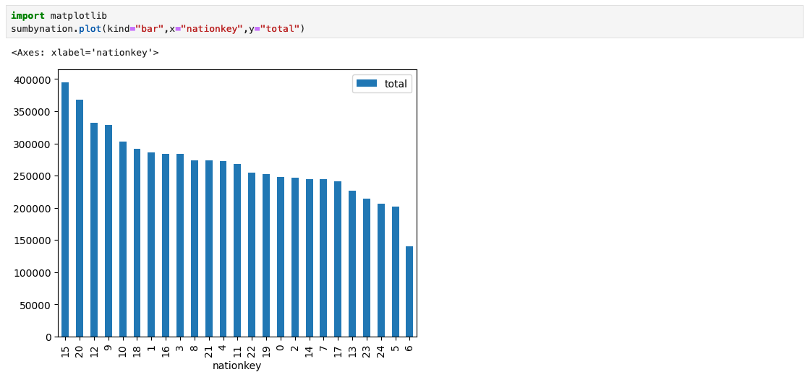

# Database Connections

There are three database systems that can be accessed inside and outside the virtual machine environment: watsonx.data Presto, Db2 LUW, MySQL and PostgreSQL.

In order to access these images outside the Virtual machine image, you need the server name and port for the service. You will also need to download the `presto-key.jks` file for connecting to Presto.

   * [Connection Certificate](#watsonxdata-connection-certificate)
   * [Accessing watsonx.data (Presto)](#watsonxdata-presto-access)
   * [Accessing Db2](#db2-access)
   * [Accessing PostgreSQL](#postgresql-access)
   * [Accessing MySQL](#mysql-access)
   * [Adding a database to watsonx.data](#adding-a-database-to-watsonxdata)
   * [Accessing watsonx.data via Python](#accessing-watsonxdata-via-python)
   * [Accessing watsonx.data via Pandas Dataframes](#accessing-watsonxdata-via-pandas-dataframes)
   * [Generating a Certificate](#generating-a-certificate)
   * [Adding a Service](#adding-a-service)

## Watsonx.data Connection Certificate

When connecting to the watsonx.data Presto database, you will need to have the connection certificate available to the client that you are using. Usually this location is your workstation, but it could be another service like CP4D.

To extract the certificate to your local file system, use the following command in a terminal window. Replace the `port` and `regions.techzone-server.com` with the SSH values found in the TechZone reservation.

```
scp -P port watsonx@region.techzone-server.com:/certs/presto-key.jks /Users/myname/Downloads
```

Change the target directory to a location that you can remember! 

You can also download the certificate by using the Jupyter Notebook link and opening the Credentials notebook. There you will find links to the certificates.


## Watsonx.data Presto Access

When connecting to the Presto engine, choose the PrestoDB driver.

### Presto Internal Access

For local access the following credentials are used:

   * Hostname: <code style="color:blue;font-size:medium;">localhost</code>
   * Port: <code style="color:blue;font-size:medium;">8443</code>
   * Username: <code style="color:blue;font-size:medium;">ibmlhadmin</code>
   * Password: <code style="color:blue;font-size:medium;">password</code>
   * Database: <code style="color:blue;font-size:medium;">tpch</code>

In addition, you need to set the following driver properties:

   * <code style="color:blue;font-size:medium;">SSL</code> <code style="color:blue;font-size:medium;">True</code>
   * <code style="color:blue;font-size:medium;">SSLTrustStorePath</code> <code style="color:blue;font-size:medium;">/certs/presto-key.jks</code>
   * <code style="color:blue;font-size:medium;">SSLTrustStorePassword</code> <code style="color:blue;font-size:medium;">watsonx.data</code>

### Presto External Access

The watsonx.data Presto database requires that the certificate be extracted from the image. See the section above on [Connection Certificate](#watsonxdata-connection-certificate) for more details.

In the following settings, remember to update the Hostname and Port to the values provided in your TechZone reservation.

The database connection settings are:

   * Hostname: <code style="color:blue;font-size:medium;">region.techzone-server.com</code>
   * Port: <code style="color:blue;font-size:medium;">port</code>
   * Username: <code style="color:blue;font-size:medium;">ibmlhadmin</code>
   * Password: <code style="color:blue;font-size:medium;">password</code>
   * Database: <code style="color:blue;font-size:medium;">tpch</code>

In addition, you need to set the following driver properties:

   * <code style="color:blue;font-size:medium;">SSL</code> <code style="color:blue;font-size:medium;">True</code>
   * <code style="color:blue;font-size:medium;">SSLTrustStorePath</code> <code style="color:blue;font-size:medium;">/mydownload/presto-key.jks</code>
   * <code style="color:blue;font-size:medium;">SSLTrustStorePassword</code> <code style="color:blue;font-size:medium;">watsonx.data</code>

**Note**: The `/mydownload/presto-key.jks` value needs to be replaced with the location that you copied the key in the earlier step.

## Db2 Access

When connecting to the Db2 engine, select the Db2 LUW driver.

### Db2 Internal Access

The Db2 server can be accessed on port 50000 inside the virtual machine using the following credentials:

   * Hostname - <code style="color:blue;font-size:medium;">watsonxdata</code>
   * Port - <code style="color:blue;font-size:medium;">50000</code>
   * Username - <code style="color:blue;font-size:medium;">db2inst1</code>
   * Password - <code style="color:blue;font-size:medium;">db2inst1</code>
   * Database - <code style="color:blue;font-size:medium;">gosales</code>
   * SSL - <code style="color:blue;font-size:medium;">off</code>

### Db2 External Access

When accessing the database outside the virtual machine, you must change the host to `region.techzone-server.com` and the port number based on your TechZone reservation. All the other settings remain the same.

   * Hostname - <code style="color:blue;font-size:medium;">region.techzone-server.com</code>
   * Port - <code style="color:blue;font-size:medium;">port</code>
   * Username - <code style="color:blue;font-size:medium;">db2inst1</code>
   * Password - <code style="color:blue;font-size:medium;">db2inst1</code>
   * Database - <code style="color:blue;font-size:medium;">gosales</code>
   * SSL - <code style="color:blue;font-size:medium;">off</code>

## PostgreSQL Access

When connecting to the PostgreSQL engine, select the PostgreSQL driver. In order to connect to the PostgreSQL system, you will need to extract the admin password using the following command when connected to the watsonx.data system.

```
cat /certs/passwords
```

You can also retrieve the credentials by opening up the Credentials notebook in the Jupyter notebook service.

### PostgreSQL Internal Access

When accessing the PostgreSQL database in the system, use the following settings.

   * Hostname –<code style="color:blue;font-size:medium;">ibm-lh-postgres</code>
   * Port – <code style="color:blue;font-size:medium;">5432</code>
   * Username – <code style="color:blue;font-size:medium;">admin</code>
   * Password – The value that was extracted in the earlier step
   * Database – <code style="color:blue;font-size:medium;">gosales</code>   

### PostgreSQL External Access

The following credentials are used for remote access.

   * Hostname: <code style="color:blue;font-size:medium;">regions.techzone-server.com</code>
   * Port: <code style="color:blue;font-size:medium;">port</code>
   * Username: <code style="color:blue;font-size:medium;">admin</code>
   * Password: The value that was extracted in the earlier step
   * Database name: <code style="color:blue;font-size:medium;">gosales</code>

## MySQL Access

When connecting to the MySQL engine, select the MySQL driver. 

```
export POSTGRES_PASSWORD=$(docker exec ibm-lh-postgres printenv | grep POSTGRES_PASSWORD | sed 's/.*=//')
echo "Postgres Userid   : admin"
echo "Postgres Password : " $POSTGRES_PASSWORD
echo $POSTGRES_PASSWORD > /tmp/postgres.pw
```

### MySQL Internal Access

When accessing the MySQL database in the system, use the following settings.

   * Hostname –<code style="color:blue;font-size:medium;">watsonxdata</code>
   * Port – <code style="color:blue;font-size:medium;">3306</code>
   * Username – <code style="color:blue;font-size:medium;">root</code>
   * Password - <code style="color:blue;font-size:medium;">password</code>
   * Database – <code style="color:blue;font-size:medium;">gosalesdw</code>   

You must set the `allowPublicKeyRetrieval` to `True` for the connection to work with dBeaver.


### MySQL External Access

The following credentials are used for remote access.

   * Hostname: <code style="color:blue;font-size:medium;">regions.techzone-server.com</code>
   * Port: <code style="color:blue;font-size:medium;">port</code>
   * Username: <code style="color:blue;font-size:medium;">root</code>
   * Password - <code style="color:blue;font-size:medium;">password</code>
   * Database name: <code style="color:blue;font-size:medium;">gosalesdw</code>   

You must set the `allowPublicKeyRetrieval` to `True` for the connection to work with dBeaver (see above).   

## Adding a Database to watsonx.data

When adding a database engine to the watsonx.data system, make sure to change the database display name since that needs to be unique. For instance, when you add `gosales` database from Db2 to the system, the display name could be `gosales` as well. However, if you now add the PostgreSQL database to the system, the display name cannot be the same. You may want to differentiate databases with the same name by prefixing them with the database type. For instance, the `gosales` database could be shown as `db2_gosales` or `pg_gosales` so that you keep the names distinct.

Once a database has been added, make sure to wait for a few moments before attempting to access the database. The Presto server takes a few moments to start up. To make sure that it is running, run the `check_presto` command in a terminal window and wait until it says the service is ready.

When attempting to view the contents of a new database, the process may take a few minutes to complete. Refresh the browser window if you haven't seen any changes to the display.

## Accessing watsonx.data via Python

In order to access the watsonx.data database (Presto), you will need to install the Presto client using the following command on your local machine.

```
pip3 install presto-python-client
```

Once the installation is complete, extract the certificate from the watsonx.data server that we will use in the connection.

```
scp -P port watsonx@region.techzone-server.com:/certs/presto-key.jks /Users/myname/Downloads
```

Change the target directory to a location that you can remember! 

You can also download the certificate by using the Jupyter Notebook link and opening the Certificate notebook. 

## Python and Jupyter Connection Code

Your Python or Jupyter notebook code will need to import the `prestodb` library and then connect to watsonx.data using the `connect` call.

```
import prestodb

conn = prestodb.dbapi.connect(
       host='watsonxdata',
       port=8443,
       user='ibmlhadmin',
       catalog='tpch',
       schema='tiny',
       http_scheme='https',
       auth=prestodb.auth.BasicAuthentication("ibmlhadmin", "password")
)
conn._http_session.verify = '/certs/lh-ssl-ts.crt'
cur = conn.cursor()
```

In the above connection string, you will need to replace the following values:

   * host - `watsonxdata` when connecting to the image externally, and `ibm-lh-presto-svc` when connecting internally 
   * catalog - What is the name of the catalog that we are accessing
   * schema - The schema inside the catalog that will be used

   
You also need to update the `conn._http_session.verify` value with the location where you downloaded the `lh-ssl-ts.crt` file. For internal connections, this value will be `/certs/lh-ssl-ts.crt`.

Once connected, you can run an SQL statement and return the results.

```
cur.execute("SELECT * FROM tpch.tiny.customer")
rows = cur.fetchall()
```

The `rows` variable contains the answer set from the select statement. You can manipulate the `row` variable to view the results. 

<pre style="font-size: small; color: darkgreen; overflow: auto">
rows[0]

[1,
 'Customer#000000001',
 'IVhzIApeRb ot,c,E',
 15,
 '25-989-741-2988',
 711.56,
 'BUILDING',
 'to the even, regular platelets. regular, ironic epitaphs nag e']
</pre>

The PrestoDB driver supports the DBAPI spec. For more details on the use of the DBAPI interface, please refer to <a href="https://peps.python.org/pep-0249/" target="_blank">https://peps.python.org/pep-0249/</a>.

For instance, if you want to find the description of the columns returned, you would use the `description` function.

<pre style="font-size: small; color: darkgreen; overflow: auto">
cur.description

[('custkey', 'bigint', None, None, None, None, None),
 ('name', 'varchar(25)', None, None, None, None, None),
 ('address', 'varchar(40)', None, None, None, None, None),
 ('nationkey', 'bigint', None, None, None, None, None),
 ('phone', 'varchar(15)', None, None, None, None, None),
 ('acctbal', 'double', None, None, None, None, None),
 ('mktsegment', 'varchar(10)', None, None, None, None, None),
 ('comment', 'varchar(117)', None, None, None, None, None)]
</pre>

## Accessing watsonx.data via Pandas Dataframes

The following code is required for accessing watsonx.data in Jupyter notebooks.  Run the following code inside a notebook code cell.

```
%pip install ipython-sql==0.4.1
%pip install sqlalchemy==1.4.46
%pip install sqlalchemy==1.4.46 "pyhive[presto]"
```

The notebook may need a restart of the kernel to pick up the changes to the driver.

If you are running in a Jupyter Lab environment, you can use the most current versions of the drivers.

```
%pip install ipython-sql
%pip install sqlalchemy
%pip install sqlalchemy "pyhive[presto]"
```

Once the drivers have been loaded, you will need to extract the certificate from the watsonx.data server that we will use in the connection.

```
scp -P port watsonx@region.techzone-server.com:/certs/presto-key.jks /Users/myname/Downloads
```

Change the target directory to a location that you can remember! 

You can also download the certificate by using the Jupyter Notebook link and opening the Certificate notebook. 

In your Jupyter notebook, you will need to import a number of libraries.

```
import pandas as pd
import sqlalchemy
from sqlalchemy import create_engine
```

Create a notebook cell which will contain all the credentials that are required to connect. Change the `catalog`, `schema` and `certfile` to your values.
```
userid    = "ibmlhadmin"
password  = "password"
hostname  = "watsonxdata"
port      = "8443"
catalog   = "tpch"
schema    = "tiny"
certfile  = "/certs/lh-ssl-ts.crt"
connect_args={
        'protocol': 'https', 
        'requests_kwargs': {'verify': f'{certfile}'}
        }
```

In the above settings, you will need to replace the following values:

   * hostname - `region.techzone-server.com` when connecting to the image externally, and  `ibm-lh-presto-svc` when connecting internally 
   * catalog - What is the name of the catalog that we are accessing
   * schema - The schema inside the catalog that will be used

You also need to update the `certfile` value with the location where you downloaded the `lh-ssl-ts.crt` file. For internal connections, this value will be `/certs/lh-ssl-ts.crt`.   

To create a connection to the database, use the following syntax.
```
engine = create_engine(
   f"presto://{userid}:{password}@{hostname}:{port}/{catalog}/{schema}",
   connect_args=connect_args
   )
```

Now that you have established a connection, you can use the Pandas `read_sql_query` function to execute a SELECT statement against the database.

```
mypresto = pd.read_sql_query('SELECT * from tpch.tiny.customer',engine)
```

The variable `mypresto` contains the dataframe generated from the SELECT statement.

```
mypresto
```


You can use the features of Pandas to generate plots of the data in your notebook. First make sure you have `matplotlib` installed.

```
%pip install matplotlib
```

The following query will compute the total account balance across all nation key values.

```
sumbynation = pd.read_sql_query('SELECT "nationkey", sum("acctbal") from tpch.tiny.customer group by "nationkey" order by 2',engine)
```

Finally, we plot the results.

```
df.plot(kind="bar", x="FirstName", y="LastName")
plt.show()
```



## Adding a Service

The watsonx.data developer edition includes two open ports which can be used to externalize a service that you create in the image. For instance, you may choose to create a MongoDB or MSSQL container using Docker and want to access this service from your own dBeaver or Mongo tooling.

Since port numbers vary between different databases, the watsonx.data system provides two port numbers that can be used by your service.

* Open Port 1 - Server: region.techzone-services.com: Port: 12345
* Open Port 2 - Server: region.techzone-services.com: Port: 23456

The internal port numbers are 10000 (Port 1) and 10001 (Port 2). The following steps are required to use these ports with your service.

### Open the local Firewall (Version 1.1.0 Only)

Ports 10000/1 are not open by default in the 1.1.0 image. For release 1.1.1, you can skip this step.

You must explicitly open ports 10000/1 with the `firewall-cmd` command. In a command line shell, as the root user, enter the following commands:
```
sudo su -
firewall-cmd --add-port={10000/tcp,10001/tcp} --zone=public --permanent
firewall-cmd --reload
```

You can use the following command to check that the ports are now open.
```
firewall-cmd --list-ports
```

### Create your Service

When creating your service, make sure to map the internal Docker port to either port 10000 or 10001. If you cannot remap the port, see the section on port redirection.

For instance, the following command will start Microsoft SQLServer in Docker by mapping the host port 10000 to the SQLServer port of 1433 to 10000 (`-p 10000:1443`).  

```
docker run -e "ACCEPT_EULA=Y" -e "MSSQL_SA_PASSWORD=Passw0rd12345678!" \
-p 10000:1433 --name mssql-server --hostname mssql-server \
-d mcr.microsoft.com/mssql/server:2019-latest
```

You can check the port mapping with the following command.
```
docker container ls --format "table {{.ID}}\t{{.Names}}\t{{.Ports}}" -a | grep mssql-server
```

When creating a connection to this database using an external tool, make sure to use the port number supplied in the reservation details (Open Port 1 is for port 10000 and Open Port 2 is for port 10001).

### Port Redirection

If you already have an existing service mapped to a different port, you can use port redirection to use either port 10000 or 10001. For instance, assume that the previous creation of the SQLServer database used port 1433.

```
docker run -e "ACCEPT_EULA=Y" -e "MSSQL_SA_PASSWORD=Passw0rd12345678!" \
-p 1433:1433 --name mssql-server --hostname mssql-server \
-d mcr.microsoft.com/mssql/server:2019-latest
```

Once the service is up and running, you can redirect the traffic on port 10000/1 to the port of your docker service.

``````
firewall-cmd --add-forward-port=port=10000:proto=tcp:toport=1433 --permanent --zone=public
firewall-cmd --reload
``````

If you need to remove the redirection, use the following command.
``````
firewall-cmd --remove-forward-port=port=10000:proto=tcp:toport=1433:toaddr= --permanent --zone=public
firewall-cmd --reload
``````

### Accessing your Service

When referring to your service from an external location, always use the port numbers that are provided for Open Port 1 or 2. 

* Open Port 1 - Server: region.techzone-services.com: Port: 12345
* Open Port 2 - Server: region.techzone-services.com: Port: 23456

Your server will be `region.techzone-services.com` and the port number will be either of the two port numbers provided. Remember that this port number will need to be opened in the server and a Docker mapping to the open port or a firewall port redirection will be required.