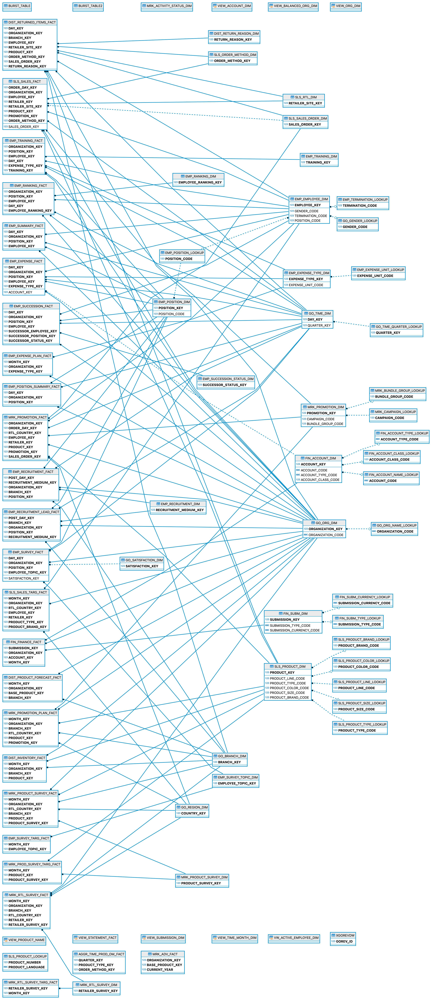

# Great Outdoors Company

The Sample Outdoors Company, or GO Sales, or any variation of the Sample Outdoors name, is the name of a fictitious business operation whose sample data is used to develop sample applications for IBM® and IBM customers. Its fictitious records include sample data for sales transactions, product distribution, finance, and human resources. Any resemblance to actual names, addresses, contact numbers, or transaction values, is coincidental. 

Two links that provide more details on the database.

* <a href="https://www.ibm.com/docs/en/cognos-analytics/11.1.0?topic=packages-sample-outdoors-company" target="_blank">Great Outdoors Company</a>
* <a href="https://www.ibm.com/docs/en/data-studio/4.1.1?topic=database-gsdb-reference" target="_blank">Great Outdoors Database Reference</a>

The second link will say that there is no content available, but if you click on the down arrow you will see the table names.

## Disclaimer

The Sample Outdoors Company, or GO Sales, or any variation of the Sample Outdoors name, is the name of a fictitious business operation whose sample data is used to develop sample applications for IBM® and IBM customers. Its fictitious records include sample data for sales transactions, product distribution, finance, and human resources. Any resemblance to actual names, addresses, contact numbers, or transaction values, is coincidental. Unauthorized duplication is prohibited.

## Table Definitions

These tables are created under the GOSALESDW schema. Thanks to Michael Schapira for generating the following ER diagram. You may need to download the image to zoom in on the relationships.

#### DIST_INVENTORY_FACT
|Column|Type
|------|------|
MONTH_KEY | INTEGER 
ORGANIZATION_KEY | INTEGER 
BRANCH_KEY | INTEGER 
PRODUCT_KEY | INTEGER 
OPENING_INVENTORY | INTEGER 
QUANTITY_SHIPPED | INTEGER 
ADDITIONS | INTEGER 
UNIT_COST | DECIMAL
CLOSING_INVENTORY | INTEGER 
AVERAGE_UNIT_COST | DECIMAL

#### DIST_PRODUCT_FORECASE_FACT
|Column|Type
|------|------|
MONTH_KEY | INTEGER 
ORGANIZATION_KEY | INTEGER 
BASE_PRODUCT_KEY | INTEGER 
BRANCH_KEY | INTEGER 
UNIT_COST | DECIMAL
UNIT_PRICE | DECIMAL
EXPECTED_VOLUME | INTEGER 

#### DIST_RETURNED_ITEMS_FACT
|Column|Type
|------|------|
DAY_KEY | INTEGER 
ORGANIZATION_KEY | INTEGER 
BRANCH_KEY | INTEGER 
EMPLOYEE_KEY | INTEGER 
RETAILER_SITE_KEY | INTEGER 
PRODUCT_KEY | INTEGER 
ORDER_METHOD_KEY | INTEGER 
SALES_ORDER_KEY | INTEGER 
RETURN_REASON_KEY | INTEGER 
RETURN_QUANTITY | INTEGER 

#### DIST_RETURN_REASON_DIM
|Column|Type
|------|------|
RETURN_REASON_KEY | INTEGER 
RETURN_REASON_CODE | INTEGER 
REASON_DESCRIPTION_EN | VARCHAR 

#### EMP_EMPLOYEE_DIM
|Column|Type
|------|------|
EMPLOYEE_KEY | INTEGER 
MANAGER_CODE1 | INTEGER 
MANAGER1 | VARCHAR
MANAGER_MB1 | VARCHAR
MANAGER_CODE2 | INTEGER 
MANAGER2 | VARCHAR
MANAGER_MB2 | VARCHAR
MANAGER_CODE3 | INTEGER 
MANAGER3 | VARCHAR
MANAGER_MB3 | VARCHAR
MANAGER_CODE4 | INTEGER 
MANAGER4 | VARCHAR
MANAGER_MB4 | VARCHAR
MANAGER_CODE5 | INTEGER 
MANAGER5 | VARCHAR
MANAGER_MB5 | VARCHAR
MANAGER_CODE6 | INTEGER 
MANAGER6 | VARCHAR
MANAGER_MB6 | VARCHAR
EMPLOYEE_CODE | INTEGER 
EMPLOYEE_NAME | VARCHAR
FIRST_NAME | VARCHAR
LAST_NAME | VARCHAR
EMPLOYEE_NAME_MB | VARCHAR
FIRST_NAME_MB | VARCHAR
LAST_NAME_MB | VARCHAR
MANAGER_CODE | INTEGER 
ORGANIZATION_CODE | VARCHAR
ADDRESS1 | VARCHAR
ADDRESS2 | VARCHAR
ADDRESS1_MB | VARCHAR
ADDRESS2_MB | VARCHAR
CITY | VARCHAR
CITY_MB | VARCHAR
PROV_STATE | VARCHAR
PROV_STATE_MB | VARCHAR
POSTAL_ZONE | VARCHAR
BRANCH_CODE | INTEGER 
BIRTH_DATE | DATE
GENDER_CODE | SMALLINT 
WORK_PHONE | VARCHAR
EXTENSION | VARCHAR
FAX | VARCHAR
EMAIL | VARCHAR
DATE_HIRED | DATE
TERMINATION_CODE | INTEGER 
TERMINATION_DATE | DATE
POSITION_START_DATE | DATE
POSITION_CODE | INTEGER 
EMPLOYEE_LEVEL | SMALLINT 
ACTIVE_INDICATOR | SMALLINT 
RECORD_START_DATE | DATE
RECORD_END_DATE | DATE
MANAGER_KEY | INTEGER 

#### EMP_EXPENSE_FACT
|Column|Type
|------|------|
DAY_KEY | INTEGER 
ORGANIZATION_KEY | INTEGER 
POSITION_KEY | INTEGER 
EMPLOYEE_KEY | INTEGER 
EXPENSE_TYPE_KEY | INTEGER 
ACCOUNT_KEY | INTEGER 
EXPENSE_UNIT_QUANTITY | FLOAT 
EXPENSE_TOTAL | DECIMAL

#### EMP_EXPENSE_PLAN_FACT
|Column|Type
|------|------|
MONTH_KEY | INTEGER 
ORGANIZATION_KEY | INTEGER 
EXPENSE_TYPE_KEY | INTEGER 
ACCOUNT_KEY | VARCHAR
EXPENSE_PLAN_TOTAL | DECIMAL

#### EMP_EXPENSE_TYPE_DIM
|Column|Type
|------|------|
EXPENSE_TYPE_KEY | INTEGER 
EXPENSE_GROUP_CODE | INTEGER 
EXPENSE_TYPE_CODE | INTEGER 
EXPENSE_UNIT_CODE | INTEGER 
EXPENSE_GROUP_EN | VARCHAR
EXPENSE_TYPE_EN | VARCHAR

#### EMP_EXPENSE_UNIT_LOOKUP
|Column|Type
|------|------|
EXPENSE_UNIT_CODE | INTEGER 
EXPENSE_UNIT_EN | VARCHAR

#### EMP_POSITION_DIM
|Column|Type
|------|------|
POSITION_KEY | INTEGER 
POSITION_CODE1 | INTEGER 
POSITION_CODE2 | INTEGER 
POSITION_CODE3 | INTEGER 
POSITION_CODE | INTEGER 
POSITION_PARENT | INTEGER 
MIN_SALARY | DECIMAL
MAX_SALARY | DECIMAL
PAID_HOURLY | INTEGER 
POSITION_LEVEL | SMALLINT 

#### EMP_POSITION_LOOKUP
|Column|Type
|------|------|
POSITION_CODE | INTEGER 
POSITION_EN | VARCHAR

#### EMP_POSITION_SUMMARY_FACT
|Column|Type
|------|------|
DAY_KEY | INTEGER 
ORGANIZATION_KEY | INTEGER 
POSITION_KEY | INTEGER 
POSITION_COUNT | INTEGER 
PLANNED_POSITION_COUNT | INTEGER 
INTERNAL_HIRES | INTEGER 
EXTERNAL_HIRES | INTEGER 
TERMINATIONS | INTEGER 

#### EMP_RANKING_DIM
|Column|Type
|------|------|
EMPLOYEE_RANKING_KEY | INTEGER 
RANKING_CODE | INTEGER 
RANKING_DESCRIPTION_EN | VARCHAR 

#### EMP_RANKING_FACT
|Column|Type
|------|------|
ORGANIZATION_KEY | INTEGER 
POSITION_KEY | INTEGER 
EMPLOYEE_KEY | INTEGER 
DAY_KEY | INTEGER 
EMPLOYEE_RANKING_KEY | INTEGER 
RANKING_CODE | INTEGER 

#### EMP_RECRUITMENT_DIM
|Column|Type
|------|------|
RECRUITMENT_MEDIUM_KEY | INTEGER 
RECRUITMENT_MEDIUM_CODE | INTEGER 
RECRUITMENT_TYPE_CODE | INTEGER 
RECRUITMENT_MEDIUM_NAME_EN | VARCHAR
RECRUITMENT_TYPE_EN | VARCHAR

#### EMP_RECRUITMENT_FACT
|Column|Type
|------|------|
POST_DAY_KEY | INTEGER 
RECRUITMENT_MEDIUM_KEY | INTEGER 
ORGANIZATION_KEY | INTEGER 
BRANCH_KEY | INTEGER 
POSITION_KEY | INTEGER 
POSITION_POSTING_DATE | DATE
POSITION_FILLED_DATE | DATE
POSITION_START_DATE | DATE
DAYS_TO_FILL | INTEGER 

#### EMP_SUCCESSION_FACT
|Column|Type
|------|------|
DAY_KEY | INTEGER 
ORGANIZATION_KEY | INTEGER 
POSITION_KEY | INTEGER 
EMPLOYEE_KEY | INTEGER 
SUCCESSOR_EMPLOYEE_KEY | INTEGER 
SUCCESSOR_POSITION_KEY | INTEGER 
SUCCESSOR_STATUS_KEY | INTEGER 
PERCENT_READY | FLOAT 
TARGET_PERCENT_READY | FLOAT 

#### EMP_SUCCESSION_STATUS_DIM
|Column|Type
|------|------|
SUCCESSOR_STATUS_KEY | INTEGER 
SUCCESSOR_STATUS_CODE | INTEGER 
SUCCESSOR_STATUS_EN | VARCHAR

#### EMP_SUMMARY_FACT
|Column|Type
|------|------|
DAY_KEY | INTEGER 
ORGANIZATION_KEY | INTEGER 
POSITION_KEY | INTEGER 
EMPLOYEE_KEY | INTEGER 
SALARY | DECIMAL
PAY_INCREASE | FLOAT 
BONUS | FLOAT 
VACATION_DAYS_TAKEN | FLOAT 
SICK_DAYS_TAKEN | FLOAT 

#### EMP_SURVEY_FACT
|Column|Type
|------|------|
DAY_KEY | INTEGER 
ORGANIZATION_KEY | INTEGER 
POSITION_KEY | INTEGER 
EMPLOYEE_TOPIC_KEY | INTEGER 
EMPLOYEE_TOPIC_SCORE | FLOAT 
SATISFACTION_KEY | INTEGER 

#### EMP_SURVEY_TARG_FACT
|Column|Type
|------|------|
MONTH_KEY | INTEGER 
EMPLOYEE_TOPIC_KEY | INTEGER 
EMPLOYEE_TOPIC_TARGET | FLOAT 
EMPLOYEE_SURVEY_BENCHMARK | FLOAT 

#### EMP_SURVEY_TOPIC_DIM
|Column|Type
|------|------|
EMPLOYEE_TOPIC_KEY | INTEGER 
EMPLOYEE_TOPIC_CODE | INTEGER 
EMPLOYEE_TOPIC_EN | VARCHAR

#### EMP_TERMINATION_LOOKUP
|Column|Type
|------|------|
TERMINATION_CODE | INTEGER 
TERMINATION_REASON_EN | VARCHAR

#### EMP_TRAINING_DIM
|Column|Type
|------|------|
TRAINING_KEY | INTEGER 
COURSE_CODE | INTEGER 
COURSE_COST | DECIMAL
COURSE_DAYS | FLOAT 
COURSE_NAME_EN | VARCHAR

#### EMP_TRAINING_FACT
|Column|Type
|------|------|
ORGANIZATION_KEY | INTEGER 
POSITION_KEY | INTEGER 
EMPLOYEE_KEY | INTEGER 
DAY_KEY | INTEGER 
EXPENSE_TYPE_KEY | INTEGER 
TRAINING_KEY | INTEGER 
COURSE_COST | DECIMAL
COURSE_DAYS | FLOAT 

#### FIN_ACCOUNT_CLASS_LOOKUP
|Column|Type
|------|------|
ACCOUNT_CLASS_CODE | INTEGER 
ACCOUNT_CLASS_EN | VARCHAR 

#### FIN_ACCOUNT_DIM
|Column|Type
|------|------|
ACCOUNT_KEY | INTEGER 
ACCOUNT_CODE1 | VARCHAR
ACCOUNT_CODE2 | VARCHAR
ACCOUNT_CODE3 | VARCHAR
ACCOUNT_CODE4 | VARCHAR
ACCOUNT_CODE5 | VARCHAR
ACCOUNT_CODE6 | VARCHAR
ACCOUNT_CODE7 | VARCHAR
ACCOUNT_CODE8 | VARCHAR
ACCOUNT_CODE9 | VARCHAR
ACCOUNT_CODE10 | VARCHAR
ACCOUNT_CODE11 | VARCHAR
ACCOUNT_CODE12 | VARCHAR
ACCOUNT_CODE13 | VARCHAR
ACCOUNT_CODE14 | VARCHAR
ACCOUNT_CODE15 | VARCHAR
ACCOUNT_CODE16 | VARCHAR
ACCOUNT_CODE | VARCHAR
ACCOUNT_PARENT | VARCHAR
DEBIT_OR_CREDIT | CHAR(3)
ACCOUNT_TYPE_CODE | CHAR(3)
ACCOUNT_CLASS_CODE | INTEGER 
ACCOUNT_LEVEL | INTEGER 
AGGREGATION_SIGN | CHAR(3)

#### FIN_ACCOUNT_NAME_LOOKUP
|Column|Type
|------|------|
ACCOUNT_CODE | VARCHAR 
ACCOUNT_NAME_EN | VARCHAR

#### FIN_ACCOUNT_TYPE_LOOKUP
|Column|Type
|------|------|
ACCOUNT_TYPE_CODE | CHAR(3) 
ACCOUNT_TYPE_EN | VARCHAR 

#### FIN_FINANCE_FACT
|Column|Type
|------|------|
SUBMISSION_KEY | INTEGER 
ORGANIZATION_KEY | INTEGER 
ACCOUNT_KEY | INTEGER 
MONTH_KEY | INTEGER 
AMOUNT_YEAR_TO_DATE | DECIMAL
AMOUNT_MONTH | DECIMAL

#### FIN_SUBM_CURRENCY_LOOKUP
|Column|Type
|------|------|
SUBMISSION_CURRENCY_CODE | VARCHAR 
SUBMISSION_CURRENCY_EN | VARCHAR 

#### FIN_SUBM_DIM
|Column|Type
|------|------|
UBMISSION_KEY | INTEGER 
UBMISSION_CODE | VARCHAR 
UBMISSION_NAME_EN | VARCHAR 
UBMISSION_YEAR | INTEGER 
UBMISSION_TYPE_CODE | CHAR(3)
UBMISSION_CURRENCY_CODE | VARCHAR

#### FIN_SUBM_TYPE_LOOKUP
|Column|Type
|------|------|
SUBMISSION_TYPE_CODE | CHAR(3) 
SUBMISSION_TYPE_EN | VARCHAR 

#### GO_BRANCH_DIM
|Column|Type
|------|------|
BRANCH_KEY | INTEGER 
BRANCH_CODE | INTEGER 
ADDRESS1 | VARCHAR 
ADDRESS2 | VARCHAR
CITY | VARCHAR 
PROV_STATE | VARCHAR
ADDRESS1_MB | VARCHAR
ADDRESS2_MB | VARCHAR
CITY_MB | VARCHAR 
PROV_STATE_MB | VARCHAR
POSTAL_ZONE | VARCHAR 
COUNTRY_CODE | INTEGER 
WAREHOUSE_BRANCH_CODE | INTEGER 

#### GO_GENDER_LOOKUP
|Column|Type
|------|------|
GENDER_CODE | SMALLINT 
GENDER_EN | VARCHAR

#### GO_ORG_DIM
|Column|Type
|------|------|
ORGANIZATION_KEY | INTEGER 
ORGANIZATION_CODE1 | VARCHAR
ORGANIZATION_CODE2 | VARCHAR
ORGANIZATION_CODE3 | VARCHAR
ORGANIZATION_CODE4 | VARCHAR
ORGANIZATION_CODE | VARCHAR
ORGANIZATION_PARENT | VARCHAR
ORGANIZATION_LEVEL | SMALLINT 

#### GO_ORG_NAME_LOOKUP
|Column|Type
|------|------|
ORGANIZATION_CODE | VARCHAR 
ORGANIZATION_NAME_EN | VARCHAR

#### GO_REGION_DIM
|Column|Type
|------|------|
COUNTRY_KEY | INTEGER 
COUNTRY_CODE | INTEGER 
FLAG_IMAGE | VARCHAR 
ISO_THREE_LETTER_CODE | VARCHAR 
ISO_TWO_LETTER_CODE | VARCHAR 
ISO_THREE_DIGIT_CODE | VARCHAR 
REGION_KEY | INTEGER 
REGION_CODE | INTEGER 
REGION_EN | VARCHAR 
COUNTRY_EN | VARCHAR 

#### GO_SATISFACTION_DIM
|Column|Type
|------|------|
SATISFACTION_KEY | INTEGER 
SATISFACTION_CODE | INTEGER 
SATISFACTION_LOWER_LIMIT | FLOAT 
SATISFACTION_UPPER_LIMIT | FLOAT 
SATISFACTION_DESCRIPTION_EN | VARCHAR 

#### GO_TIME_DIM
|Column|Type
|------|------|
DAY_KEY | INTEGER 
DAY_DATE | DATE
MONTH_KEY | INTEGER 
CURRENT_MONTH | SMALLINT 
MONTH_NUMBER | INTEGER 
QUARTER_KEY | INTEGER 
CURRENT_QUARTER | SMALLINT 
CURRENT_YEAR | SMALLINT 
DAY_OF_WEEK | SMALLINT 
DAY_OF_MONTH | SMALLINT 
DAYS_IN_MONTH | SMALLINT 
DAY_OF_YEAR | SMALLINT 
WEEK_OF_MONTH | SMALLINT 
WEEK_OF_QUARTER | SMALLINT 
WEEK_OF_YEAR | SMALLINT 
MONTH_EN | VARCHAR
WEEKDAY_EN | VARCHAR

#### GO_TIME_QUARTER_LOOKUP
|Column|Type
|------|------|
QUARTER_KEY | INTEGER 
QUARTER_EN | VARCHAR

#### MRK_ACTIVITY_STATUS_DIM
|Column|Type
|------|------|
ACTIVITY_STATUS_KEY | INTEGER 
ACTIVITY_STATUS_CODE | SMALLINT 
ACTIVITY_STATUS_EN | VARCHAR

#### MRK_BUNDLE_GROUP_LOOKUP
|Column|Type
|------|------|
BUNDLE_GROUP_CODE | INTEGER 
BUNDLE_GROUP_EN | VARCHAR

#### MRK_CAMPAIGN_LOOKUP
|Column|Type
|------|------|
CAMPAIGN_CODE | INTEGER 
CAMPAIGN_NAME_EN | VARCHAR

#### MRK_PRODUCT_SURVEY_DIM
|Column|Type
|------|------|
PRODUCT_SURVEY_KEY | INTEGER 
PRODUCT_TOPIC_CODE | INTEGER 
PRODUCT_TOPIC_EN | VARCHAR

#### MRK_PRODUCT_SURVEY_FACT
|Column|Type
|------|------|
MONTH_KEY | INTEGER 
ORGANIZATION_KEY | INTEGER 
RTL_COUNTRY_KEY | INTEGER 
BRANCH_KEY | INTEGER 
PRODUCT_KEY | INTEGER 
PRODUCT_SURVEY_KEY | INTEGER 
PRODUCT_TOPIC_SCORE | FLOAT 

#### MRK_PROD_SURVEY_TARG_FACT
|Column|Type
|------|------|
MONTH_KEY | INTEGER 
PRODUCT_KEY | INTEGER 
PRODUCT_SURVEY_KEY | INTEGER 
PRODUCT_TOPIC_TARGET | FLOAT 

#### MRK_PROMOTION_DIM
|Column|Type
|------|------|
PROMOTION_KEY | INTEGER 
PROMOTION_CODE | INTEGER 
CAMPAIGN_CODE | INTEGER 
BUNDLE_GROUP_CODE | INTEGER 
PROMOTION_NAME_EN | VARCHAR

#### MRK_PROMOTION_FACT
|Column|Type
|------|------|
ORGANIZATION_KEY | INTEGER 
ORDER_DAY_KEY | INTEGER 
RTL_COUNTRY_KEY | INTEGER 
EMPLOYEE_KEY | INTEGER 
RETAILER_KEY | INTEGER 
PRODUCT_KEY | INTEGER 
PROMOTION_KEY | INTEGER 
SALES_ORDER_KEY | INTEGER 
QUANTITY | SMALLINT 
UNIT_COST | DECIMAL
UNIT_PRICE | DECIMAL
UNIT_SALE_PRICE | DECIMAL
GROSS_MARGIN | FLOAT 
SALE_TOTAL | DECIMAL
GROSS_PROFIT | DECIMAL

#### MRK_PROMOTION_PLAN_FACT
|Column|Type
|------|------|
MONTH_KEY | INTEGER 
ORGANIZATION_KEY | INTEGER 
BRANCH_KEY | INTEGER 
RTL_COUNTRY_KEY | INTEGER 
PRODUCT_KEY | INTEGER 
PROMOTION_KEY | INTEGER 
UNIT_COST | DECIMAL
UNIT_PRICE | DECIMAL
UNIT_SALE_PRICE | DECIMAL
PROMOTION_PLAN_QUANTITY | INTEGER 
PROMOTION_PLAN_REVENUE | DECIMAL

#### MRK_RTL_SURVEY_DIM
|Column|Type
|------|------|
RETAILER_SURVEY_KEY | INTEGER 
RETAILER_TOPIC_CODE | INTEGER 
RETAILER_TOPIC_EN | VARCHAR

#### MRK_RTL_SURVEY_FACT
|Column|Type
|------|------|
MONTH_KEY | INTEGER 
ORGANIZATION_KEY | INTEGER 
BRANCH_KEY | INTEGER 
RTL_COUNTRY_KEY | INTEGER 
RETAILER_KEY | INTEGER 
RETAILER_SURVEY_KEY | INTEGER 
RETAILER_TOPIC_SCORE | FLOAT 

#### MRK_RTL_SURVEY_TARG_FACT
|Column|Type
|------|------|
RETAILER_SURVEY_KEY | INTEGER 
MONTH_KEY | INTEGER 
RETAILER_TOPIC_WEIGHT | INTEGER 
RETAILER_TOPIC_TARGET | FLOAT

#### SLS_ORDER_METHOD_DIM
|Column|Type
|------|------|
ORDER_METHOD_KEY | INTEGER 
ORDER_METHOD_CODE | INTEGER 
ORDER_METHOD_EN | VARCHAR 

#### SLS_PRODUCT_BRAND_LOOKUP
|Column|Type
|------|------|
PRODUCT_BRAND_CODE | INTEGER 
PRODUCT_BRAND_EN | VARCHAR

#### SLS_PRODUCT_COLOR_LOOKUP
|Column|Type
|------|------|
PRODUCT_COLOR_CODE | INTEGER 
PRODUCT_COLOR_EN | VARCHAR

#### SLS_PRODUCT_DIM
|Column|Type
|------|------|
PRODUCT_KEY | INTEGER 
PRODUCT_LINE_CODE | INTEGER 
PRODUCT_TYPE_KEY | INTEGER 
PRODUCT_TYPE_CODE | INTEGER 
PRODUCT_NUMBER | INTEGER 
BASE_PRODUCT_KEY | INTEGER 
BASE_PRODUCT_NUMBER | INTEGER 
PRODUCT_COLOR_CODE | INTEGER 
PRODUCT_SIZE_CODE | INTEGER 
PRODUCT_BRAND_KEY | INTEGER 
PRODUCT_BRAND_CODE | INTEGER 
PRODUCT_IMAGE | VARCHAR
INTRODUCTION_DATE DATE 
DISCONTINUED_DATE DATE

#### SLS_PRODUCT_LINE_LOOKUP
|Column|Type
|------|------|
PRODUCT_LINE_CODE | INTEGER 
PRODUCT_LINE_EN | VARCHAR 

#### SLS_PRODUCT_LOOKUP
|Column|Type
|------|------|
PRODUCT_NUMBER | INTEGER 
PRODUCT_LANGUAGE | VARCHAR 
PRODUCT_NAME | VARCHAR
PRODUCT_DESCRIPTION | VARCHAR

#### SLS_PRODUCT_SIZE_LOOKUP
|Column|Type
|------|------|
PRODUCT_SIZE_CODE | INTEGER 
PRODUCT_SIZE_EN | VARCHAR

#### SLS_PRODUCT_TYPE_LOOKUP
|Column|Type
|------|------|
PRODUCT_TYPE_CODE | INTEGER 
PRODUCT_TYPE_EN | VARCHAR 

#### SLS_RTL_DIM
|Column|Type
|------|------|
RETAILER_SITE_KEY | INTEGER 
RETAILER_SITE_CODE | INTEGER 
RETAILER_KEY | INTEGER 
RETAILER_CODE | INTEGER 
RETAILER_NAME | VARCHAR 
RETAILER_NAME_MB | VARCHAR
RETAILER_CONTACT_CODE | INTEGER 
CONTACT_FIRST_NAME | VARCHAR 
CONTACT_LAST_NAME | VARCHAR 
GENDER_CODE | SMALLINT 
CONTACT_PHONE_NUMBER | VARCHAR 
CONTACT_EXTENSION | VARCHAR
CONTACT_FAX | VARCHAR
CONTACT_EMAIL | VARCHAR
RTL_ADDRESS1 | VARCHAR 
RTL_ADDRESS2 | VARCHAR
RTL_CITY | VARCHAR 
RTL_PROV_STATE | VARCHAR
CONTACT_FIRST_NAME_MB | VARCHAR
CONTACT_LAST_NAME_MB | VARCHAR
RTL_ADDRESS1_MB | VARCHAR
RTL_ADDRESS2_MB | VARCHAR
RTL_CITY_MB | VARCHAR
RTL_PROV_STATE_MB | VARCHAR
RTL_POSTAL_ZONE | VARCHAR
RTL_COUNTRY_CODE | INTEGER 
RETAILER_START_DATE | DATE
RETAILER_TYPE_CODE | INTEGER 
RETAILER_TYPE_EN | VARCHAR 
JOB_POSITION_EN | VARCHAR 

#### SLS_SALES_FACT
|Column|Type
|------|------|
ORDER_DAY_KEY | INTEGER 
ORGANIZATION_KEY | INTEGER 
EMPLOYEE_KEY | INTEGER 
RETAILER_KEY | INTEGER 
RETAILER_SITE_KEY | INTEGER 
PRODUCT_KEY | INTEGER 
PROMOTION_KEY | INTEGER 
ORDER_METHOD_KEY | INTEGER 
SALES_ORDER_KEY | INTEGER 
SHIP_DAY_KEY | INTEGER 
CLOSE_DAY_KEY | INTEGER 
QUANTITY | BIGINT 
UNIT_COST | DECIMAL
UNIT_PRICE | DECIMAL
UNIT_SALE_PRICE | DECIMAL
GROSS_MARGIN | FLOAT 
SALE_TOTAL | DECIMAL
GROSS_PROFIT | DECIMAL

#### SLS_SALES_ORDER_DIM
|Column|Type
|------|------|
SALES_ORDER_KEY | INTEGER 
ORDER_DETAIL_CODE | INTEGER 
ORDER_NUMBER | INTEGER 
WAREHOUSE_BRANCH_CODE | INTEGER

#### SLS_SALES_TARG_FACT
|Column|Type
|------|------|
MONTH_KEY | INTEGER
ORGANIZATION_KEY | INTEGER 
RTL_COUNTRY_KEY | INTEGER 
EMPLOYEE_KEY | INTEGER 
RETAILER_KEY | INTEGER 
PRODUCT_TYPE_KEY | INTEGER 
PRODUCT_BRAND_KEY | INTEGER 
SALES_TARGET | DECIMAL

