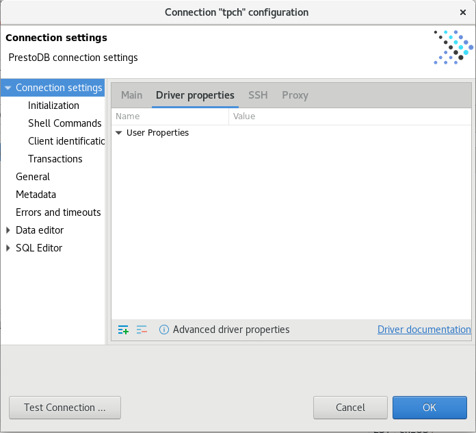
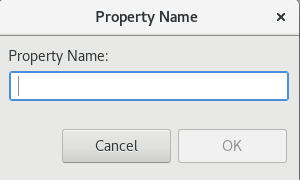
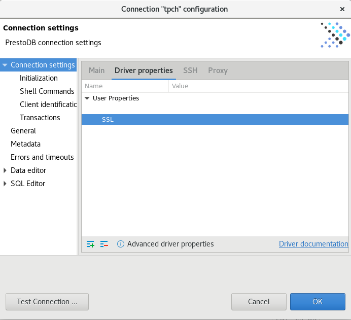

# dBeaver Client Tool

You could use any tool that supports connectivity through JDBC drivers to connect to watsonx.data, but we chose to use dBeaver for this lab. 

dBeaver is a client tool that we can use to connect to watsonx.data and execute queries etc. The tool has been installed in the watsonx users home directory. To access dBeaver, you must use the VNC service which has been installed on this server for you.

## Start dBeaver Locally
To start dBeaver, you must be connected to the VM console of the Linux server as the watsonx user (see [Accessing the Console](#wxd-reference-console.md)).

In the virtual machine, click on the Applications button, choose the Database folder and click on the dBeaver icon.

 

The start-up screen for dBeaver will display.

 
 
The dBeaver program may ask if you want to create an empty database or update the release. Just say No.

 

The first dialog from dBeaver will ask you to create a database connection.

If you do not see this screen, select Database, and then select New Database Connection:

 
## Catalog watsonx.data Connection
We will use the PrestoDB JDBC connector (NOT PrestoSQL). This is the other name for Trino, a variant of PrestoDB which might work. Select SQL (see Left side) and scroll down until you see PrestoDB. 

 
Select PrestoDB and then press "Next". The following screen will be displayed.

 
Enter the following values into the dialog. 
**Note**: These settings are case-sensitive.
 
* Host: <code style="color:blue;font-size:medium;">localhost</code>
* Port: <code style="color:blue;font-size:medium;">8443</code>
* Username: <code style="color:blue;font-size:medium;">ibmlhadmin</code>
* Password: <code style="color:blue;font-size:medium;">password</code>
* Database: <code style="color:blue;font-size:medium;">tpch</code>

Then select the Driver Properties tab. You might be asked to download the database driver.

 

Make sure select "Force Download" otherwise it will not properly download the driver. Once downloaded it will display the Driver properties dialog.

 
Press the [+] button on the bottom left of the User Properties list.

 
You need to enter three properties:

   * <code style="color:blue;font-size:medium;">SSL</code> <code style="color:blue;font-size:medium;">True</code>
   * <code style="color:blue;font-size:medium;">SSLTrustStorePath</code> <code style="color:blue;font-size:medium;">/certs/presto-key.jks</code>
   * <code style="color:blue;font-size:medium;">SSLTrustStorePassword</code> <code style="color:blue;font-size:medium;">watsonx.data</code>

Enter the property name "SSL", in uppercase (the parameter is case-sensitive!). When you hit OK it will display the setting in the list.

 

Click on the <code style="color:blue;font-size:medium;">SSL</code> field and you will update the value to<code style="color:blue">True</code> and hit Enter. Add another field called <code style="color:blue;font-size:medium;">SSLTrustStorePath</code> and give it value of <code style="color:blue;font-size:medium;">/certs/presto-key.jks</code> and finally add the <code style="color:blue;font-size:medium;">SSLTrustStorePassword</code> setting with a value of <code style="color:blue;font-size:medium;">watsonx.data</code>. The panel should now contain three values.

 
Press Finish when done. You should now see the TPCH database on the left panel. Clicking on the >TPCH line should display the objects that are found in the database.

 
You can now use dBeaver to navigate through the different schemas in the Presto database. The iceberg_data schema should also be visible in the dBeaver console. Open the iceberg_data catalog and search for the customer table under workshop schema. This schema will only exist if you created it in the previous section on MinIO.