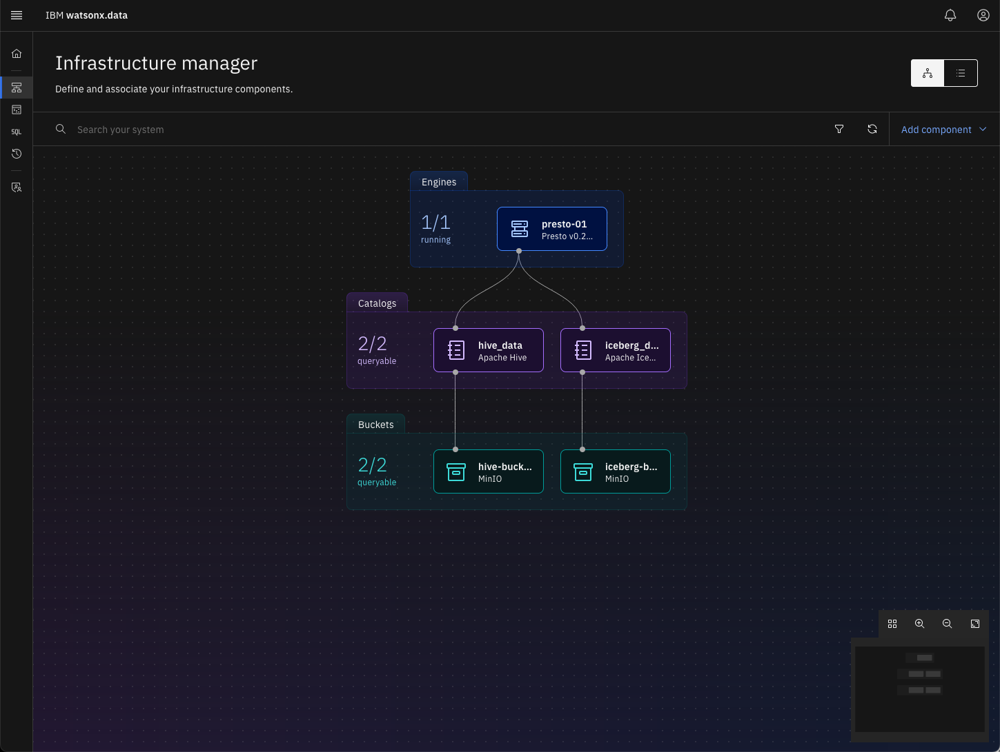
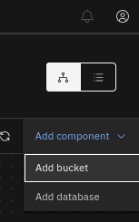
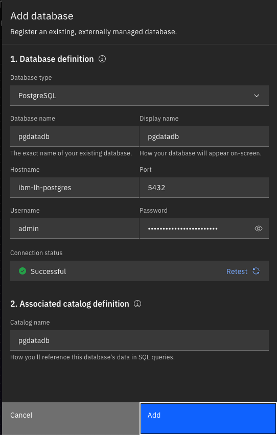
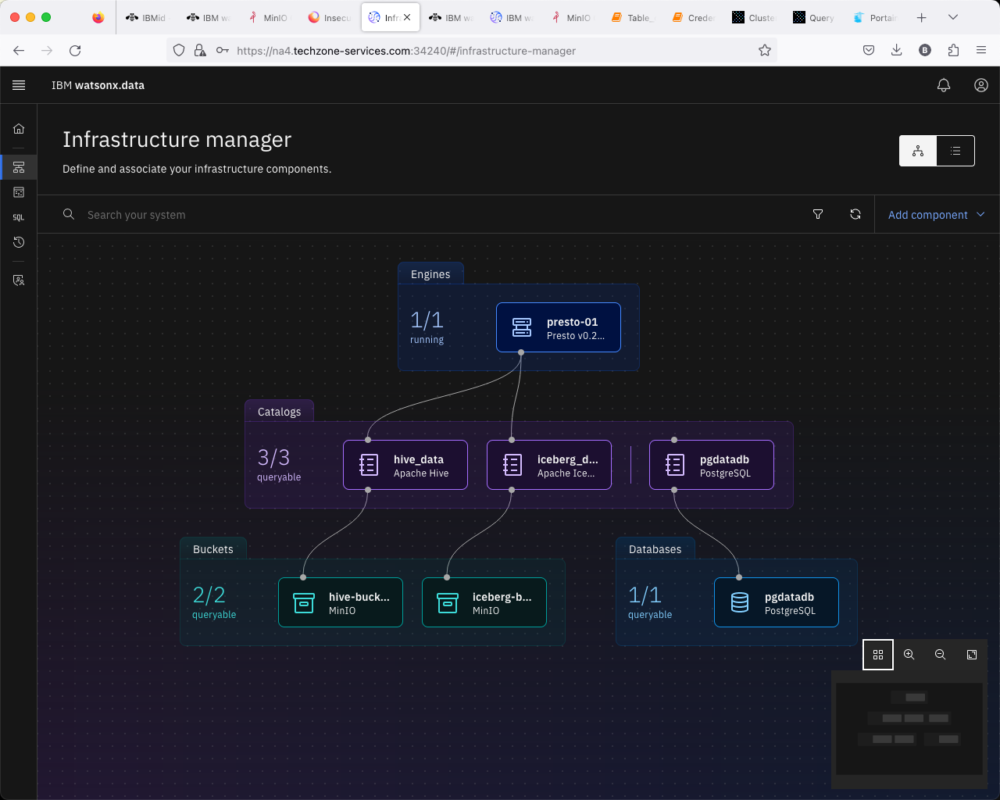
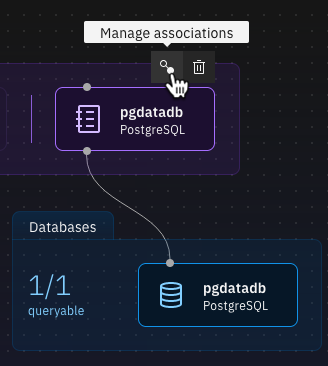
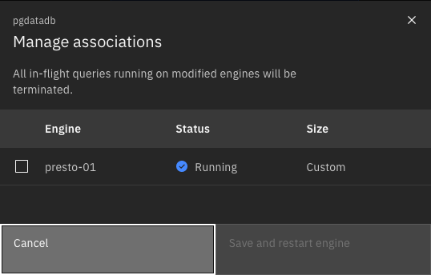
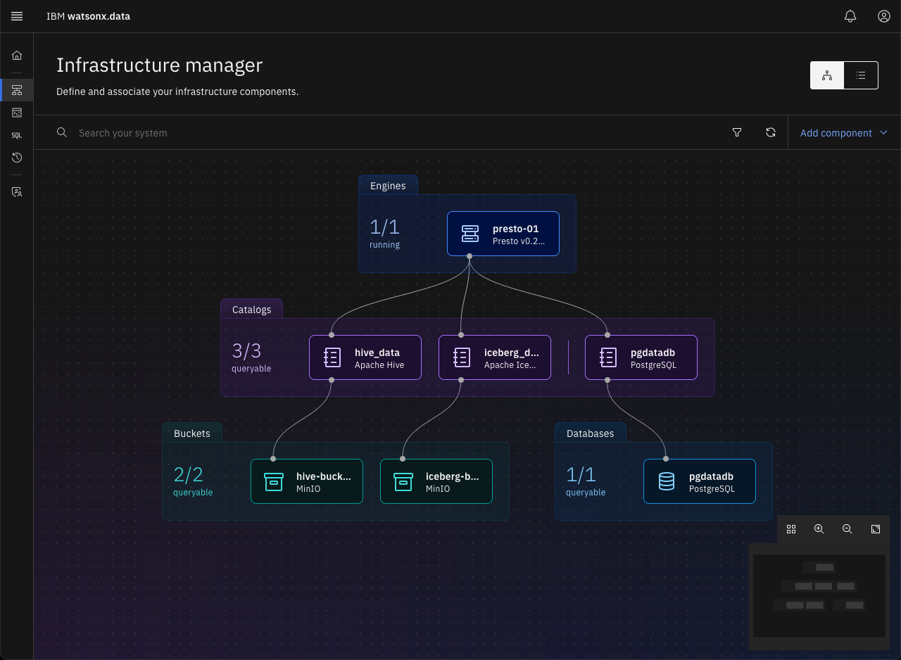

# Federation with watsonx.data
Watsonx.data can federate data from other data sources, there are a few out of box connectors and one could create additional connectors using the SDK if need be (This does involve some programming and testing effort) and not a trivial exercise. We will use the existing PostgreSQL instance, add some data, and test the federation capabilities. 

Open the developer sandbox and use existing scripts to create a PostgreSQL database and add some data.

Switch to the bin directory as the root user.

```
cd /root/ibm-lh-dev/bin
```

Connect to the sandbox.
```
./dev-sandbox.sh 
```
Create the database.
```
/scripts/create_db.sh pgdatadb
```
<pre style="font-size: small; color: darkgreen; overflow: auto">
exists result: 
CREATE DATABASE
</pre>

Connect to the Database.quit;
```
/scripts/runsql.sh pgdatadb
```
<pre style="font-size: small; color: darkgreen; overflow: auto">
psql (11.19, server 13.4 (Debian 13.4-4.pgdg110+1))
WARNING: psql major version 11, server major version 13.
         Some psql features might not work.
Type "help" for help.
</pre>

Create a Table.
```
create table t1( c1 int, c2 int);
```
<pre style="font-size: small; color: darkgreen; overflow: auto">
CREATE TABLE
</pre>
Insert some sample data.
```
insert into t1 values(1,2);
```
<pre style="font-size: small; color: darkgreen; overflow: auto">
INSERT 0 1
</pre>

Quit Postgres.
```
quit
```

Quit Sandbox.
```
exit
```
### PostgreSQL Properties
To set up federation, we need to get the credentials for the PostgreSQL database. Use the following command to get the database password.
```
export POSTGRES_PASSWORD=$(docker exec ibm-lh-postgres printenv | grep POSTGRES_PASSWORD | sed 's/.*=//')
echo "Postgres Userid   : admin"
echo "Postgres Password : " $POSTGRES_PASSWORD
echo $POSTGRES_PASSWORD > /tmp/postgres.pw
```
Open your browser and navigate to:


* Watsonx.data UI - https://region.techzone-server.com:port
* Credentials: username: <code style="color:blue;font-size:medium;">ibmlhadmin</code> password: <code style="color:blue;font-size:medium;">password</code>

   
Navigate to the Infrastructure manager by clicking on the icon below the Home symbol.


  
You should see a panel like the following.


 
On the top right-hand corner, select Add Component->Add database.


 
The Add database dialog is displayed.


      
Enter the following values:

   * Database type – <code style="color:blue;font-size:medium;">PostgreSQL</code>
   * Database name – <code style="color:blue;font-size:medium;">pgdatadb</code>
   * Hostname –<code style="color:blue;font-size:medium;">ibm-lh-postgres</code>
   * Port – <code style="color:blue;font-size:medium;">5432</code>
   * Display name – <code style="color:blue;font-size:medium;">pgdatadb</code>
   * Username – <code style="color:blue;font-size:medium;">admin</code>
   * Password – The value that was extracted in the earlier step
   * Catalog Name – <code style="color:blue;font-size:medium;">pgdatadb</code>
   
Your screen should look like the one below. You can press the "Test" button to check to see if the connection settings are correct. Once you are satisfied with the settings, press "Add". 



The infrastructure screen should now show the Postgres database.


 
What we are currently missing the connection between the Presto engine and the Postgres data in pgdatadb. We must connect the pgdatadb database to the Presto engine. Use your mouse to hover over the pgdatadb icon until you see the Associate connection icon:


 
Click on the association icon. You should see the following confirmation dialog:



Select the <code style="color:blue;font-size:medium;">presto-01</code> engine and press **Save and restart engine**.
 
Press the Associate button and the screen will update to show the connection.


 
### Presto Federation

First check to make sure that the Presto engine has finished starting. While the watsonx.data UI has restarted the Presto process, it takes a few seconds to become available.

```
check_presto
```

When the command comes back as Ready, you can start using the Presto CLI.

Connect to watsonx.data and try Federation.
```
./presto-cli --catalog pgdatadb
```

Show the current schemas. 
```
show schemas;
```
<pre style="font-size: small; color: darkgreen; overflow: auto">
       Schema       
--------------------
pg_catalog         
 public             
(2 rows)
</pre>
Use the public schema.
```
use public;
```
Select the table we created in Postgres.
```
select * from public.t1;
```
<pre style="font-size: small; color: darkgreen; overflow: auto">
 c1 | c2 
----+----
  1 |  2 
(1 row)
</pre>
 
Join with data from other schemas (Sample TPCH+PostgreSQL).
```
select t1.*,customer.name from tpch.tiny.customer, pgdatadb.public.t1 limit 10;
```
<pre style="font-size: small; color: darkgreen; overflow: auto">
c1 | c2 |        name        
----+----+--------------------
  1 |  2 | Customer#000000001 
  1 |  2 | Customer#000000002 
  1 |  2 | Customer#000000003 
  1 |  2 | Customer#000000004 
  1 |  2 | Customer#000000005 
  1 |  2 | Customer#000000006 
  1 |  2 | Customer#000000007 
  1 |  2 | Customer#000000008 
(10 rows)
</pre>

Quit Presto.
```
quit;
```