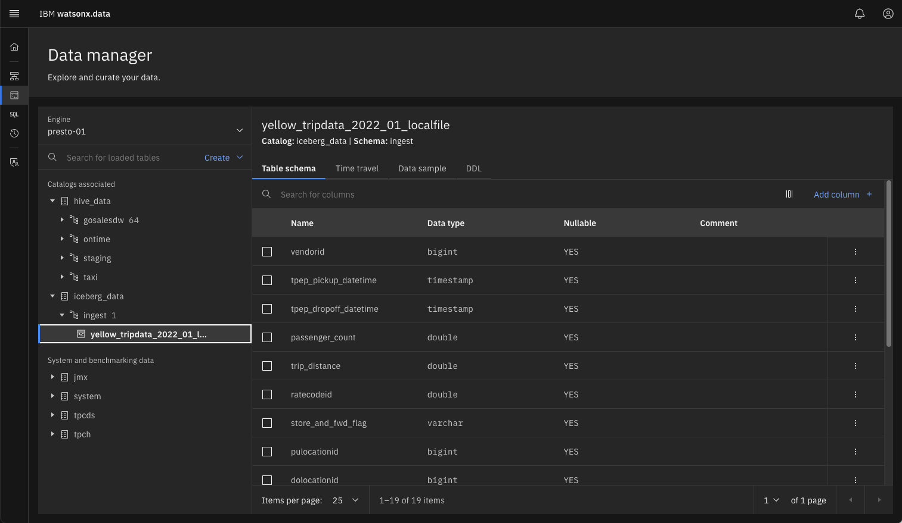
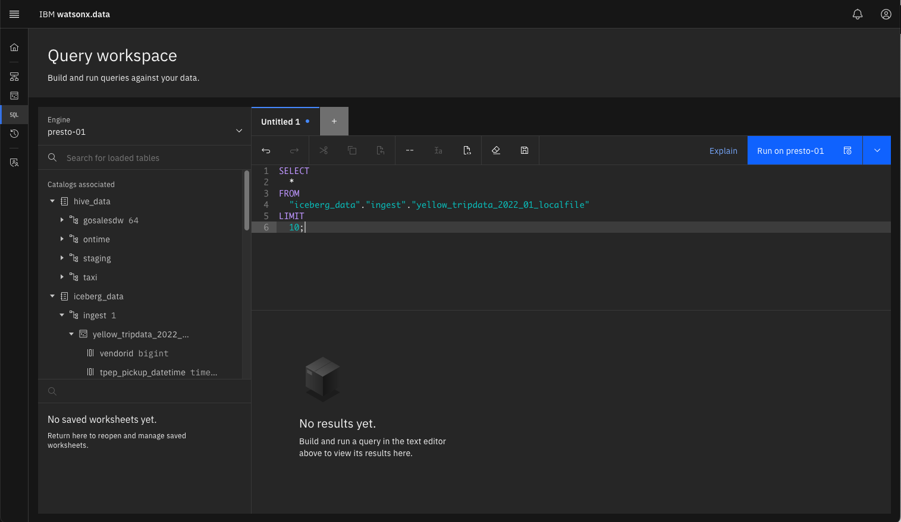

# Ingesting Data

In this lab we will use the ingest tool (lh-tool) alongside the IBM watsonx.data developer edition that is running in this lab. The Ingest tool is a separate install and currently needs to be downloaded after IBM watsonx.data is started. The lab image contains a copy of this code, so you will not need to download it.

In addition, there is a staging file (yellowtaxi-parquet) found in the sample data directory that will be used for loading data into the system.

As the `root` user, switch to the client bin directory.
```
cd /root/ibm-lh-client/bin
```

### Ingest data into the IBM watsonx.data
Before running the utility, we need to retrieve several credentials for MinIO and the keystore password. 
```
export LH_S3_ACCESS_KEY=$(docker exec ibm-lh-presto printenv | grep LH_S3_ACCESS_KEY | sed 's/.*=//')
export LH_S3_SECRET_KEY=$(docker exec ibm-lh-presto printenv | grep LH_S3_SECRET_KEY | sed 's/.*=//')
export LH_KEYSTORE_PASSWORD=$(docker exec ibm-lh-presto printenv | grep LH_KEYSTORE_PASSWORD | sed 's/.*=//')
```
We need to generate three export lines and create a directory that will be used later in another script. The `staging` directory is used to move files between this system and the docker container that the `ibm-lh` tool is running in.
```
export staging=/root/ibm-lh-client/localstorage/volumes/infra/staging

mkdir -p ${staging}
cat <<EOF > ${staging}/keys.sh
#!/bin/bash
export access_key=$LH_S3_ACCESS_KEY
export secret_key=$LH_S3_SECRET_KEY
export keystore_password=$LH_KEYSTORE_PASSWORD
EOF
chmod +x ${staging}/keys.sh
```

A copy of the MinIO SSL certificate needs to be copied from the docker container. In addition, the file that we want loaded into watsonx.data will be moved into the staging file directory. 
```
docker cp ibm-lh-presto:/mnt/infra/tls/lh-ssl-ts.jks ${staging}/lh-ssl-ts.jks
\cp -f /sampledata/yellow_tripdata_2022-01.parquet ${staging}/.
```

### Create a hive schema for staging the ingest file

Before ingesting the file, we need to create a new schema that we will use for the table being loaded. Your TechZone reservation will include the server name and port number to connect to the watsonx.data UI. 
   
In the watsonx.data UI select the Data Explorer.


You should see a screen like the following.


 
Use the "Create" pulldown and select Create schema in the `hive_data` catalog. 


 
Select the `hive_data` catalog and use `staging` as the new schema name.


 
Press the Create button to finish the creation of the schema.


 
You should see the new `staging` schema under `hive_data`. You need to repeat the same process again, but this time you are going to add a schema called `ingest` in the `iceberg_data` catalog.


 
You should see the new `ingest` schema in the navigator screen. 


### Start the IBM tools Container

To access the tools container, we issue the `ibm-lh` command with the `data-load` option.
```
./ibm-lh data-copy
```
<pre style="font-size: small; color: darkgreen; overflow: auto">
///////////////////////////////////////
///////////////////////////////////////
        _                  _  _       
     _ | |__   _,   ,_    | || |_ _   
    | || '_ \ / /\//| |_ _| || |_  |  
    | || |_) || |   | |_ _| || | | |  
    |_||_.__/ |_|   |_|   |_||_| |_|  
///////////////////////////////////////
///////////////////////////////////////
</pre>
Once inside the utility, you can use the following command to get more details on the `data-copy` option.
```
ibm-lh data-copy --help
```

Exit from the tools container by using the `exit` command.
```
exit
```

The following script is used to ingest the taxi data (yellow_tripdata_2022_01) into watsonx.data. Choose the script which corresponds to the release of watsonx.data that you are currently running. 

#### Watsonx.data Version 1.0.3

```
cat <<EOF > ${staging}/ingest-local.sh
#!/bin/bash
dir=/mnt/infra/staging
cd \${dir}
source ./keys.sh
table_name="iceberg_data.ingest.yellow_tripdata_2022_01_localfile"
file="yellow_tripdata_2022-01.parquet"

ibm-lh data-copy \\
   --source-data-files \${dir}/\${file} \\
   --target-tables \${table_name} \\
   --ingestion-engine-endpoint "hostname=ibm-lh-presto-svc,port=8443" \\
   --staging-location s3://iceberg-bucket/ingest/ \
   --staging-hive-catalog hive_data \
   --staging-hive-schema staging \
   --staging-s3-creds \\
"AWS_SECRET_ACCESS_KEY=\${secret_key}\\
,AWS_ACCESS_KEY_ID=\${access_key}\\
,AWS_REGION=us-east-1\\
,BUCKET_NAME=iceberg-bucket\\
,ENDPOINT_URL=http://ibm-lh-minio:9000" \\
    --create-if-not-exist \\
    --trust-store-path \${dir}/lh-ssl-ts.jks \\
    --trust-store-password \${keystore_password} \\
    --dbuser ibmlhadmin \\
    --dbpassword password
EOF
sed -i '/^$/d' ${staging}/ingest-local.sh
chmod +x ${staging}/ingest-local.sh
```
#### Watsonx.data Version 1.1.0

In version 1.1.0, the `--staging-s3-creds` are replaced with an environment variable called `STAGING_S3_CREDS`.

```
cat <<EOF > ${staging}/ingest-local.sh
#!/bin/bash
dir=/mnt/infra/staging
cd \${dir}
source ./keys.sh
table_name="iceberg_data.ingest.yellow_tripdata_2022_01_localfile"
file="yellow_tripdata_2022-01.parquet"
export STAGING_S3_CREDS="AWS_SECRET_ACCESS_KEY=\${secret_key}\\
,AWS_ACCESS_KEY_ID=\${access_key}\\
,AWS_REGION=us-east-1\\
,BUCKET_NAME=iceberg-bucket\\
,ENDPOINT_URL=http://ibm-lh-minio:9000"

ibm-lh data-copy \\
   --source-data-files \${dir}/\${file} \\
   --target-tables \${table_name} \\
   --ingestion-engine-endpoint "hostname=ibm-lh-presto-svc,port=8443" \\
   --staging-location s3://iceberg-bucket/ingest/ \\
   --staging-hive-catalog hive_data \\
   --staging-hive-schema staging \\
   --create-if-not-exist \\
   --trust-store-path \${dir}/lh-ssl-ts.jks \\
   --trust-store-password \${keystore_password} \\
   --dbuser ibmlhadmin \\
   --dbpassword password
EOF
sed -i '/^$/d' ${staging}/ingest-local.sh
chmod +x ${staging}/ingest-local.sh
```

### Start the Ingest Process

Start the `ibm-lh` container again:
```
./ibm-lh data-copy
```

Now run the ingest job inside the tool container.
```
/mnt/infra/staging/ingest-local.sh
```
<pre style="font-size: small; color: darkgreen; overflow: auto">
Start data migration
Ingesting SECTION: cmdline
Reading parquet file:/staging/yellow_tripdata_2022-01.parquet
Inferring source schema...
Schema inferred
Ingesting source folder s3://dev-bucket-01/ingest/stage_1686085369_19_ea7fa9994c96/ into target table ingest.yellow_tripdata_2022_01_localfile

The specified table does not exist
Target table does not exist.. creating
Current State: RUNNING Rows Ingested: 408575
Current State: RUNNING Rows Ingested: 52
Current State: 100% FINISHED
Done ingesting into table: ingest.yellow_tripdata_2022_01_localfile
Complete migration
</pre>
 
After ingesting the data, exit the docker container.
```
exit
```
Refresh the IBM watsonx.data UI to view the iceberg_data catalog in the Data Explorer.


 
Click on the yellow_tripdata table to see the schema definition.


 
Then click on the Data sample tab to see a snippet of the data.


 
Now we can use the UI to run a query against this imported data. Select the SQL icon on the left side of the display.


 
On the line where the yellow_tripdate table is located, click the icon at the end of the name. This will display a drop-down list. Select "Generate SELECT".


 
This will generate a SQL statement in the window to the right of the table name.


 
Now execute the query to see what the results are.


 
That completes the labs! Congratulations you are done! 


