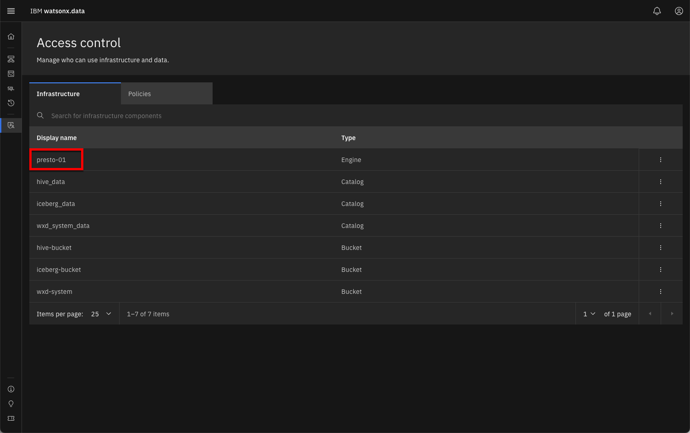
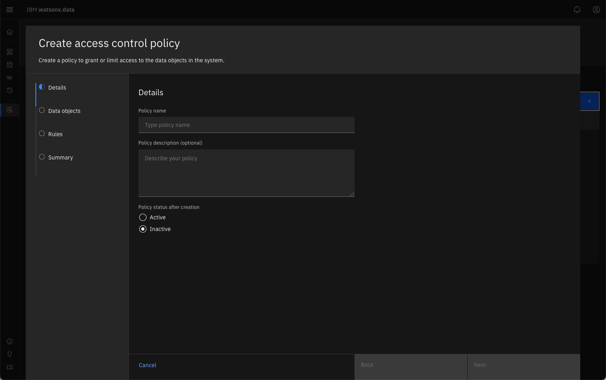
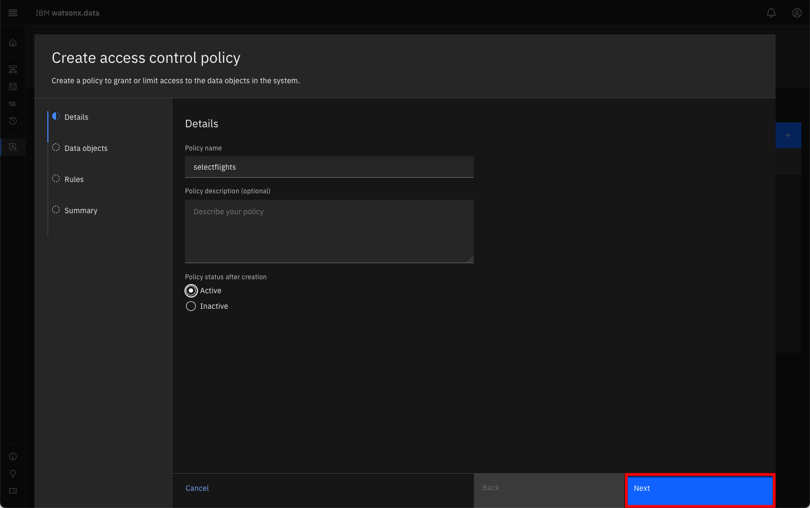
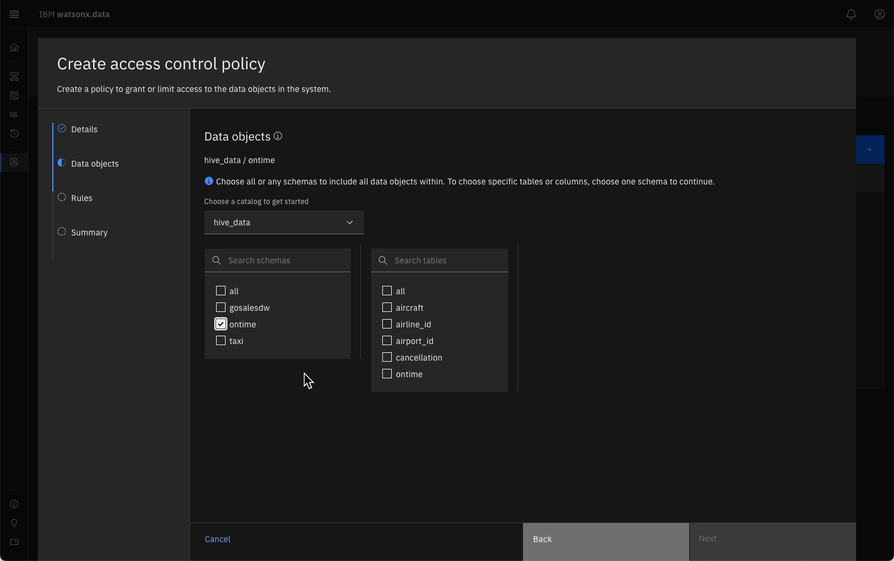
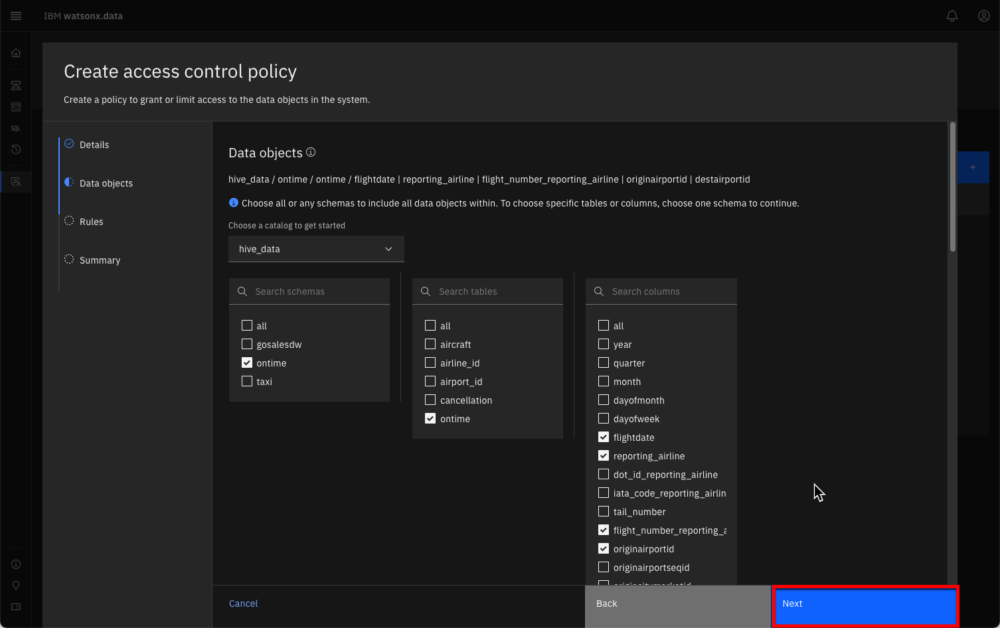
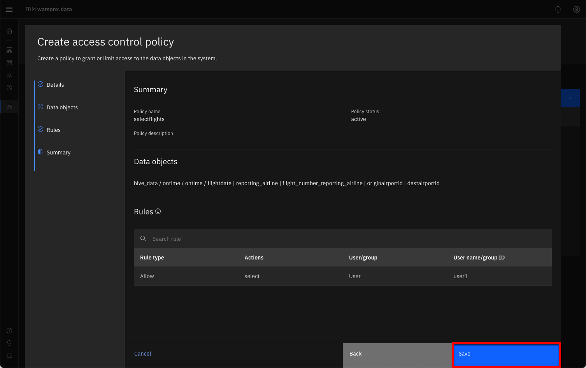
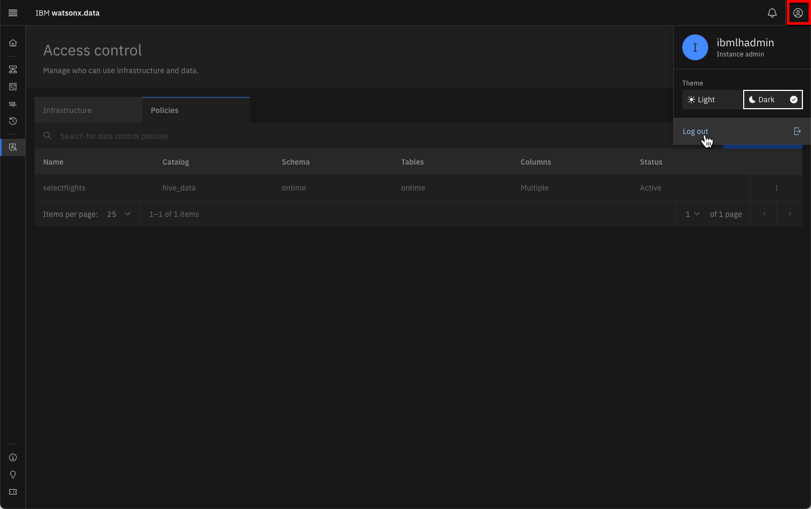

# Access Control

Security and access control within watsonx.data are based on roles. A role is a set of privileges that control the actions that users can perform. Authorization is granted by assigning a specific role to a user, or by adding the user to a group that has been assigned one or more roles.

Access control at the infrastructural level allows permissions to be granted on the engines, catalogs, buckets, and databases. Roles for these components include Admin, Manager, User, Writer, and Reader (depending on the component).

Access to the data itself is managed through data control policies. Policies can be created to permit or deny access to schemas, tables, and columns.
User account management and access management varies between the different deployment options for watsonx.data. For instance, in the managed cloud service (SaaS), the service owner would need to invite other users to the environment and give them appropriate service access.

With the standalone software, users can be added within the console’s Access control page. In the Developer Edition, users can be added using a command line tool.

!!! abstract "Click on the Access Control icon on the left side of the screen<br>"

 

The Access Control panel is divided into Infrastructure and Policies. 

 

The initial screen displays the objects that are considered part of the Infrastructure. A user must be granted access to the infrastructure (i.e. Presto engine) in order for them to run queries against any of the schemas in the database.

!!! abstract "Click on the Policies Tab"

 

Your system should not contain any policies at this time. 

## Roles and Policies

In this section you will add a new user and provide them with privileges over the infrastructure and data. First start by adding a new user to the watsonx.data system.

This lab is using the Developer edition of the watsonx.data software, which means that the Access control panel does not provide a UI for adding users. In order to manage users, the `user-mgmt` command will need to be used. The `user-mgmt` command is normally run from a command line in the server.

This server includes a user called `watsonx` with a password of `watsonx.data`. If you want to add additional users, see the [User Administration](#user-administration) section at the end of this lab.

### Access Control

To view what users are currently authorized to use the system, select the Access control icon found on the left side of the watsonx.data UI.

!!! abstract "Click on the Access Control icon on the left side of the screen"


A list of objects that make up the watsonx.data infrastructure are displayed.



You can see that the objects are made up of:

* Engines
* Catalogs
* Buckets

In a real-world scenario where a user will be querying data from a table, that user will need to be given a minimum of User access to an engine (to be able to run the query), User access for the catalog associated with the data (to be able to see the schema information associated with the table), and Reader access to the bucket associated with the data (to be able to read the data
from object storage).

Additionally, a policy has to be created to permit the user to access the table in question. 

### Granting Access

!!! abstract "Select the presto-01 engine (highlighted in red above) to view the current users that have access to the engine"


At this point, only the administrative user (ibmlhadmin) can use the Presto engine. 

!!! abstract "Click on the Add Access button to add a new authorized user to the list"


!!! error "If you do not see the watsonx userid, or the dropdown is blank, issue the following command in a terminal window. Once the user is added, refresh the browser window and then click on the Add Access button again."
    ```
    sudo /root/ibm-lh-dev/bin/user-mgmt add-user watsonx User watsonx.data   
    ```

The role button has been selected in the dialog to show the role options of Admin, Manager, or User. An Admin user can grant any role to a user, while a Manager can only grant User privileges. 

!!! abstract "Grant watsonx "user" privileges and then press Add"


!!! abstract "Close the dialog by clicking on the [x] on the top right of the screen"

The `watsonx` user needs to be granted access to a catalog. In this case, the `iceberg_data` and `hive_data` catalogs are required for the Presto engine and are implicitly granted to the user.  

!!! abstract "Click on the iceberg_data line to confirm that watsonx has access"


You should see that `watsonx` has already been granted access to the catalog. 


!!! abstract "Close the dialog to return to the Access control screen"

The final step is to grant access to the underlying buckets. Because `watsonx` was implicitly granted access to the `iceberg_data` and `hive_data` catalogs, the underlying buckets `iceberg-bucket` and `hive-bucket` were also added to their access list. 

!!! abstract "Click on iceberg-bucket to view the access control"


!!! abstract "Close the dialog to return to the Access control dialog"

### Policies

After access has been granted to engines, catalogs, and buckets, the final step is to create a policy to grant access to tables. 

!!! abstract "Click on the Policy tab to display the current policies in place (there should be none)"


The Add Policy button is highlighted on the far right side of the screen. 
!!! abstract "Press the Add Policy button to display the new Access Control Policy dialog"



!!! abstract "Fill in the following fields with these values"

    * Policy name: selectflights
    * Description: blank
    * Policy status: active



You can always activate a policy after you have created it. 

!!! abstract "Click Next"


Here we need to select which catalog to use and then the schemas that the user will be able to access.

!!! abstract "Select hive_data catalog, and then the ontime schema"

!!! error "If you do not see any values being populated on the screen, refresh the browser"

After selecting the schema, a set of tables associated with the schema will be listed.



You can choose which tables can be searched. If you choose an individual table, you can restrict which columns can be searched. 

!!! abstract "Select the ontime table and then select the following columns (you will need to scroll down the page)"

    * `flightdate`
    * `reporting_airline`
    * `flight_number_reporting_airline`
    * `originairportid`
    * `destairportid`



!!! abstract "Press the Next button when all columns are selected"


The Rules dialog allows you to fine-tune what actions can be done by a user against the data. 

!!! abstract "Press the Add Rule button to display the Add Rule dialog"


Rules can be used to **Allow** actions or to **Deny** actions. 

!!! abstract "Allow watsonx to SELECT data from the data, but with no other options"

**Note**: In production versions of watsonx.data, you can provide access to a group which makes it simpler to create a set of rules that apply to a group and then add a user to a group. That way a user will inherit the rules that were applied to the group rather than having to create rules for that individual. The developer edition displays GROUP as an option, but it is not implemented.

!!! abstract "Make sure to select watsonx as the user"


!!! abstract "Press the Add button"


You can continue to add additional rules to the list. Since we only want the one rule, select the Review button.

!!! abstract "Press the Review button"



!!! abstract "Confirm that the data objects and rules look correct then press the Create button"


The `selectflights` policy is now in place and is actively enforced. 

!!! abstract "Press the Query Workspace Icon"

Before testing the policy enforcement, use the SQL icon on the left side to navigate to the `hive_data` catalog and view the schemas that are associated with it.

!!! abstract "Expand the ontime schema to view the tables and the columns that are available in the ontime table"


When you connect as `watsonx`, you will be able to compare what objects can be accessed from that userid.

### Testing Policy Enforcement

To test whether the rules are enforced, you will need to log out of the current watsonx.data UI session. At the top of the Query workspace screen, you will see the user icon on the top right. 

!!! abstract "Click on the user icon to display the logout dialog"



!!! abstract "Log out to the main watsonx.data UI screen"

You will be prompted to confirm log out.


The log in dialog should be displayed.


!!! abstract "Enter the credentials for the watsonx user and press Log in"

    * Username: watsonx
    * Password: watsonx.data
    
Your watsonx.data UI should now display `watsonx`. Note how you have less components in the Infrastructure summary.


!!! abstract "Navigate to the SQL icon and then select hive_data <span style="color:blue">&rarr;</span> ontime <span style="color:blue">&rarr;</span> ontime" 


You should notice that `watsonx` was restricted to seeing only the `ontime` schema in the `hive_data` catalog. In addition, the user was restricted to accessing one of the tables (`ontime`) and 5 columns. Attempting to run a SELECT statement against all the data will result in a policy error.

!!! abstract "Enter this text into the SQL window and Run the code"

    ```
    SELECT
      *
    FROM
      "hive_data"."ontime"."ontime"
    LIMIT
      10;
    ``` 


Correcting the SQL to include only permitted columns results in an answer set.

!!! abstract "Enter this text into the SQL window and Run the code"

    ```
    SELECT
      flightdate, reporting_airline, flight_number_reporting_airline, originairportid, destairportid
    FROM
      "hive_data"."ontime"."ontime"
    LIMIT
      10;
    ``` 


The policy rules have been enforced for `watsonx`, preventing them from viewing any other schemas or tables in the system. In addition, the SQL that they could execute was restricted to specific columns in the table.

Before moving onto any other sections, make sure to log out as `watsonx` and reconnect as the `ibmlhadmin` user.

!!! abstract "Click on the user icon to display the logout dialog"


!!! abstract "Log out to the main watsonx.data UI screen"

You will be prompted to confirm log out.


The log in dialog should be displayed.


!!! abstract "Enter the credentials for the ibmlhadmin user and press Log in"

    * Username: ibmlhadmin
    * Password: password
    
Your watsonx.data UI should now display `ibmlhadmin`.

## Summary
In this section you learned how to add a user to watsonx.data (via a command) and control what objects they are allowed to access. In production versions of watsonx.data, the adding and removal of users is directly handled through the User Interface.

## User Administration

Users can be added to the watsonx.data Developer Edition by using a command line tool called `user-mgmt`. The syntax of the command is:

<pre style="font-size: medium; color: darkgreen; overflow: auto">
./user-mgmt add-user <username> [User | Admin] <password>
</pre>

The values are:

* `username` - The name of the user
* `[User|Admin]` - The type of user. Note that the type of user is case-sensitive!
* `password` - The password for the user.

For the purposes of this lab, we are going to use a Jupyter notebook that was specifically created for managing users.

!!! abstract "Find the URL in your reservation that reads Jupyter Notebook - Server: http://region.services.cloud.techzone.ibm.com:xxxx/notebooks/Table_of_Contents.ipynb and click on it"

The initial screen will request that you enter a password.

The password is <code style="color:blue;font-size:medium;">watsonx.data</code>.

!!! abstract "Enter watsonx.data as the password"

 

Once you have authenticated, the Table of Contents is displayed.

 

Click on the Arrow on the User Administration tile. The Administration notebook is displayed.

 

A Jupyter notebook contains multiple "cells" which can contain a couple of different objects:

- **Code** - A cell that contains code that will run (usually Python)
- **Markdown** - A cell that contains text and formatting using a language called Markdown

In this lab, we need to run code that is found in the notebook. You can tell which text is a code cell because of the **`[ ]:`** beside the cell and probably because it has some code in the cell! 


Before executing the contents of the cell, you must click on the cell (place focus on the cell). You can tell when the focus is on the code cell because it will be highlighted with a thin blue box. 

To "execute" the contents of the cell, you must either hit the run button icon <span style="font-style:bold; color:blue;">&#9658;</span> or Shift-Return on your keyboard. 

 

!!! abstract "Modify any values and run the contents of the cell which contains the add-user command"

A message indicating that a user was successfully added will be displayed in the notebook.

<pre style="font-size: medium; color: darkgreen; overflow: auto">
['Adding password for user watsonx']
</pre>

At this point you will return to the browser page which contains the watsonx.data UI.

!!! abstract "Click on the browser tab which contains the watsonx.data UI"
