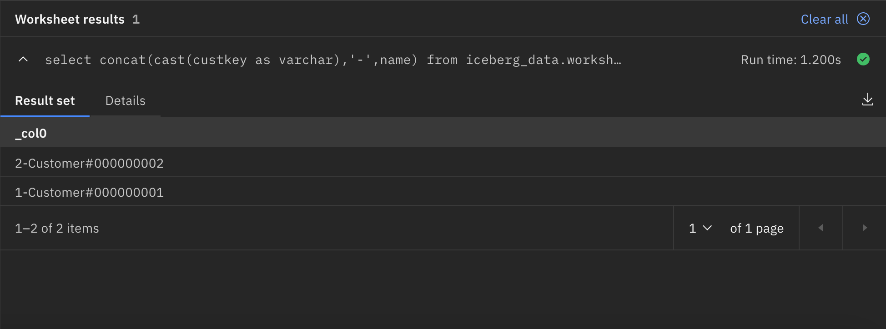
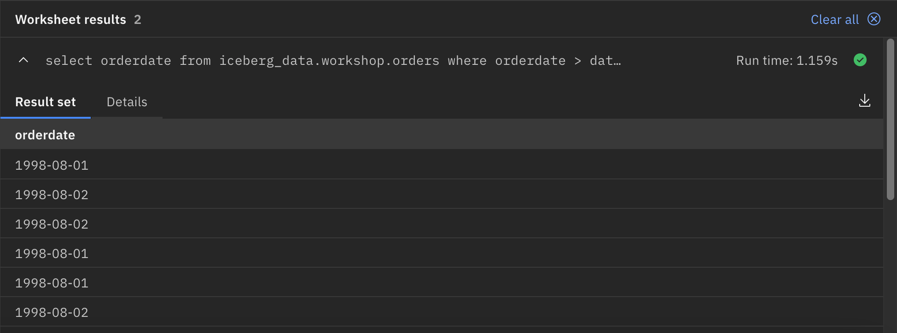
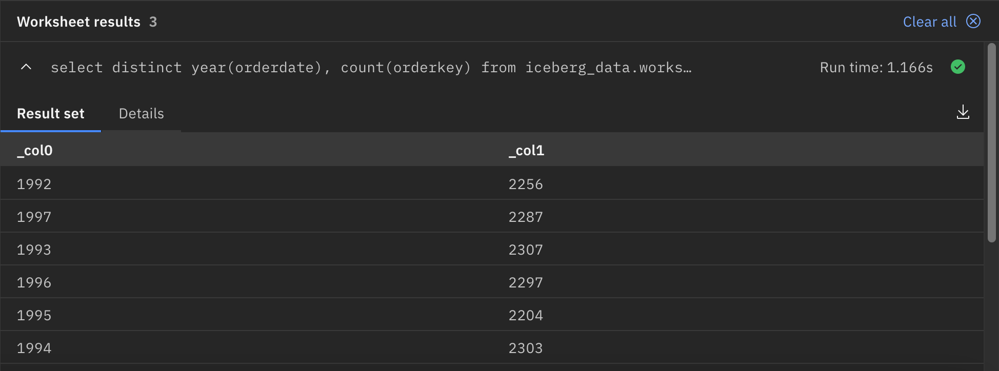
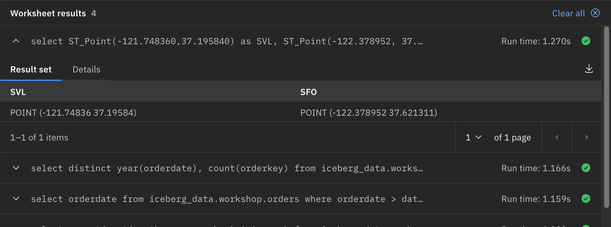
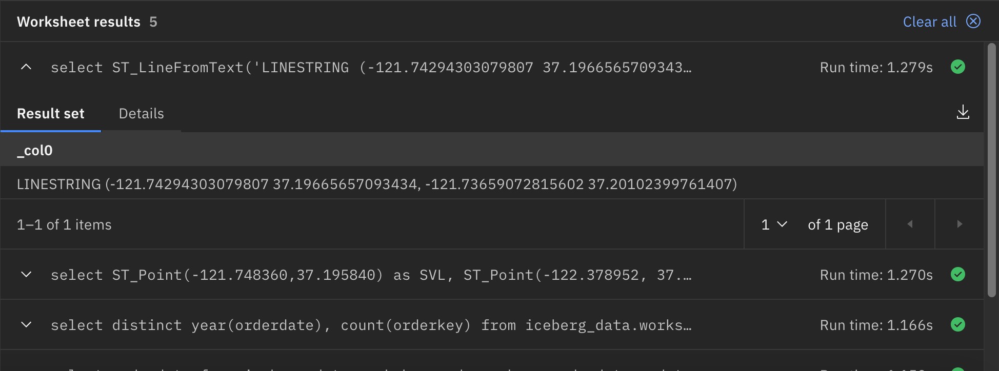
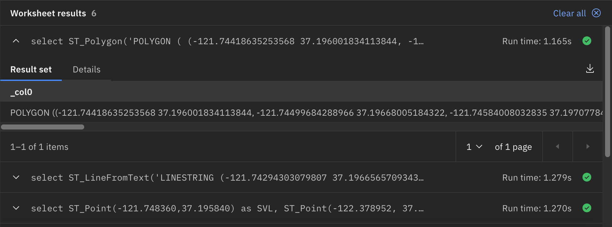
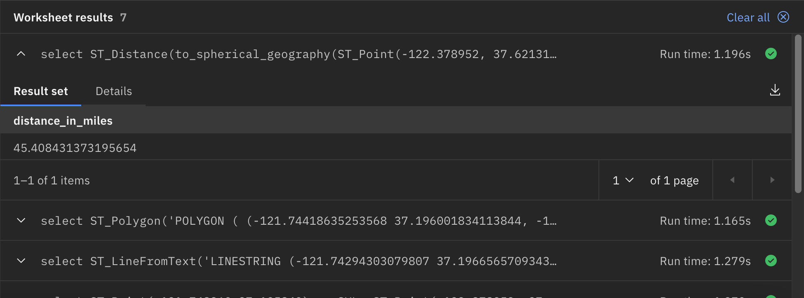
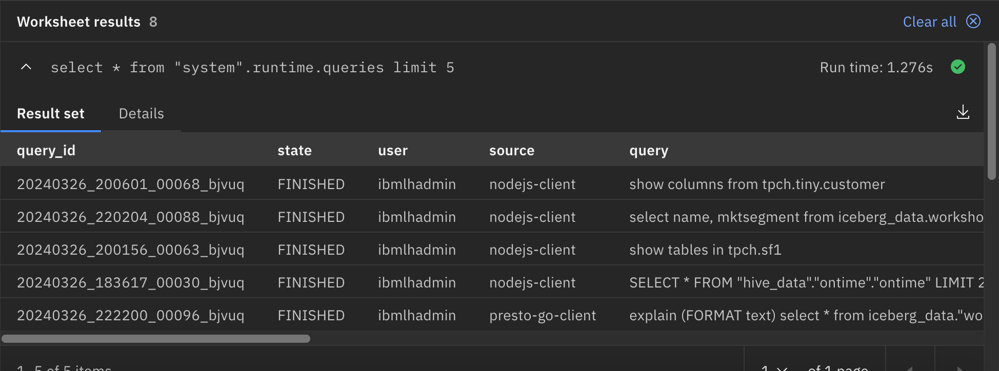
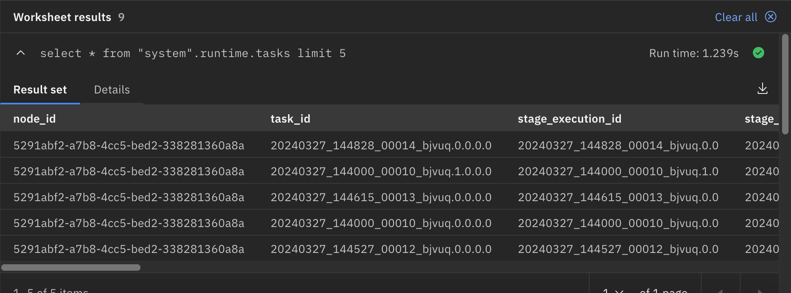

# Advanced Functions

Watsonx.data supports several types of functions including:

   * Mathematical functions
   * Conversion functions
   * String functions
   * Regular expression functions
   * Window functions
   * URL functions
   * Geospatial functions 

For a complete list see - [https://prestodb.io/docs/current/functions.html](https://prestodb.io/docs/current/functions.html). We will look at using a few simple examples as part of this lab.

!!! abstract "Before starting, make sure you are in the Query Workspace by clicking this icon on the left side<br>"

### Concatenation of one or more string/varchar values

Note: We are using a combination of the `concat` string function and the `cast` conversion function as part of this query.

!!! abstract "Concatenate two strings"
      ```
      select 
         concat(cast(custkey as varchar),'-',name) 
      from 
         iceberg_data.workshop.customer
      limit 2;
      ```



### Date functions

Date functions can be used as part of the projected columns or in the predicate/where clause.

!!! abstract "Select orders from the last 2 days"
      ```
      select
         orderdate 
      from 
         iceberg_data.workshop.orders 
      where 
         orderdate >  date '1998-08-02' - interval '2' day;
      ```



!!! abstract "Compute the number of orders by year"
      ```
      select 
         distinct year(orderdate), count(orderkey) 
      from 
         iceberg_data.workshop.orders 
      group by 
         year(orderdate);
      ```


 
### Geospatial functions

There are 3 basic geometries, then some complex geometries. The basic geometries include:

   * Points
   * Lines
   * Polygons

#### Points

You could use [https://www.latlong.net](https://www.latlong.net) to get the longitude/latitude given any address.

!!! abstract "SQL Representation of Co-ordinates"
   ```
   select 
      ST_Point(-121.748360,37.195840)  as SVL, 
      ST_Point(-122.378952, 37.621311) as SFO;
   ```



#### Lines

You could use [https://www.latlong.net](https://www.latlong.net) to get the longitude/latitude for 2 points and then create a straight line from it. Below is just a small stretch of the road leading to IBM SVL campus.

!!! abstract "SQL Representation of a Line"
   ```
   select 
      ST_LineFromText('LINESTRING (-121.74294303079807 37.19665657093434, -121.73659072815602 37.20102399761407)');
   ```

 
#### Polygons

You could use [https://geojson.io/#map=16.39/37.196336/-121.746303](https://geojson.io/#map=16.39/37.196336/-121.746303) to click around and generate the coordinates for a polygon of any shape. The following is a polygon of the IBM Silicon Valley campus.

!!! abstract "SQL Representation of a Polygon"
      ``` 
      select ST_Polygon('POLYGON (
         (-121.74418635253568 37.196001834113844, 
         -121.74499684288966 37.19668005184322,
         -121.74584008032835 37.19707784979194,  
         -121.74629035274705 37.197645197338105, 
         -121.74672425162339 37.198186455965086, 
         -121.74705172247337 37.19828427337538, 
         -121.74760023614738 37.19827775221884,  
         -121.74848440744239 37.19836252721197, 
         -121.74932764488139 37.19789300297414,  
         -121.75039192514376 37.19746260319114, 
         -121.75130884352407 37.19721479614175, 
         -121.75195559845278 37.1963670290329, 
         -121.75198015876644 37.19555185937345,  
         -121.7508585711051 37.19458016564036, 
         -121.74940132582242 37.19447582194559,  
         -121.74841891327239 37.1942866986312,
         -121.7474446874937 37.193556286900346, 
         -121.74418635253568 37.196001834113844))');
      ```



So now that we have 3 basic geometries Point, Line and Polygon we can perform different operations on spatial data including:

   * Distance between 2 points
   * Point in polygon
   * Intersection of line and polygon

We can now use geospatial functions in a nested way to find the distance between 2 points.   

!!! abstract "Distance between SFO airport and IBM SVL"
      ```
      select 
         ST_Distance(to_spherical_geography(ST_Point(-122.378952, 37.621311)), 
         to_spherical_geography(ST_Point(-121.748360,37.195840)))*0.000621371 as distance_in_miles;
      ```



## System Connector

The Presto System connector provides information and metrics about the currently running Presto cluster. You can use this function to monitor the workloads on the Presto cluster using normal SQL queries.

!!! abstract "What queries are currently running?"
      ```
      select * from "system".runtime.queries limit 5;
      ```




!!! abstract "What tasks make up a query and where is the task running?"
      ```
      select * from "system".runtime.tasks limit 5;
      ```




## Summary

In this lab you learned about some of the advanced SQL that is found in watsonx.data, including time and date functions, character formatting functions, systen functions, and a series of functions used for manipulating Geo-spatial data.

