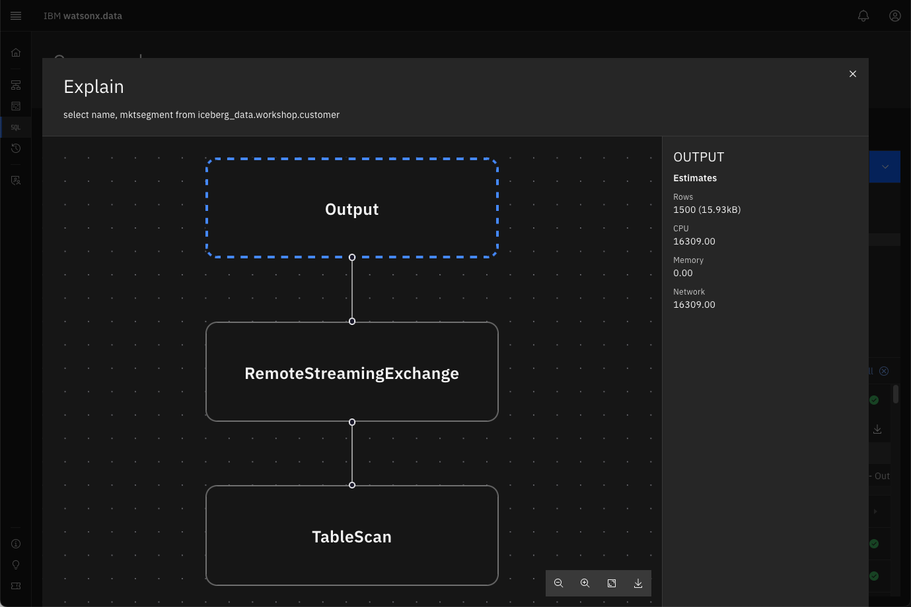
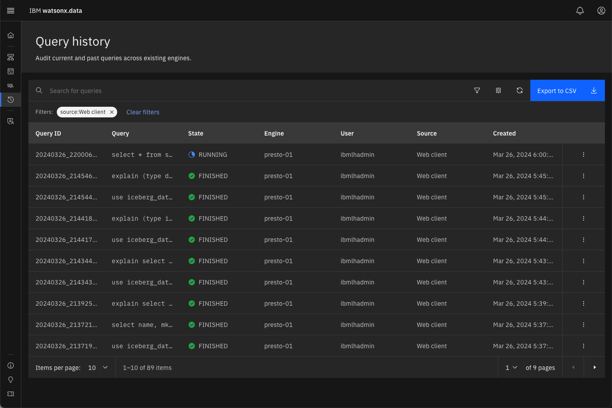
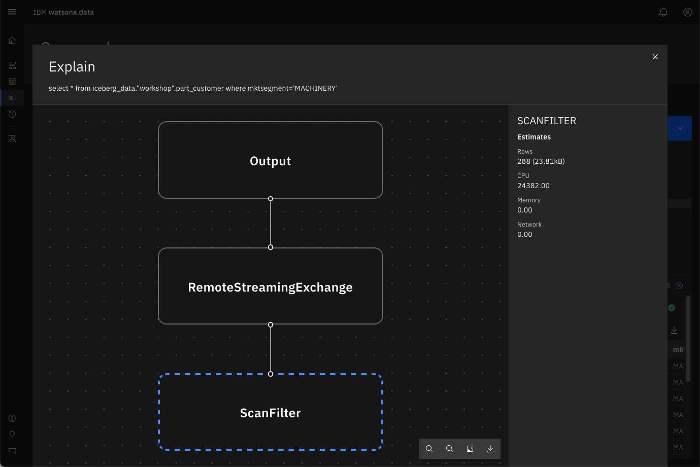

# Analytic Workload

This section will explore some of the analytic workloads that you can run with watsonx.data.

!!! abstract "Before starting, make sure you are in the Query Workspace by clicking this icon on the left side<br>"

For the analytic workloads, you are going to create a new schema in the `iceberg_data` catalog. The next statement will create the `workshop` schema in the existing `iceberg-bucket`.

!!! abstract "Create the workshop schema in the iceberg_data catalog"
    ```
    CREATE SCHEMA IF NOT EXISTS iceberg_data.workshop 
    with (location='s3a://iceberg-bucket/');
    ```

This SQL will create a new Apache Iceberg table using existing data in the sample Customer table as part of the TPCH catalog schema called TINY.   

!!! abstract "Create the workshop customer table"
    ```
    create table iceberg_data.workshop.customer as 
      select * from tpch.tiny.customer;
    ```
   
Let us start with some simple examples of running queries and analyzing the execution. 

!!! abstract "Run a simple scan query which selects customer names and market segment"
    ```
    use iceberg_data.workshop; 
    select 
      c_name, c_mktsegment 
    from 
      customer 
    limit 3;
    ```


To understand the query execution plan we use the explain statement.

!!! abstract "Run an explain against the previous statement"
    ```
    use iceberg_data.workshop;
    explain select name, mktsegment from customer;
    ```


What you see above is the hierarchy of logical operations to execute the query. It is very difficult to read since the information is found on one line. One option is to export the data and view the results in a spreadsheet. 

!!! abstract "Explain the query and focus on IO operations"
    ```
    use iceberg_data.workshop;
    explain (type io) select name, mktsegment from customer;
    ```


Explain physical execution plan for the query.
!!! abstract "Explain physical execution plan for the query"
    ```
    use iceberg_data.workshop;
    explain (type distributed) select name, mktsegment from customer;
    ```

    

A fragment represents a stage of the distributed plan. The Presto scheduler schedules the execution by each stage, and stages can be run on separate instances.

Rather than executing these explain queries, the SQL interface provides an explain button beside the Run button.

 

!!! abstract "Enter the following query into the SQL window and press the Explain button"
    ```
    select 
      name, mktsegment 
    from 
      iceberg_data.workshop.customer 
    ```

 

!!! abstract "Click on the TableScan operator"

 

The panel on the right side provides information about the work the engine will do to retrieve the data. The Presto optimizer estimates that 1500 rows will be retrieved and take approximately 16000 cpu units.

!!! abstract "Close the explain window"

Another way of viewing the explain information is to run the query and then review the Query history. 

!!! abstract "Run the query that is currently in the SQL window"

Once the query completes, switch to the Query history screen.

!!! abstract "Click on the Query History icon on the left side of the screen<br>"

 

!!! abstract "Refresh the browser to update the Query history"

Once you have refreshed the screen, look for your query in the list. It should be near the top.

!!! abstract "Click on the kebab <span style="font-style:bold; color:blue;">&vellip;</span> icon and select View Execution Plan"

 

You will see all the explain output that you created with the earlier SQL statements.

 

!!! abstract "Close the explain output by pressing the [x] on the screen"

### Creating a Table with User-defined Partitions

!!! abstract "Before starting, make sure you are in the Query Workspace by clicking this icon on the left side<br>"

Tables can be partitioned in watsonx.data. This SQL will create a partitioned table, based on column mktsegment with data copied from the TPCH.TINY.CUSTOMER table.

!!! abstract "Create a partitioned table"
    ```
    create table iceberg_data.workshop.part_customer 
      with (partitioning = array['mktsegment']) 
    as select * from tpch.tiny.customer;
    ```

The new table `part_customer` will be created in the `iceberg_bucket` with multiple files corresponding to the partitioning. We are going to use the Infrastructure manager to view the file structure.

!!! abstract "Click on the Infrastructure icon on the left side of the screen<br>"

Find the `iceberg-bucket` in the Infrastructure diagram.

 

!!! abstract "Click on the iceberg-bucket"

 

!!! abstract "Click on Objects <span style="color:blue">&rarr;</span> part_customer <span style="color:blue">&rarr;</span> data"

 

The `partitioning = array['mktsegment']` clause in the create table statement resulted in 5 different files being created, each with data specific to that segment. By partitioning the table this way, the Presto engine is able to optimize queries by only scanning partitions that match your SQL predicates.

!!! abstract "Close the current window [x] and then  return to the Query Workspace by clicking this icon on the left side<br>"

Now that have created a partitioned table, we will execute an SQL statement that will make use of this fact.

!!! abstract "Run a query against the partitioned table"
    ```
    select
      * 
    from 
      iceberg_data."workshop".part_customer 
    where 
      mktsegment='MACHINERY';
    ```

 

Due to the partitioning of this table by `mktsegment`, it will completely skip scanning a large percentage of the objects in the object store.

!!! abstract "Press the explain keyword in the SQL window to view the execution plan and then select the ScanFilter"

 

You should see that the optimizer expected to read only 288 rows when running this query. This is due to the table being partitioned and scans only needing to be run against one of the partitions.

!!! abstract "Close the explain window"

## Joins and Aggregations 

This section will create an orders table to test joins and aggregations.

!!! abstract "Create the Orders Table"
    ```
    create table iceberg_data.workshop.orders as 
      select * from tpch.tiny.orders;
    ```

The following SQL uses a windowing function to compute a result set.

!!! abstract "SQL with a Windowing function"
    ```
    SELECT 
      orderkey, clerk, totalprice, 
      rank() OVER (PARTITION BY clerk ORDER BY totalprice DESC) AS rnk 
    FROM 
      iceberg_data.workshop.orders 
    ORDER BY 
      clerk, rnk;
    ```

 

## Prepared statements

Presto provides a feature for preparing statements for repeated execution. Using this method will reduce the overhead of optimizing the statement every time you run it.

!!! abstract "Save a query as a prepared statement"
    ```
    prepare 
      customer_by_segment
    from 
      select * from iceberg_data.workshop.customer where mktsegment=?;
    ```

Once the statement has been prepared, you can execute the statement by supplying it with some parameters. In this example we are combining the two statements because the session context is not shared between SQL executions.

!!! abstract "Execute prepared statement using parameters"
    ```
    prepare 
      customer_by_segment
    from 
      select * from iceberg_data.workshop.customer where mktsegment=?;    
    execute customer_by_segment using 'FURNITURE';
    ```

     

Note that the prepared statement only exists during the current session.

## Summary

In this lab you ran some analytic workloads, learned how to view the explain plans for a query, created a partitioned table, and created prepared statements that can be executed multiple times. 