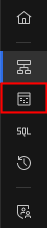
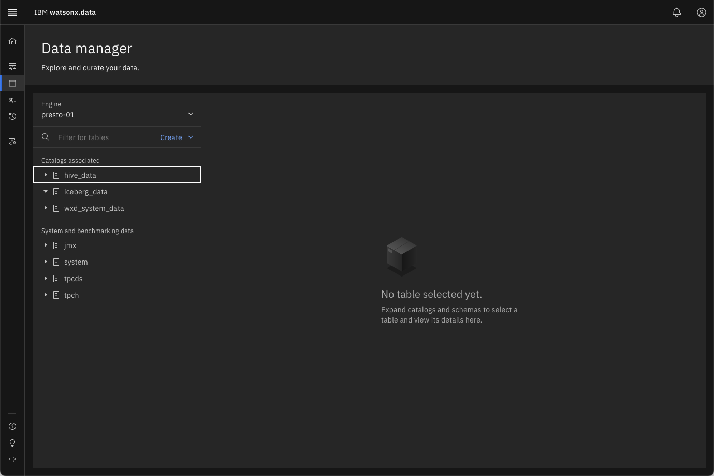
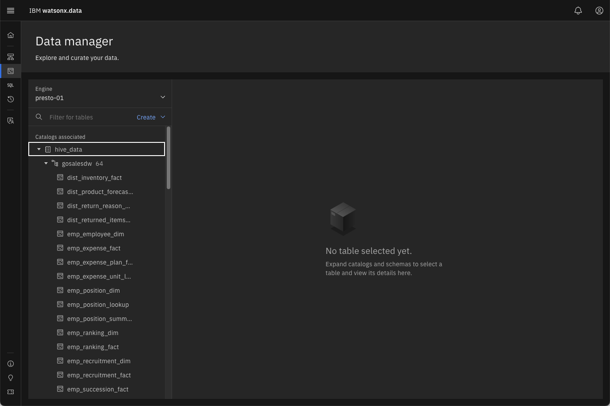
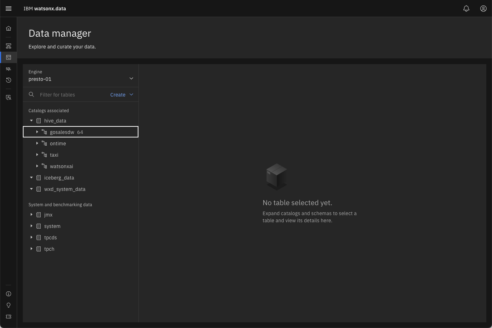
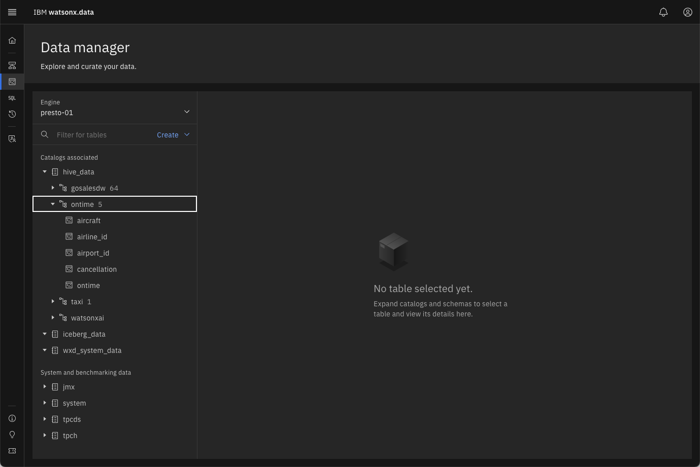
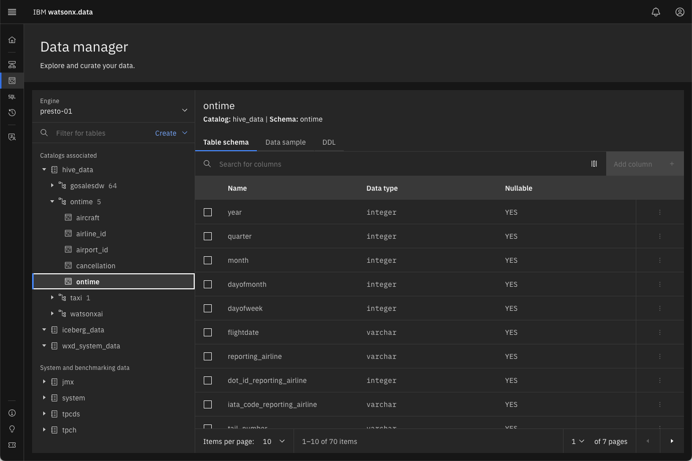

# Data Manager

The Data manager page can be used to explore and curate your data. It includes a data objects navigation pane on the left side of the page with a navigable hierarchy of engine &rarr; catalog &rarr; schema &rarr; table.

!!! abstract "Click on the Data Manager icon on the left side of the screen "

 

When the Data manager initially starts, you may not see any values on the right-hand side of the screen. This side of the screen is populated when you expand one of the selections on the left side.

 

Watsonx.data (Presto) organizes tables, views, and other database objects in schemas. A schema is a logical collection or container of related database objects. For example, sales tables might be contained in one schema and marketing tables might be contained in another.

The top-level navigation point is the query engine. You start by selecting an engine that is associated with the catalog and bucket you want to manage. As there is only one engine in this environment (presto-01), it is selected by default. 

If this was an environment with multiple engines defined, you would have the choice of selecting any one of the engines you have set up (as the administrator) or that you’ve been given access to (as a non-administrator).

With the engine selected, you can now navigate through the catalogs associated with the selected engine (the catalogs are listed in the Catalogs associated section on the left). Currently, this includes the two default catalogs (`hive_data` and `iceberg_data`) and the system catalog (`wxd_system_data`). 

!!! abstract "Press the &#9658; beside the hive_data catalog to display the schemas in the catalog"

 

If the system has not expanded the first schema in the list (`gosalesdw`), click on the `gosalesdw` schema to display the tables that are associated with that schema. 

!!! abstract  "Collapse the gosalesdw schema by pressing the &#9660; icon"

 

Your screen may show fewer schemas, but should include `gosalesdw`, `taxi`, and `ontime` in the list.

!!! abstract "Expand the ontime schema by pressing &#9658; beside the schema name"

 

There are 5 tables associated with this schema. 

!!! abstract "Get details of the ontime table by pressing on the table name"

 

The `ontime` table provides details of flight delays for flights within the United States for a one-month period of time. This screen displays the table definition (DDL) for the data. 

The panel on the right contains additional tabs which provide options for you to view some sample data, and to generate the DDL (Data Definition Language) SQL for the table.

!!! abstract "Select Data sample tab"

 

!!! abstract "Select DDL (Data Definition) tab"

 

You can use the generated DDL as an SQL statement that can be used to recreate the table.

## Summary

This lab covered the Data Manager menu found in the watsonx.data UI. The Data manager page can be used to explore and curate your data. It includes a data objects navigation pane on the left side of the page with a navigable hierarchy.
You learned how to:

* Explore the catalogs and schemas registered in the system
* View the structure (definition) of a table
* View a subset of data in the table
* Generate the DDL for creating the table

The next section will explore the Query workspace and how to issue SQL commands against the tables registered in the system.

