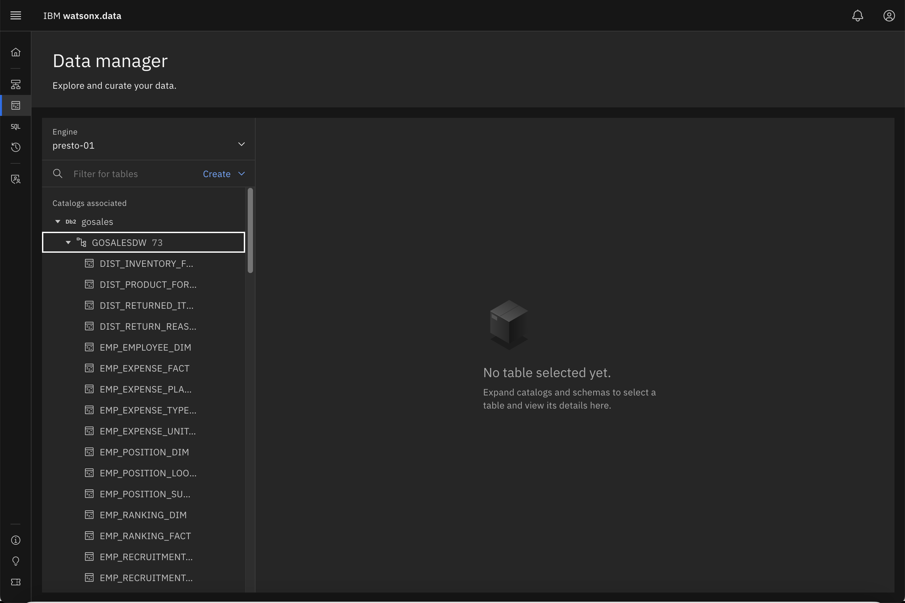

# Federation with watsonx.data

Watsonx.data can federate data from other data sources, there are a few out of box connectors and one could create additional connectors using the SDK if need be. We will be use a Db2 instance to retrieve data from that system.

### Adding Db2 to watsonx.data
To set up federation, we need to catalog the database server to the watsonx.data system. In order to do that we will need to use the Infrastructure manager.

!!! abstract "Click on the Infrastructure icon on the left side of the screen<br>"

The Infrastructure manager view should be similar to this screen.

 

!!! abstract "On the top right-hand corner, select Add Component<span style="color:blue">&rarr;</span>Add Database"


The Add database dialog is displayed.


      
!!! abstract "Enter the following values into the dialog"

    * Database type – <code style="color:blue;font-size:medium;">IBM Db2</code>
    * Database name – <code style="color:blue;font-size:medium;">gosales</code>
    * Hostname –<code style="color:blue;font-size:medium;">watsonxdata</code>
    * Port – <code style="color:blue;font-size:medium;">50000</code>
    * Display name – <code style="color:blue;font-size:medium;">gosales</code>
    * Username – <code style="color:blue;font-size:medium;">db2inst1</code>
    * Password – <code style="color:blue;font-size:medium;">db2inst1</code>
    * Catalog Name – <code style="color:blue;font-size:medium;">gosales</code>
   
Your screen should look like the one below. 


!!! abstract "Press the Test connection button to check connectivity"


!!! abstract "Once you are satisfied with the settings, press Register" 

Your infrastructure screen should now look similar to the following.


 
What we are currently missing the connection between the Presto engine and the Db2 data in gosales. We must connect the Db2 database to the Presto engine. 

!!! abstract "Use your mouse to hover over the Db2 icon until you see the Associate connection icon"


 
!!! abstract "Click on the Manage associations icon"

You should see the following confirmation dialog.


!!! abstract "Select the presto-01 engine and press Save and restart engine"
 
The infrastructure display will refresh to show the Db2 connection.


 
### Presto Federation

!!! warning "Presto Engine Status"

    When a new database or bucket is added to the watsonx.data system, the Presto engine will become unavailable temporarily while it catalogs the new objects. During this time any SQL requests or table browsing may result in an error code being displayed. The system usually restarts within a minute and you can attempt your SQL again.

We start by checking the status of our new connection to Db2. 

!!! abstract "Click on the Data Manager icon on the left side of the screen<br>"

 

Your screen should look similar to this one.

 

!!! abstract "Select the Db2 catalog and expand the gosales and gosalesdw objects"

 

!!! abstract "Select the DIST_INVENTORY_FACT table"

 

Watsonx.data is able to view the Db2 catalog and query the data that is found in it. We can now add Db2 to the queries that we run in the Presto engine.

!!! abstract "Before starting, make sure you are in the Query Workspace by clicking this icon on the left side<br>"

!!! abstract "Select the names of employees in the GOSALES database with employee ids between 4000 and 5000"
      ```
      select 
        go."EMPLOYEE_KEY", go."FIRST_NAME", go."LAST_NAME" 
      from 
        gosales."GOSALESDW"."EMP_EMPLOYEE_DIM" go
      where 
        go."EMPLOYEE_KEY" between 4000 and 5000
      order by 
        go."EMPLOYEE_KEY"
      ```

 

Now we can create a query that combines data from the TPCH catalog and the Db2 catalog.

!!! abstract "Select TPCH customers who are employees in GOSALES"
      ```
      select 
        t1.custkey, go."FIRST_NAME", go."LAST_NAME" 
      from 
        tpch.sf1.customer t1, gosales."GOSALESDW"."EMP_EMPLOYEE_DIM" go
      where 
         t1.custkey between 4000 and 5000 AND
         go."EMPLOYEE_KEY" = t1.custkey
      order by 
         t1.custkey
      ```

 

We can use the federation capability to offload tables from Db2 into a watsonx.data table.

!!! abstract "Create a table in iceberg_data using the Db2 employee table"
    ```
    create table iceberg_data.workshop.db2employee AS 
      select 
        go."EMPLOYEE_KEY", go."FIRST_NAME", go."LAST_NAME" 
      from 
        gosales."GOSALESDW"."EMP_EMPLOYEE_DIM" go
      where 
        go."EMPLOYEE_KEY" between 4000 and 5000
      order by 
        go."EMPLOYEE_KEY"
    ```

 

Now we can query the data natively with the Presto engine.

!!! abstract "Query the contents of the new db2employee table"
    ```
    select * from iceberg_data.workshop.db2employee
    ```

## Summary

In this lab you learned about the federation capabilities of the Presto engine, how to register a database into the system, and how you can run queries and create tables using Federation.