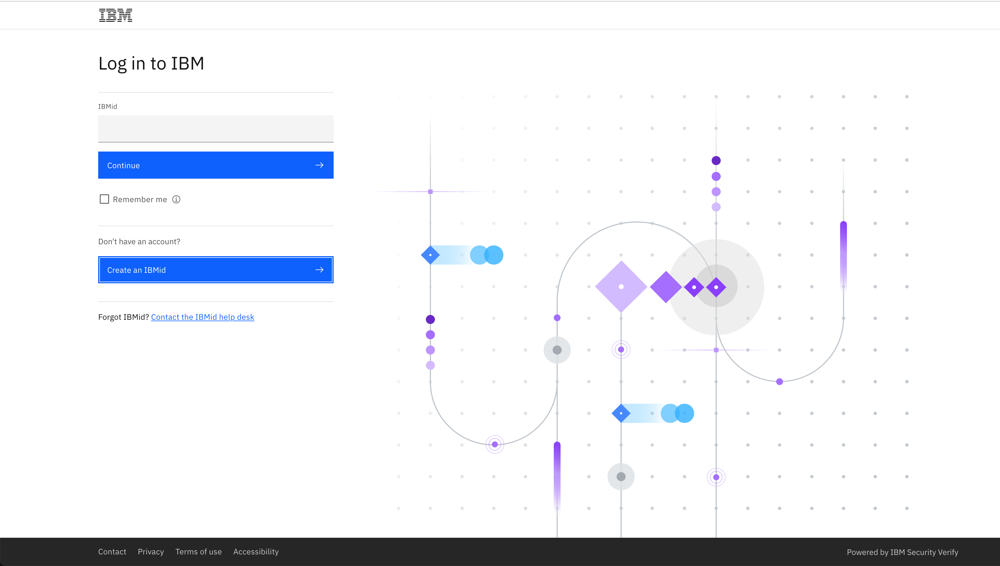

# Requesting an IBM Userid

!!! Warning "You must obtain an IBM Login Userid to use the lab"

An IBMid is needed to access IBM Technology Zone. If you do not have an IBMid, click on the following link.

<a href="https://techzone.ibm.com target="_blank">https://techzone.ibm.com</a>

You should see the following login screen for TechZone.

Click on the `Create an IBMid`` button and proceed to fill in the details on this form:

Once you have verified your account, you can continue onto logging into the TechZone server.