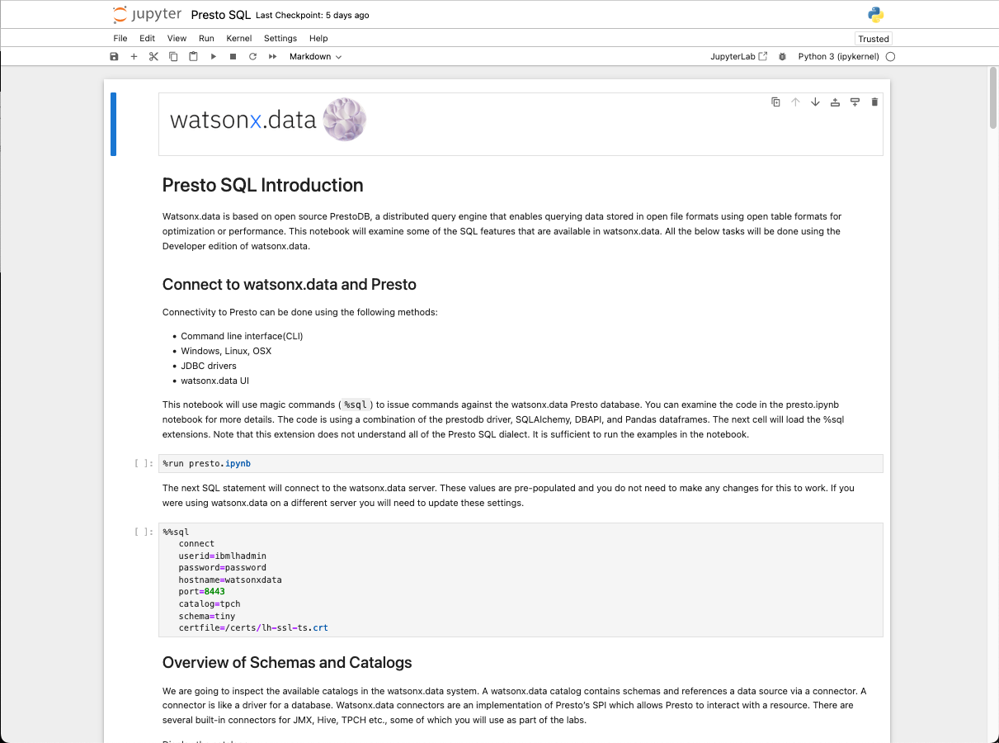

# Jupyter Notebook
The watsonx.data server includes the Jupyter Notebook service which provides an interactive way of exploring the features of the Presto database. The link to the Jupyter Notebook table of contents is provided in your TechZone reservation.

!!! abstract "Find the URL in your reservation that reads Jupyter Notebook - Server: http://useast.services.cloud.techzone.ibm.com:xxxx/notebooks/Table_of_Contents.ipynb and click on it"

The initial screen will request that you enter a password.

!!! abstract "Enter watsonx.data as the password"

 

Once you have authenticated, the main table of contents will be displayed.

 

There are 11 notebooks provided in the system, and a brief description of the notebooks are found below.

#### Introduction to Jupyter Notebooks

If you are not familiar with the use of Jupyter notebooks, this will be a good starting point. To view the notebook, click on the blue arrow found at the bottom of the box. This will open a new tab in your browser with the contents of the notebook. 

This notebook provides an introduction to what Jupyter Notebooks are and what the common tasks are that you can perform in a notebook.

#### Watsonx.data Credentials

This is a key notebook for you to use during your work with the watsonx.data system. This notebook provides details on the userids and passwords for the services that are running in the server. There is no need to use a terminal command line to determine what the credentials are! 

In addition to the userids and passwords, this notebook provides a convenient way of downloading the certificate required to connect to the Presto database. Simply click on the certificate link and it will be downloaded to your local machine.

#### Presto Magic Commands

Magic commands are special macros found in Jupyter notebooks that simplify many tasks, including the ability to run SQL commands against a database. This notebook provides an introduction to what magic commands are and how you can use the Presto magic commands to connect and query the Presto database.

#### Introduction to Presto SQL

The watsonx.data lab has two ways of running SQL against the Presto database:

* Presto CLI commands
* Python/Pandas/Magic commands

This notebook contains all the SQL that is run in the Presto SQL section of the lab. Instead of using the `presto-cli` command, this notebook uses magic commands to simplify the SQL execution.

You can choose either method to explore Presto SQL.

#### Presto Federation

Presto provides the ability to federate queries across different servers. This notebook explores the ability to federate a PostgreSQL table with a table found in Presto. This lab requires some knowledge of the watsonx.data UI, so it is recommended you become familiar with the UI before running this lab.

#### Python with watsonx.data

Accessing the Presto database in Python requires the use of the prestodb module which implements features of the DBAPI standard. The notebook demonstrates how to connect to the database and retrieve results.

#### Pandas Dataframes with watsonx.data

Pandas dataframes are commonly used in Jupyter notebooks to analyze data. This code will connect to Presto using a Pandas dataframe and display some data from an existing table that was created in Presto. Note that the certificate required for this notebook is provided in the environment. 

#### Accessing watsonx.data with Spark

This notebook demonstrates how Spark can connect to watsonx.data and manipulate the data. This system has a local, minimally configured Spark engine that will be used to access the Presto database. This engine is sufficient to demonstrate the steps needed to connect to watsonx.data and access the data that resides in the Presto catalogs.

#### Connecting to Db2

This notebook demonstrates connecting to the local Db2 server using Jupyter notebooks. 

#### Connecting to PostgreSQL

This notebook demonstrates connecting to the local PostgreSQL server using Jupyter notebooks. 

#### Connecting to MySQL

This notebook demonstrates connecting to the local MySQL server using Jupyter notebooks. 