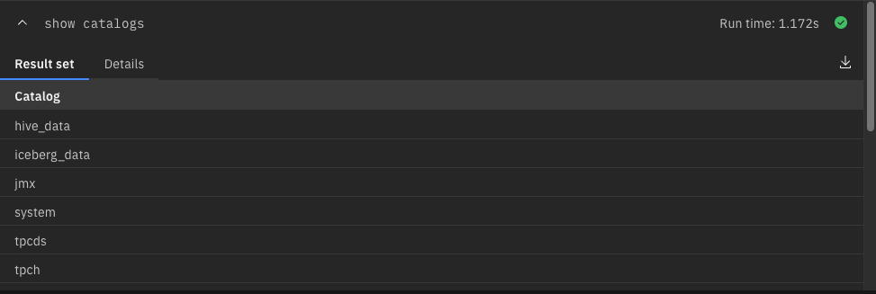
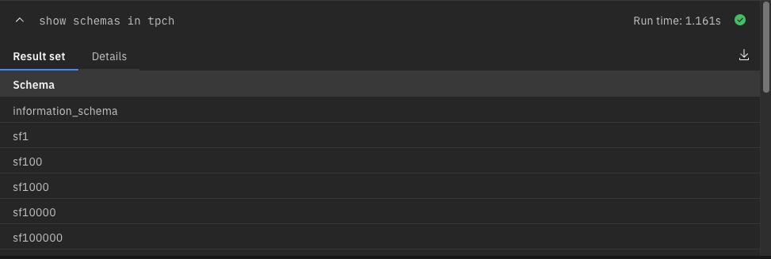
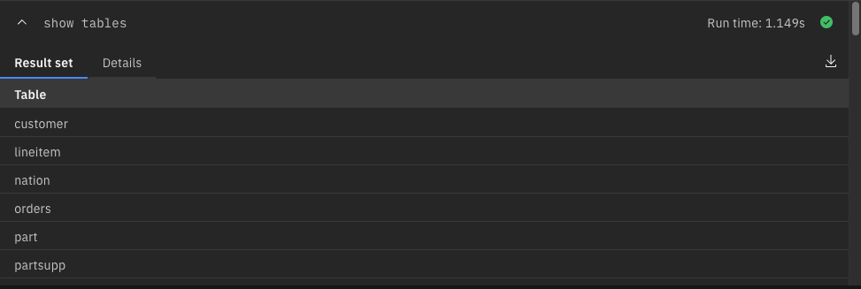
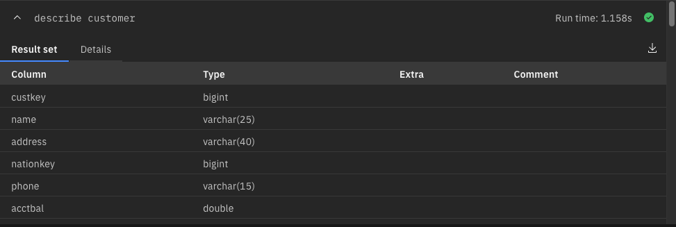
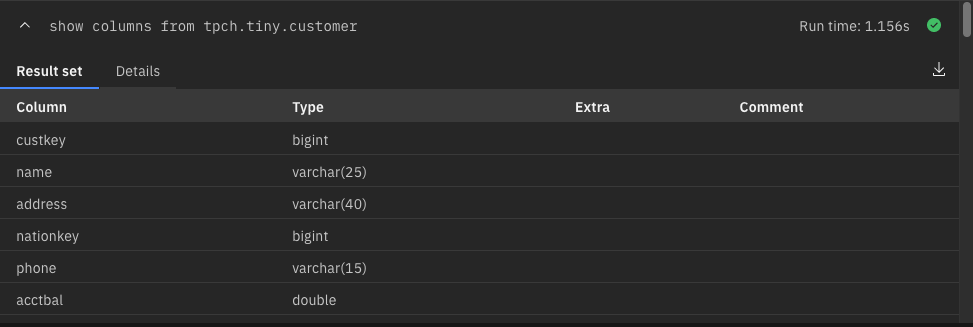
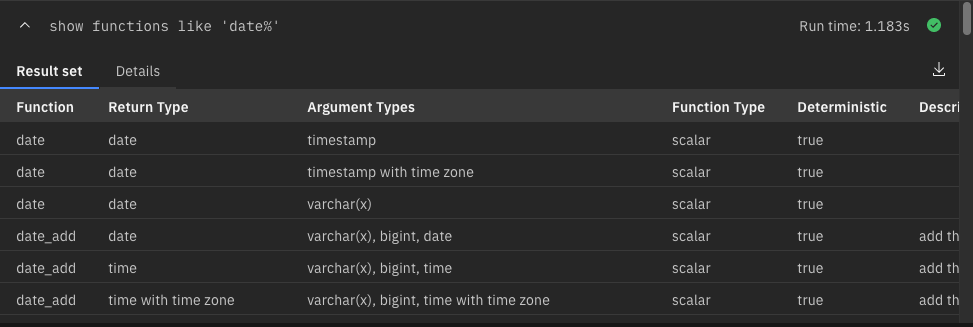
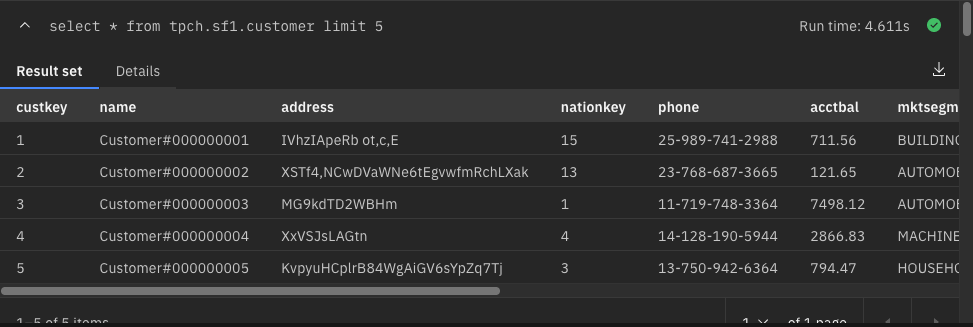
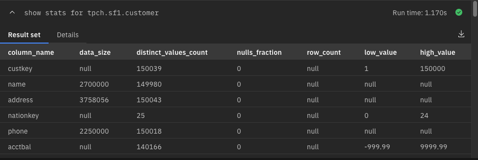

# PrestoDB Command Line Usage
 
Connectivity to watsonx.data can be done using the following methods:

   * Command line interface (CLI)
   * JDBC drivers
   * watsonx.data UI 

This lab will be using the watsonx.data Presto Command Line interface to issue the SQL commands. 
The SQL statements that you will be executing will be displayed in this format:

!!! abstract "Sample SQL"

    ```
    SELECT
      *
    FROM
      "hive_data"."ontime"."ontime"
    LIMIT
      10;
    ``` 

A copy icon is found on the far right-hand side of the command box. Use this to copy the text and paste it the SQL window. You can also select the text and copy it that way. 

The expected results are displayed below the SQL command (your results may vary depending on the query).

!!! abstract "Before starting, make sure you are in the Query Workspace by clicking this icon on the left side<br>"

### Catalog 

We are going to inspect the available catalogs in the watsonx.data system. A watsonx.data catalog contains schemas and references a data source via a connector. A connector is like a driver for a database. Watsonx.data connectors are an implementation of Presto’s SPI which allows Presto to interact with a resource. There are several built-in connectors for JMX, Hive, TPCH etc., some of which you will use as part of the labs.

!!! abstract "Display the catalogs"
    ```
    show catalogs;
    ```



Let's look up what schemas are available with any given catalog. We will use the TPCH catalog which is an internal PrestoDB auto-generated catalog and look at the available schemas.

!!! abstract "Show schemas in tpch"
    ```
    show schemas in tpch;
    ```



You can connect to a specific catalog using the `USE` command. Rather than having to type out the catalog name, you can use this command to make the catalog the default for any SQL that doesn't include it.

The command format is:
<pre style="font-size: medium; color: darkgreen; overflow: auto">
USE catalog
USE catalog.schema
</pre>

!!! abstract "Set the catalog to tpch.tiny"
    ```
    USE tpch.tiny;
    ```

Look at the available tables in the TPCH catalog under the `tiny` schema.

!!! abstract "View tables in the current schema"
    ```
    show tables; 
    ```

!!! warning "Your SQL will fail!"

The SQL doesn't quite work as expected! The reason is that each SQL statement executed in the SQL window has an independent context. What this means is that the catalog name is reset when you run another SQL statement after the `USE` statement is executed. If we bundle the two commands together, the SQL will work.

!!! abstract "Set the catalog to tpch.tiny and show the tables"
    ```
    USE tpch.tiny;
    show tables;
    ```

    
    
The describe command is used to display the format of a table.

!!! abstract "Inspect schema of the customer table"
    ```
    use tpch.tiny;
    describe customer;
    ```

 

You could also use the syntax below to achieve the same result.

!!! abstract "Show the customer table columns using an alternate format"
    ```
    show columns from tpch.tiny.customer;
    ```

    

The Presto engine includes a number of built-in functions. The following SQL will return a list of available Date functions.
 
!!! abstract "Inspect available Date functions"
    ```
    show functions like 'date%';
    ```

   

Now we will switch to a different schema and display the tables in it. In this example we use the show command with the `IN` clause to tell the system which catalog and schema to use.

!!! abstract "View the contents of the sf1 schema"
    ```
    show tables in tpch.sf1;
    ```

       

!!! abstract "Query data from customer table"
    ```
    select * from tpch.sf1.customer limit 5;
    ```

   

Presto gathers statistics for tables in order to generate more accurate access plans. This SQL will gather statistics on a given table.

!!! abstract "Gather statistics on the customer table"
    ```
    show stats for tpch.sf1.customer;
    ```

 

## Summary

This lab has provided an introduction to some of the SQL that is available in Presto and watsonx.data. The next set of labs will demonstrate some more sophisticated SQL that can be run in the Presto engine.