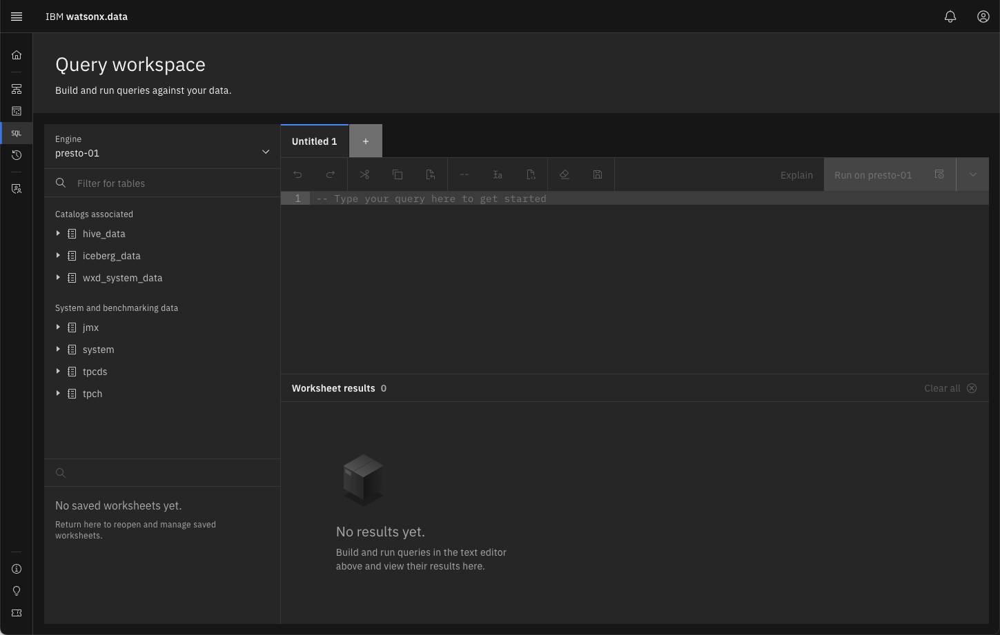
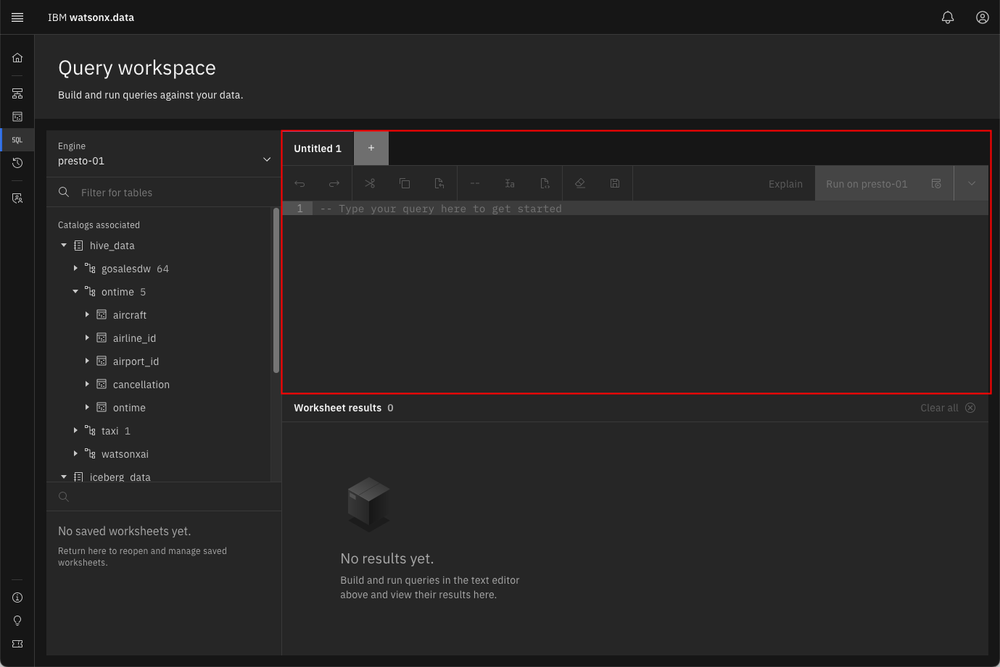
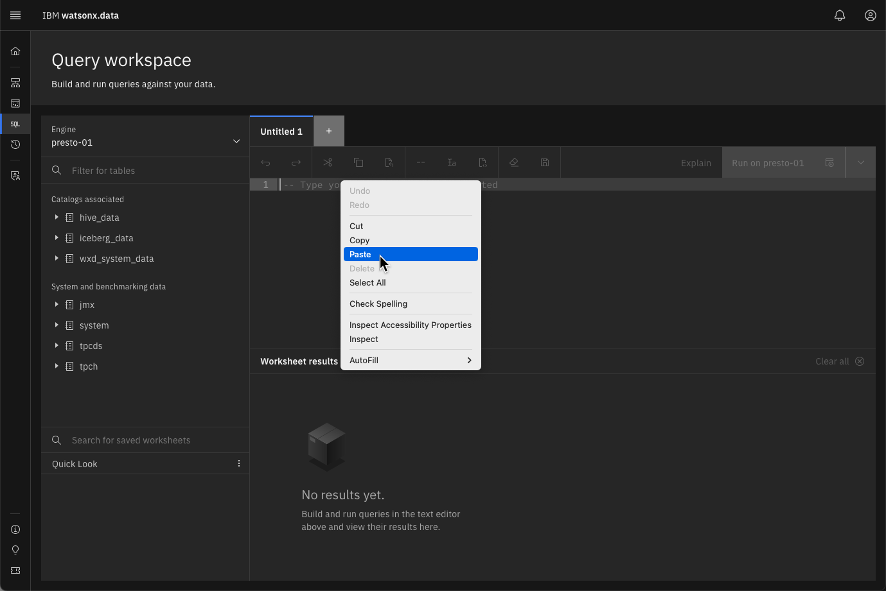
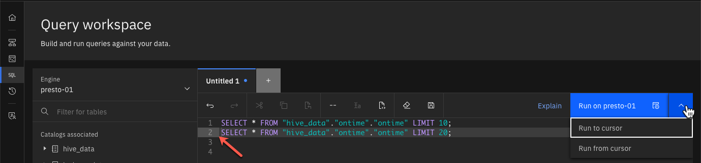
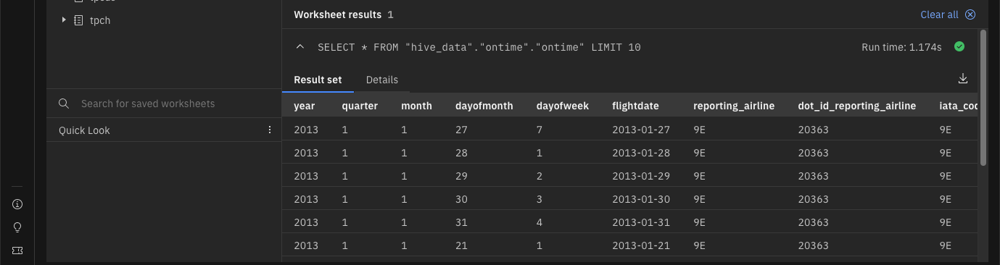
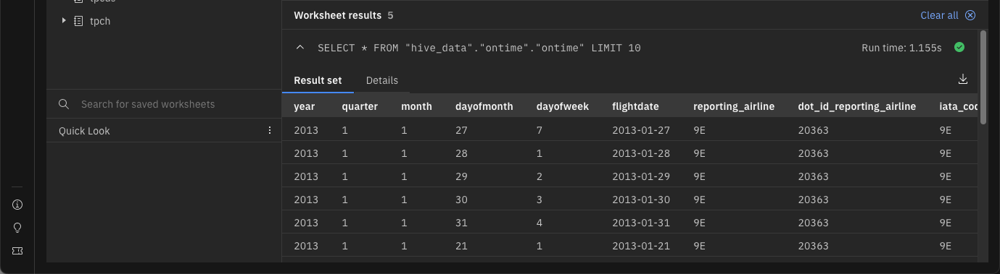
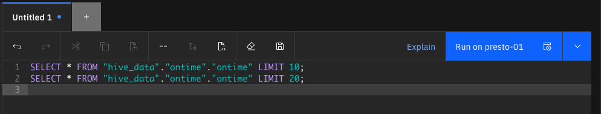

# Query Workspace

An earlier lab introduced the [Query Workspace](wxd-intro-queryworkspace.md). In this section we will provide some best practices on how to use this workspace to run the SQL examples.

!!! abstract "Click on the Query Workspace icon on the left side of the screen<br>"

 

The Query workspace will have a similar layout to the Data Manager screen, where you can navigate through the catalogs associated with the selected engine.

 

The SQL work area is found to the right of the catalog and table names.

 

The SQL work area will be used to run the commands in the lab. All the SQL examples will use the following format:

!!! abstract "Retrieve 10 rows from the ontime table"

    ```
    SELECT
      *
    FROM
      "hive_data"."ontime"."ontime"
    LIMIT
      10;
    ``` 

A copy icon is usually found on the far right-hand side of the command box. Use this to copy the text and paste it into the SQL window. You can also select the text and copy and paste it, although you need to be careful that you have selected all the text.

 

You can also use the paste command in your operating system (Command-V for OSX and Control-V for Windows).

!!! abstract "Copy the following SQL and place it into the SQL window"

    ```
    SELECT * FROM "hive_data"."ontime"."ontime" LIMIT 10;
    SELECT * FROM "hive_data"."ontime"."ontime" LIMIT 20;
    ``` 

!!! abstract "Place your cursor at the front of the second statement and left click, then use the Drop Menu to reveal two run options"



There are four options for running statements:

* Run (no dropdown) - This will run all the statements in the SQL text found in the window
* Run to cursor - Run the statements up to the cursor position
* Run from cursor - Run the statement after the cursor position
* Run selection - Run the selected text

!!! abstract "Run to cursor"



The results displayed are for the first SQL statement (LIMIT 10).

!!! abstract "Run from cursor"


The results displayed are for the second SQL statement (LIMIT 20).

!!! abstract "Run (no dropdown)"


Both statements will execute. Scrolling down on the answer set will show that there are four result sets (one for each SQL statement executed).

!!! abstract "Run with selection (Select the first SQL line)"


The results should be the same as the first query.



When running SQL statements you have the choice of opening up a new SQL window by pressing the `[+]` at the top of the SQL text box.


There are some additional icons at the top of the SQL screen that you may find useful.



These icons represent:

* Undo last change
* Redo last change
* Cut the selected text
* Copy the selected text
* Paste 
* Comment out the line(s) lines selected
* Format the select SQL 
* Format the Worksheet
* Clear the Worksheet 
* Save the SQL

Finally, there are two special characters that you should be aware of when dealing with SQL. The first is the statement terminator, the semicolon `;`. The semicolon terminates an SQL statement. You can place multiple SQL statements into an SQL window and execute them as a block (Run) or by selecting the SQL text that you want to run and then pressing Run. 

The second special character is the double dash `--` which is used to comment out everything after that position in the text.

For instance, the following SQL will only run the second statement:

<pre style="font-size: medium; color: darkgreen; overflow: auto">
    -- SELECT * FROM "hive_data"."ontime"."ontime" LIMIT 10;
    SELECT * FROM "hive_data"."ontime"."ontime" LIMIT 20;
</pre>

The comment characters become very useful when debugging SQL statements!

## Summary

This lab you learned about some additional hints and tips on using the Query Workspace and the use of the SQL window.