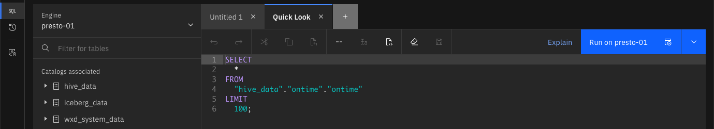

# Query Workspace
Databases and query engines such as Presto have multiple ways that users can interact with the data. For example, there is usually an interactive command line interface (CLI) that lets users run SQL statements from a command terminal. 

Applications can use JDBC (Java Database Connectivity) to connect to the data store and run SQL statements. The watsonx.data user interface includes an SQL interface for building and running SQL statements. This is called the Query workspace. Users can write or copy in their own SQL statements, or they can use templates to assist in building new SQL statements.

!!! abstract "Click on the Query Workspace icon on the left side of the screen "

 

The Query workspace will have a similar layout to the Data Manager screen, where you can navigate through the catalogs associated with the selected engine.

 

The SQL work area is found to the right of the catalog and table names.

 

You can type, paste, or use saved workspaces to enter SQL (Structured Query Language) commands into this window. An SQL statement instructs the database engine what records to look for in one or more tables. The Query workspace provides several pre-built SQL statements that can be generated for tables already cataloged in the system.

In the Data Manager lab, the Data sample tab was used to view a subset of the data in the airline_delay_cause table.

 
 
This data can be generated in the Query Workspace window by using a prebuilt SQL generator. 

!!! abstract "Expand the hive_data catalog by clicking on the &#9658; beside the hive_data name"

You should now see all the schemas associated with the catalog, including the `ontime` schema.

!!! abstract "Expand the ontime schema by pressing &#9658; beside the schema name"

The `ontime` schema includes 5 tables.

!!! abstract "Hover your mouse over the ontime table name"

When your mouse hovers over a table name, two icons will become visible.

 

The first icon the refresh symbol &#8634;.
 
The refresh icon forces the watsonx.data UI to retrieve details about the schema or table. Note that watsonx.data does not always reflect the status of tables in the display. The refresh process in not synchronous (i.e., it does not know that an update may have occurred to a table), so changes are not immediately shown in the display. 

The second icon &lt;/&gt; is used to display query templates. 
 
!!! abstract "Click on the query template icon when it appears on the ontime table line"

The menu provides four templates for your table:

* Generate Path – The path description (or location) of the object.
* Generate Select – An SQL statement that will return the contents of the table.
* Generate Alter – An SQL statement (DDL – Data Definition Language) used to alter characteristics of the table, like adding a column.
* Generate Drop – An SQL statement used to remove the object from the system.

!!! abstract "Select the Generate SELECT option"

The system has populated the SQL window with the catalog name, the schema and the table name. This SQL will retrieve all the columns of the table and limit the output to 10 rows (LIMIT 10). 

The Run on presto-01 button is highlighted at the far right of the SQL window. 

The button will reflect which engine watsonx.data will run your query on. There is a pulldown menu beside the button that provides an option to run the query to the point where your cursor is on the text, or from where your cursor is on the text.

You can use these options to run portions of an SQL statement when you are debugging results. In this instance, you just want to run the query and display the results. 

!!! abstract "Press the Run on presto-01 button and wait for the results to return"

Near the middle of the screen, you will see the statement that was executed, the run time, and the success or failure of the statement.

The result set (if there is one) is displayed below the SQL statement.

An export icon &DownArrowBar; is found on the far-right side of the result set. Clicking on the export icon will download the results as a CSV file on your workstation.

!!! abstract "Select the Details tab in the result set window"

This dialog provides more information on the execution of the SQL statement. If you want additional details on the query execution plan, you can press the Explain button beside the Run on presto-01 button.

!!! abstract "Press the Explain button in the SQL window"

The graph displays the steps the Presto engine took to compute the answer. 
You can click on any one of the boxes in the diagram to display the details of the step. The system will not show many details because the data is in a hive catalog and not optimized for retrieval.

!!! abstract "Close the Explain dialog by pressing the [x]"

If you find that you are running the same SQL repeatedly, you can save the SQL as a worksheet. The SQL window should still have your select statement that was generated to retrieve the first 10 rows of the table. The save button is found above the SQL.

!!! abstract "Press the save button"

The Save icon will open a dialog to save the SQL statement.

!!! abstract "Enter the name Quick Look and press the Save button"

At the bottom of your catalog and table list you will see a list of saved worksheets. In there should be the one you just saved called `Quick Look`.

!!! abstract "If you do not see your file, refresh your browser window"

!!! abstract "Open a new SQL tab [+] and then click on the Quick Look worksheet you created"
 
When you click on the name of a worksheet, the SQL will be placed into the current tab in the SQL window, with the tab containing the name of your saved worksheet. 

 
You can now modify the SQL before running it to retrieve results.

## Summary

This chapter explored the use of the Query Workspace to run SQL commands, generate queries, and determine how the optimizer ran a query. In addition, the ability to store and retrieve SQL was used.