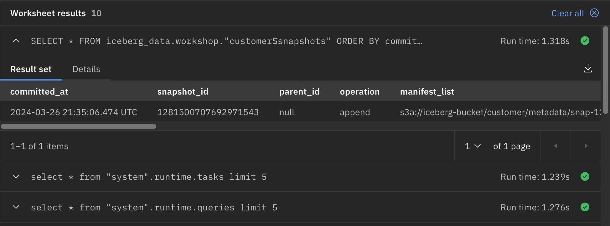
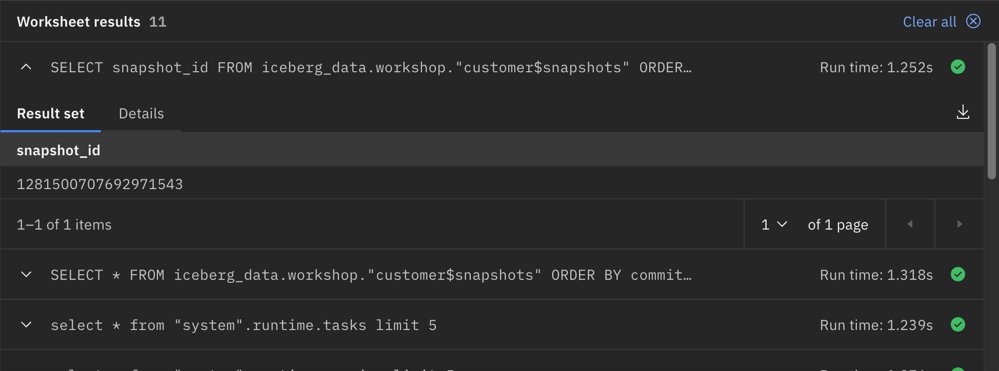
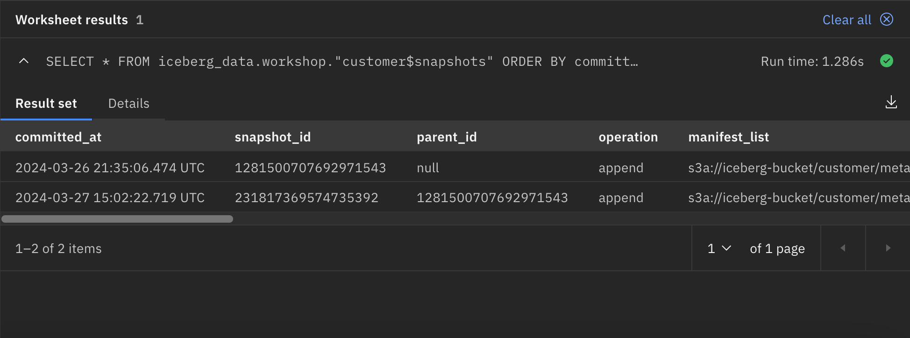
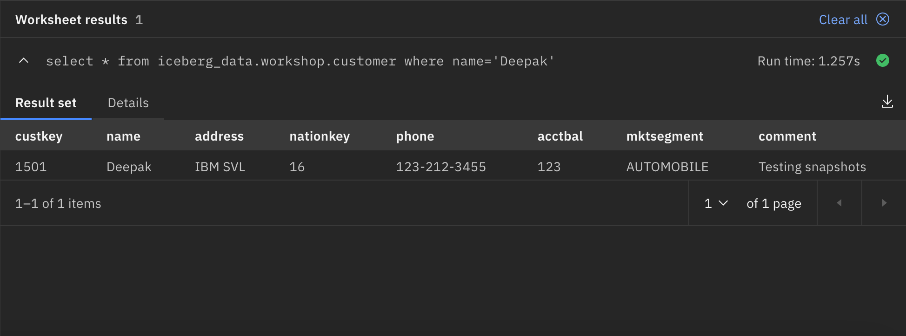
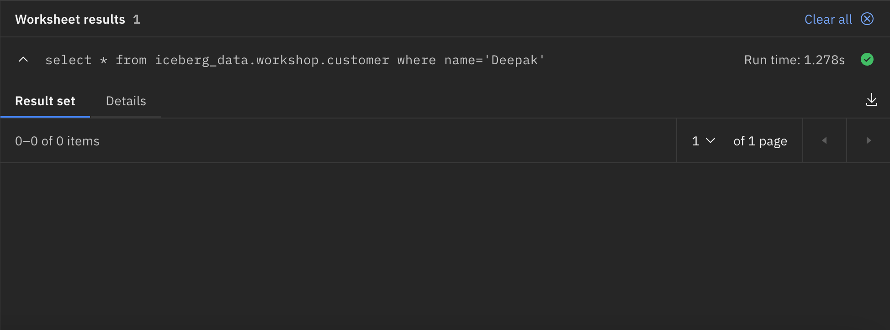

# Time Travel

Time travel allows you change the view of the data to a previous time. This is not the same as an `AS OF` query commonly used in SQL. The data is rolled back to a prior time.

!!! abstract "Before starting, make sure you are in the Query Workspace by clicking this icon on the left side<br>"

Let us look at the snapshots available for the customer table in the workshop schema.

!!! abstract "Check current snapshots – STARTING STATE"
      ```
      SELECT 
         * 
      FROM 
         iceberg_data.workshop."customer$snapshots" 
      ORDER BY 
         committed_at;
      ```



You need to capture the first snapshot ID returned by the SQL statement. You will need this value when you run the rollback command.

!!! abstract "Capture the first snapshot ID"
      ```
      SELECT 
         snapshot_id 
      FROM 
         iceberg_data.workshop."customer$snapshots" 
      ORDER BY 
         committed_at;
      ```

      

Remember the number that was returned with the query above. 

!!! warning "Your snapshot ID will be different than the examples in this lab"

Insert the following record to change the customer table in the workshop schema. 

!!! abstract "Insert a new customer record into the table"
      ```
      insert into iceberg_data.workshop.customer 
         values(1501,'Deepak','IBM SVL',16,'123-212-3455',
                123,'AUTOMOBILE','Testing snapshots');
      ```
 
Let's look at the snapshots available for the customer table in the workshop schema. You should have 2 snapshots. 

!!! abstract "View available snapshots"
      ```
      SELECT 
         * 
      FROM 
         iceberg_data.workshop."customer$snapshots" 
      ORDER BY 
         committed_at;
      ```

 

Querying the customer table in the workshop schema, we can see the record inserted with name=’Deepak’.

!!! abstract "Select customer Deepak"
      ```
      select * from iceberg_data.workshop.customer where name='Deepak';
      ```

 

We realize that we don't want the recent updates or just want to see what the data was at any point in time to respond to regulatory requirements. We will leverage the out-of-box system function `rollback_to_snapshot` to rollback to an older snapshot. The syntax for this function is:
<code style="color:blue; font-size: small">CALL iceberg_data.system.rollback_to_snapshot('workshop','customer',x);</code>

The "x" would get replaced with the <code style="color:blue;font-size:medium;">snapshot_id</code> number that was found in the earlier query. It will be different on your system than the examples above.

!!! abstract "View the available snapshots"
      ```
      SELECT 
         snapshot_id 
      FROM 
         iceberg_data.workshop."customer$snapshots" 
      ORDER BY 
         committed_at;
      ```

!!! abstract "Copy the first snapshot ID back into the SQL window by itself. Then when you copy the next command, make sure to paste the SQL before the number, and then you can edit the SQL to add the snapshot ID." 

!!! abstract "Rollback to previous snapshot - Replace the ID parameter with the snapshot ID previously found. Remember the closing parenthesis!"
      ```
      CALL iceberg_data.system.rollback_to_snapshot('workshop','customer',ID)
      ```

The only output that is produced is a true or false value.

Querying the customer table in the workshop schema, we cannot see the record inserted with name=’Deepak’.

!!! abstract "Select customer Deepak"
      ```
      select * from iceberg_data.workshop.customer where name='Deepak';
      ```



## Summary

In this lab you learned how to rollback transactions to a previous checkpoint in the table.