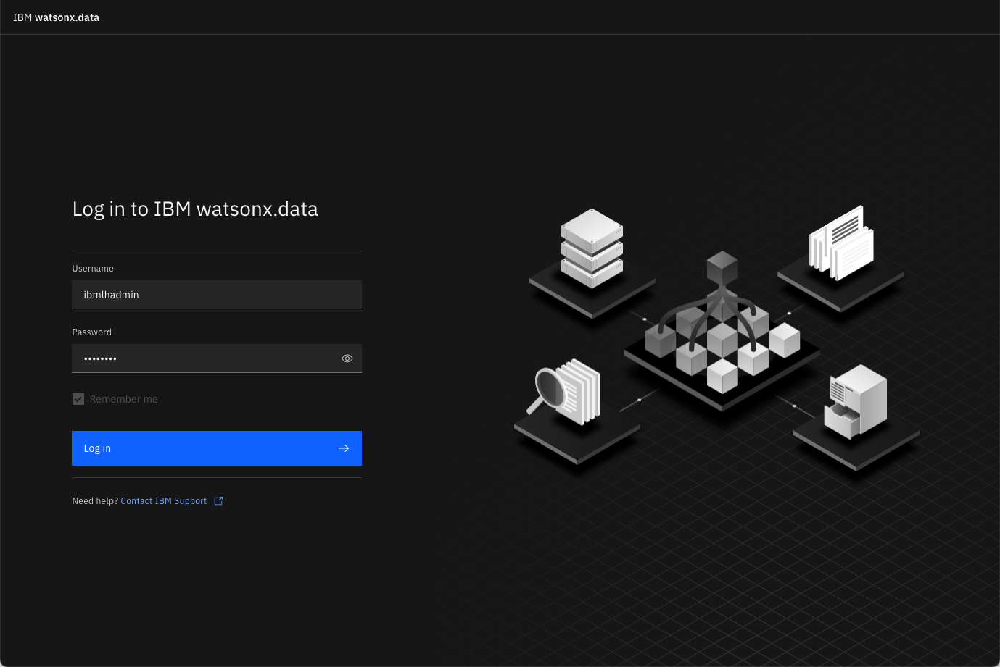
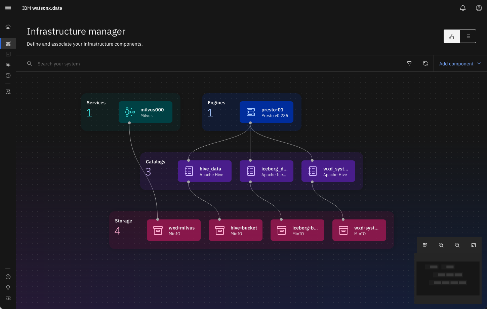
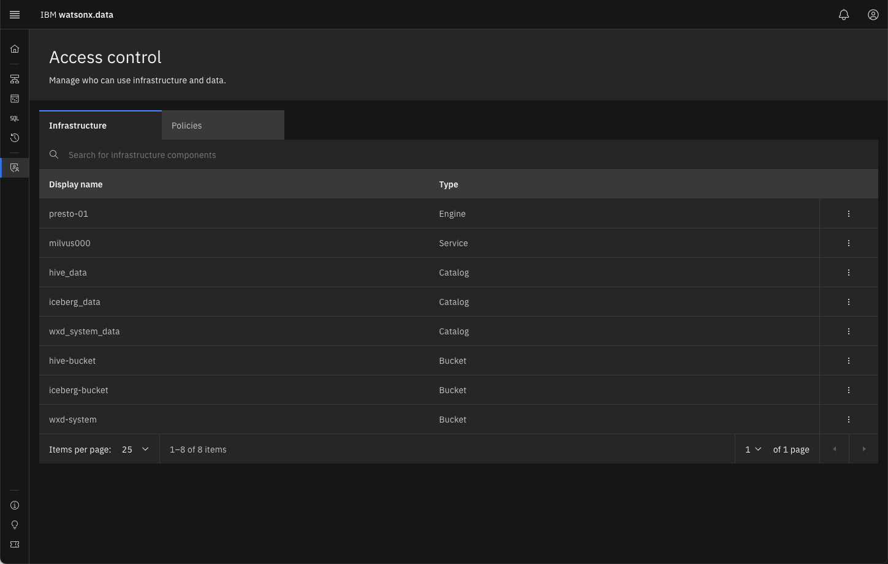

# Watsonx.data Console UI Overview
Your TechZone reservation will include the server name and port number to use when connecting to the watsonx.data UI. 

<code style="color:blue; font-size: 90%;">Watsonx UI - https://na4.services.cloud.techzone.ibm.com:xxxxx</code>

!!! abstract "Click on the watsonx.data UI supplied link or copy the URL and port number into your browser"

The watsonx.data UI will display with a login prompt.

!!! abstract "Enter the credentials for the ibmlhadmin user and press Log in"

    * Username: ibmlhadmin
    * Password: password

After entering the userid and password, the main watsonx.data UI will be displayed.
  
  

## Watsonx.data UI Navigation

The main screen provides a snapshot of the objects that are currently found in the watsonx.data system. The infrastructure display shows that there is 1 engine, 3 catalogs, 4 buckets, and no databases associated with the system.

 

You can examine these objects by using the menu system found on the left side of the screen. 

!!! abstract "Click on the hamburger icon "

This will provide a list of items that you can explore in the UI.

You can also access this list by clicking on one of the following icons.

    

A brief description of the items is found below.

* Display the Home page.
* Infrastructure Manager – Displays the current engines, buckets and databases associated with the installation.
* Data Manager – Used to explore the various data sources that are cataloged in the system. You can explore the schemas, tables, table layout and view a subset of the data with this option. 
* Query Workspace – An SQL-based query tool for accessing the data.
* Query History – A list of SQL queries that were previously run across all engines.
* Access Control – Control who can access the data.

#### Home Page
Displays a summary of the watsonx.data system and provides a summary of recent activity in the system.

#### Infrastructure manager
The Infrastructure manager displays the current engines, buckets and databases associated with the installation.

!!! abstract "Click on the Infrastructure Manager icon "

 

#### Data Manager

The Data Manager is used to explore the various data sources that are cataloged in the system. You can explore the schemas, tables, table layout and view a subset of the data with this option. The display make take a few minutes to show the schemas in the system as it is querying the catalog and populating the descriptions on the screen.

!!! abstract "Click on the Data Manager icon "

 

#### Query Workplace

The Query Workspace provides an SQL-based query tool for accessing the data.

!!! abstract "Click on the Query Workplace icon "

 

#### Query History

The Query History displays a list of SQL queries that were previously run across all engines.

!!! abstract "Click on the Query History icon "

 

#### Access Control

The Access Control dialog provides controls for who can access the data.

!!! abstract "Click on the Access Control icon "

 

!!! warning "Access Control Restrictions"

The Developer Edition does not provide the ability to add or remove users from the Access Control panel. The full version of watsonx.data does provide this capability. Add and removing users can be done through a command line interface instead.

## Summary
In this lab you learned how to display the watsonx.data UI. You then explored some of the menu items that are found in the watsonx.data UI itself.

The subsequent labs will explore the following menu items:

* Infrastructure Manager
* Data Manager
* Query Workspace
* Access Control

The next section will examine the Infrastructure Manager and how it provides a graphical view of the watsonx.data system.
