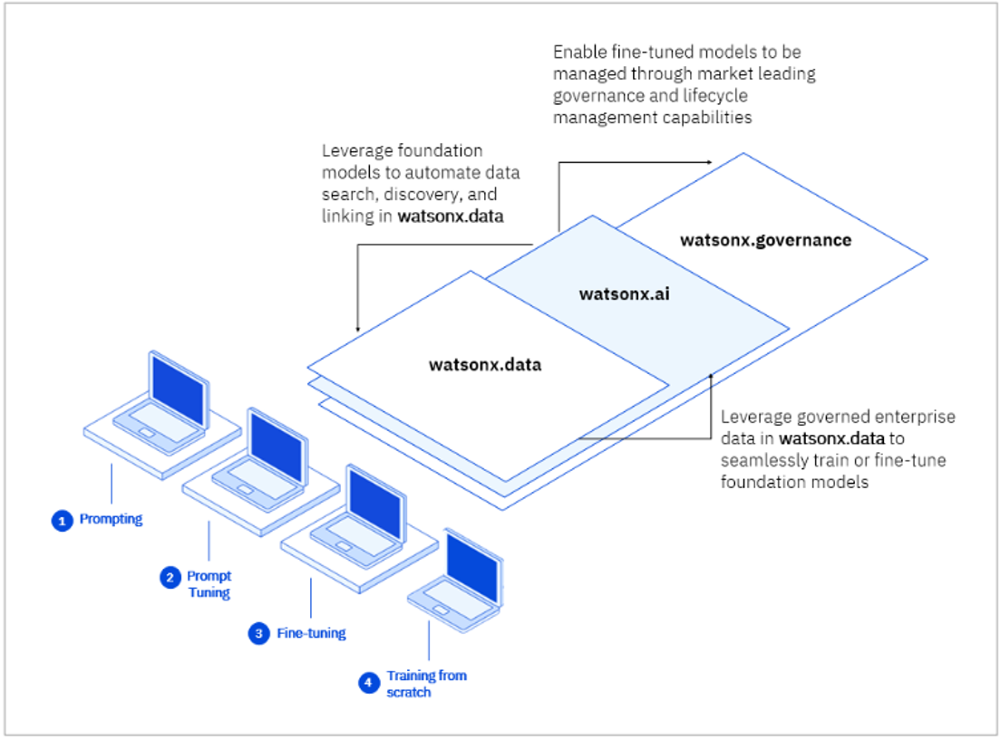
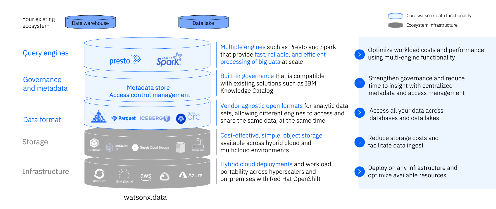

# Introducing watsonx.data 

# Introducing watsonx.data 

Watsonx.data is a core component of watsonx, IBM’s enterprise-ready AI and data platform designed to multiply the impact of AI across an enterprise’s business.
The watsonx platform comprises three powerful components: the watsonx.ai studio for new foundation models, generative AI, and machine learning; the watsonx.data fit-for-purpose data store that provides the flexibility of a data lake with the performance of a data warehouse; plus, the watsonx.governance toolkit, to enable AI workflows that are built with responsibility, transparency, and explainability.

The watsonx.data component (the focus of this lab) makes it possible for enterprises to scale analytics and AI with a data store built on an open lakehouse architecture, supported by querying, governance, and open data and table formats, to access and share data. With watsonx.data, enterprises can connect to data in minutes, quickly get trusted insights, and reduce their data warehouse costs.

The next-gen watsonx.data lakehouse is designed to overcome the costs and complexities enterprises face. This will be the world’s first and only open data store with multi-engine support that is built for hybrid deployment across your entire ecosystem.
 
   * Watsonx.data is the only lakehouse with multiple query engines allowing you to optimize costs and performance by pairing the right workload with the right engine.
   * Run all workloads from a single pane of glass, eliminating trade-offs with convenience while still improving cost and performance.
   * Deploy anywhere with full support for hybrid-cloud and multi cloud environments.
   * Shared metadata across multiple engines eliminates the need to re-catalog, accelerating time to value while ensuring governance and eliminating costly implementation efforts.

# Watsonx.data Lab 
The watsonx.data hands-on lab introduces you to several core components and capabilities of IBM watsonx.data. By completing this lab, you will gain and understanding of what the watsonx.data platform provides for users.

Specifically, you will get hands-on experience in the following areas:

* The watsonx.data web-based user interface (UI), including infrastructure management, data management, running SQL statements, and managing user access
* An introduction to Presto SQL 
* Running queries that combine data from multiple data sources (data federation)
* Offloading tables from Db2 into watsonx.data
* Rolling back a table to a previous point in time

This lab requires that a workshop environment be provisioned for you using the IBM Technology Zone (TechZone). The image used comes pre-configured with watsonx.data Developer Edition, additional database systems including Db2 and PostgreSQL, and sample data sets. 

!!! info "Watsonx.data Dialogs and Screens"

Watsonx.data is being developed and released in an agile manner. In addition to new capabilities being added, the web interface is also likely to change over time. Therefore, the screenshots used in this lab may not always look exactly like what you see.

This lab uses the watsonx.data developer package. The Developer package is meant to be used on single nodes. While it uses the same code base, there are some restrictions, especially on scale. In this lab, we will open some additional ports as well to understand how everything works. We will also use additional utilities to illustrate connectivity and what makes the watsonx.data system "open". 

We organized this lab into a number of sections that cover many of the highlights and key features of watsonx.data.

   * Access a TechZone or VMWare image for testing
   * Checking watsonx.data status
   * Introduction to watsonx.data components
   * Analytical SQL
   * Advanced SQL functions
   * Time Travel and Federation
   * Working with Object Store Buckets

In addition, there is an Appendix which includes common errors and potential fixes or workarounds. 

## Watsonx.data Developer Image 

The watsonx.data system is running on a virtual machine with the following resources:

   * 4 vCPUs
   * 16Gb of memory
   * 400Gb of disk

This is sufficient for running this exercises found in this lab but should not be used for performance testing or dealing with large data sets.

## Watsonx.data Level 3/4 Technical Training

For the Level 3 and 4 technical training courses, you should choose the watsonx.data developer image which specifically mentions the courses. This system is used as a basis for the watsonx.data Level 3/4 Technical Training images, but will container newer code that may change the UI screens and scripts that are used in the training material. 

For the detailed lab material, please refer to the following PDF found in Seismic: [https://ibm.seismic.com/Link/Content/DCG37pjmPj7VmGCHj2Df8fHVmDJj](https://ibm.seismic.com/Link/Content/DCG37pjmPj7VmGCHj2Df8fHVmDJj)
