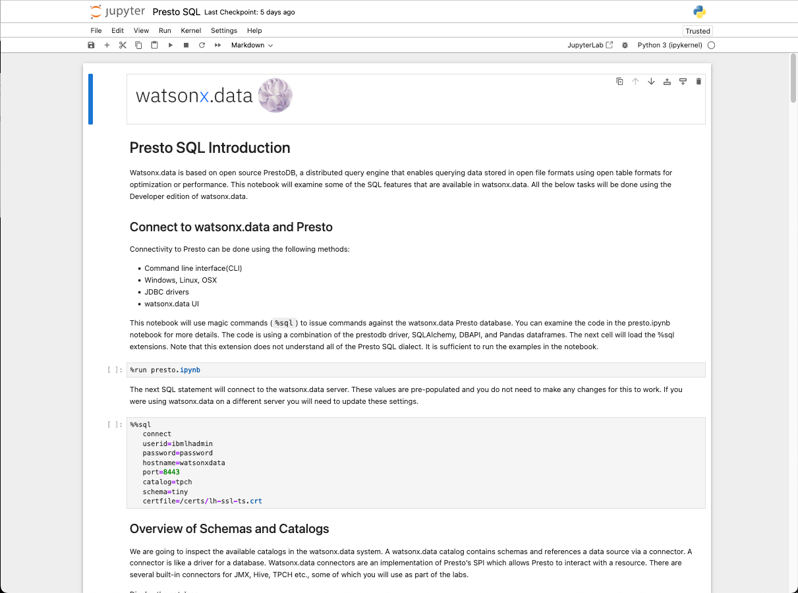

# Jupyter Notebook
The watsonx.data server includes the Jupyter Notebook service which provides an interactive way of exploring the features of the Presto database. The link to the Jupyter Notebook table of contents is provided in your TechZone reservation.

When you initially open the link, it will request a password to view the Table of Contents:

The default password for the notebook is `watsonx.data`. Once you enter the password, the Table of Contents will be displayed.

There are several notebooks provided in the system, and a brief description of the notebooks are found below.

#### Introduction to Jupyter Notebooks

If you are not familiar with the use of Jupyter notebooks, this will be a good starting point. To view the notebook, click on the blue arrow found at the bottom of the box. This will open a new tab in your browser with the contents of the notebook. 

This notebook provides an introduction to what Jupyter Notebooks are and what the common tasks are that you can perform in a notebook.

#### Watsonx.data Credentials

This is a key notebook for you to use during your work with the watsonx.data system. This notebook provides details on the userids and passwords for the services that are running in the server. There is no need to use a terminal command line to determine what the credentials are! 

In addition to the userids and passwords, this notebook provides a convenient way of downloading the certificate required to connect to the Presto database. Simply click on the certificate link and it will be downloaded to your local machine.

#### Presto Magic Commands

Magic commands are special macros found in Jupyter notebooks that simplify many tasks, including the ability to run SQL commands against a database. This notebook provides an introduction to what magic commands are and how you can use the Presto magic commands to connect and query the Presto database.

#### Introduction to Presto SQL

The watsonx.data lab has two ways of running SQL against the Presto database:

* Presto CLI commands
* Python/Pandas/Magic commands

This notebook contains all the SQL that is run in the Presto SQL section of the lab. Instead of using the `presto-cli` command, this notebook uses magic commands to simplify the SQL execution.

You can choose either method to explore Presto SQL.

#### Additional Notebooks

There are additional notebooks that explore different features of watsonx.data.

* Presto Federation
* Python with watsonx.data
* Pandas Dataframes with watsonx.data
* Accesing watsonx.data with Spark
* Converting CSV files to Parquet
* Connecting to Db2
* Connecting to PostgreSQL
* Connecting to MySQL
* Connecting to Milvus
* Milvus Example
* Milvus Attu Console
* Create a Kafka Service
* Kafka Console
* Using RESTful Services in Presto
* Using RESTful Services in watsonx.data
* Running Notebooks in an External Service
* New Notebooks Link

The last notebook (New Notebooks) contains a link to any new notebooks that may have been introduced after this image was released.