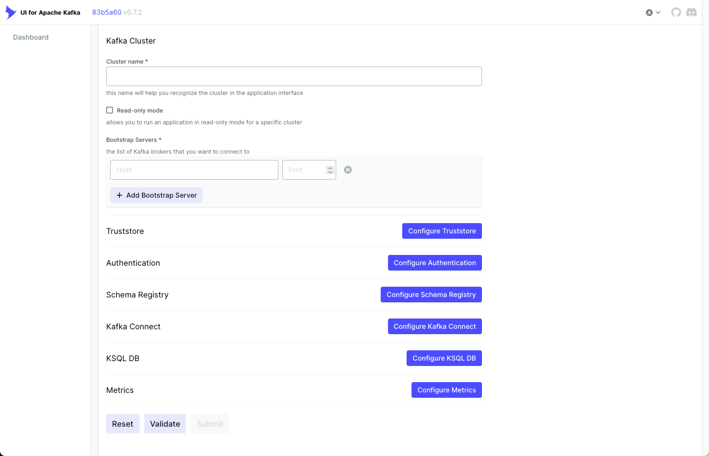
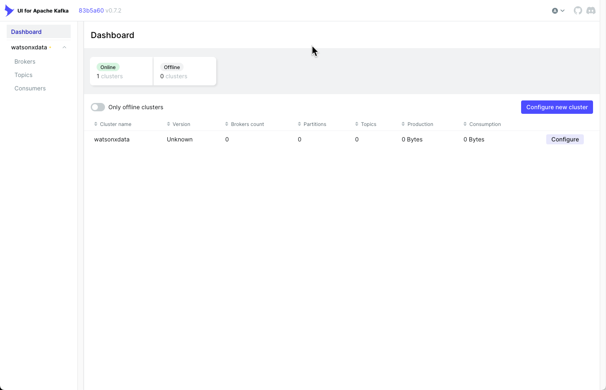
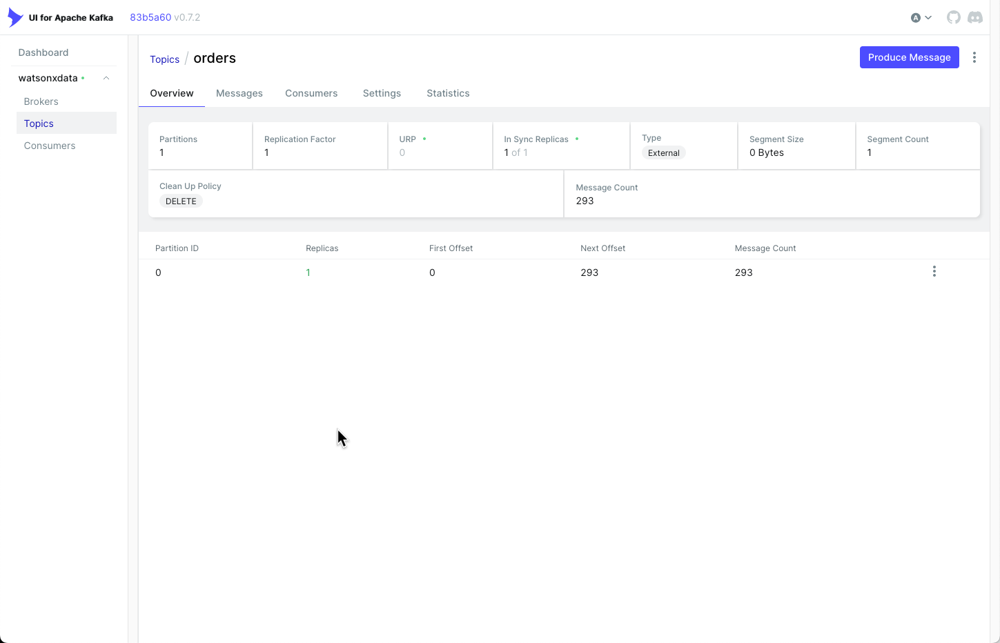

# Kafka Console

This section provides instructions on how to start and use the UI for [Apache Kafka Clusters.](https://github.com/provectus/kafka-ui)

!!! quote "UI for Apache Kafka is a free, open-source web UI to monitor and manage Apache Kafka clusters. The UI for Apache Kafka is a simple tool that makes your data flows observable, helps find and troubleshoot issues faster and deliver optimal performance. Its lightweight dashboard makes it easy to track key metrics of your Kafka clusters - Brokers, Topics, Partitions, Production, and Consumption.<sup>1</sup>"

Some of the key features:

* Multi-Cluster Management — monitor and manage all your clusters in one place
* Performance Monitoring with Metrics Dashboard — track key Kafka metrics with a lightweight dashboard
* View Kafka Brokers — view topic and partition assignments, controller status
* View Kafka Topics — view partition count, replication status, and custom configuration
* View Consumer Groups — view per-partition parked offsets, combined and per-partition lag
* Browse Messages — browse messages with JSON, plain text, and Avro encoding
* Dynamic Topic Configuration — create and configure new topics with dynamic configuration
* Configurable Authentification — secure your installation with optional Github/Gitlab/Google OAuth 2.0

<p style="font-size: small;line-height: 0.4;"><sup>1. Additional details can be found on the <a href="https://github.com/provectus/kafka-ui">Kafka UI website.</a></sup></p>

## Starting the Kafka UI

Before starting the Kafka UI service, you will need to choose a port number to expose the UI to the network. In your reservation you will find two open port numbers:

* Open Port 1 - Server: useast.services.cloud.techzone.ibm.com Port: 12345
* Open Port 2 - Server: useast.services.cloud.techzone.ibm.com Port: 23456

These ports are available for any service that you decide to use in the machine. The first open port maps to the internal port 10000, while the second open port is for 10001. In this notebook, Open Port 2 (10001) is going to be used as the Kafka UI port. When accessing the Kafka UI, you will need to use the following address in your browser (with the URL and port number adjusted to your reservation):

```python
useast.services.cloud.techzone.ibm.com:23456
```

The next command will start the Kafka UI service. 
### Start Kafka UI
If you want to change to open port #1, change the <span style="color:blue;background-color: transparent;">-p 10001:8080</span> to <span style="color:blue;background-color: transparent;">-p 10000:8080</span>.

!!! abstract "Start Kafka UI"
      ```
      sudo docker run --detach --name kafkaui -p 10001:8080 -e DYNAMIC_CONFIG_ENABLED=true provectuslabs/kafka-ui
      ```

### Stop Kafka UI
If you want to stop the Kafka UI service, run the following docker command.

!!! abstract "Stop Kafka UI"
      ```
      sudo docker stop kafkaui
      ```

## Kafka UI Overview
The following section describes some of the screens that you will use when accessing the Kafka service running on your watsonx server.

### Initial Connection

In a new browser tab, enter the name of your watsonx.data server and the port number assigned to Open Port #2 (10001) in your reservation.

* Open Port 2 - Server: useast.services.cloud.techzone.ibm.com Port: 23456

You should see the initial connection dialog displayed. Note that there is no authentication performed by this interface.



### Configure the Kafka Connection
In order to get the Kafka UI running, you must add details about the Kafka server that is running. Since the Kafka UI is running inside the watsonxdata server, the addresses reflect the internal address of the server, rather than a traditional URL. Use the following values:

* Cluster name - <span style="color:blue;background-color: transparent;">watsonxdata</span>
* Bootstrap Server - <span style="color:blue;background-color: transparent;">watsonxdata</span>
* Port - <span style="color:blue;background-color: transparent;">29092</span>

Then hit the Submit button.


### Dashboard

The main dashboard provides information on Brokers, Topics, and Consumers. The watsonxdata Kafka service is shown with the only topic (orders) displayed.



### Topic
The Topic menu lets view details of the various topics by selecting the topic name. Click on the orders topic to view more details about the topic.


### Topic Details

The Topic details panel provides more details about the topic, including sections providing details on messages, consumers, settings, and statistics.



### Messages
You can view the current messages in the Topic by selecting the messages tab.


### Message Content
Beside each message in the topic is a plus sign [+] which when pressed, will expand to show the contents of the message.


### Stop Kafka UI
When you are done with the Kafka UI service, run the following docker command to stop it.

!!! abstract "Stop Kafka UI"
      ```
      sudo docker stop kafkaui
      ```