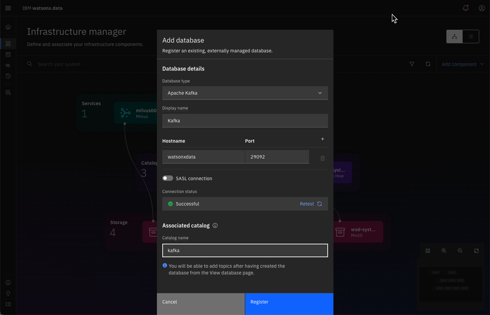
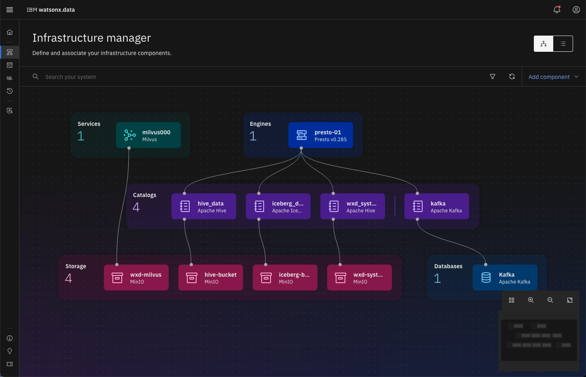
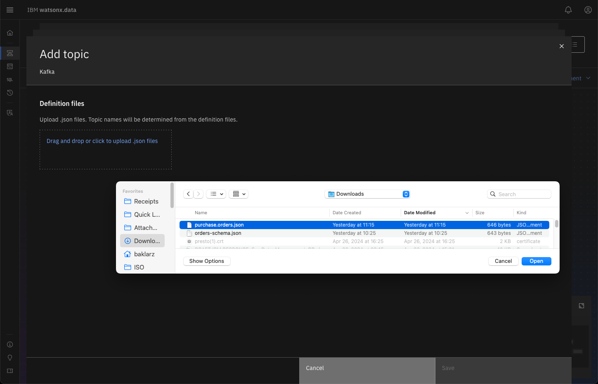
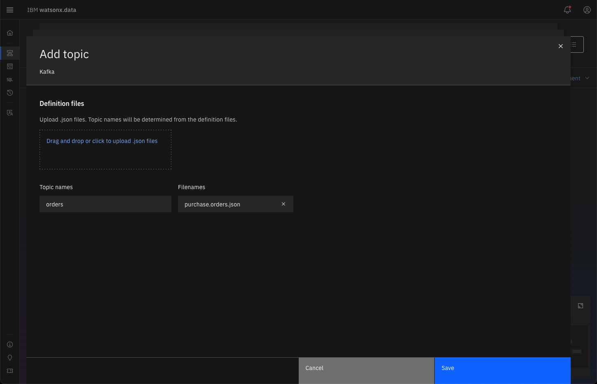
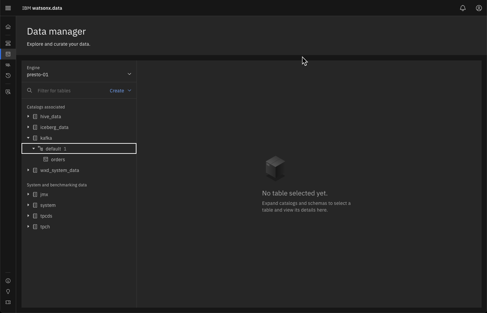
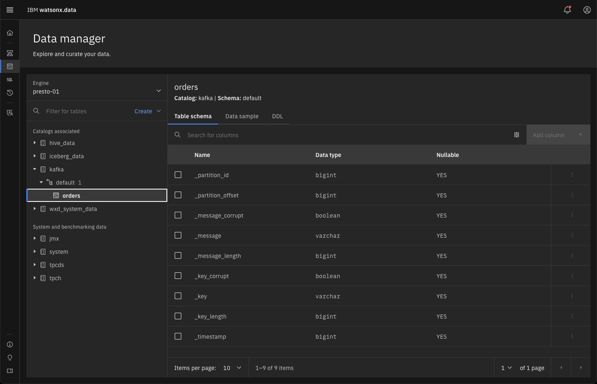

# Kafka

Apache Kafka® <sup style="color: blue;">1,2</span></sup> is an event streaming platform. Kafka combines three capabilities so you can implement your use cases for event streaming.

* To publish (write) and subscribe to (read) streams of events, including continuous import/export of your data from other systems.
* To store streams of events durably and reliably for as long as you want.
* To process streams of events as they occur or retrospectively.

#### Producers and Consumers
Producers are those client applications that publish (write) events to Kafka, and consumers are those that subscribe to (read and process) these events. In Kafka, producers and consumers are fully decoupled and agnostic of each other, which is a key design element to achieve the high scalability that Kafka is known for. For example, producers never need to wait for consumers. Kafka provides various guarantees such as the ability to process events exactly-once.

#### Events
Events are organized and durably stored in topics. Very simplified, a topic is similar to a folder in a filesystem, and the events are the files in that folder. An example topic name could be "payments". Topics in Kafka are always multi-producer and multi-subscriber: a topic can have zero, one, or many producers that write events to it, as well as zero, one, or many consumers that subscribe to these events. Events in a topic can be read as often as needed—unlike traditional messaging systems, events are not deleted after consumption. Instead, you define for how long Kafka should retain your events through a per-topic configuration setting, after which old events will be discarded. Kafka's performance is effectively constant with respect to data size, so storing data for a long time is perfectly fine.

<p style="font-size: small;line-height: 0.4;"><sup>1. Additional details can be found on the <a href="https://kafka.apache.org/documentation/#gettingStarted">Kafka website</a>.</sup></p>
<p style="font-size: small;line-height: 0.4;"><sup>2. Thanks to Chunyu Jiang for prototyping the Kafka connector and suggestions on the code.</sup></p>

## Creating a Kafka Service

The first step is to create a Kafka service in your system. The following text needs to be placed into a file called `kafka-compose.yaml`. This is the control file required to create the Kafka Docker images. The system does not contain any topics when it starts up.

!!! abstract "kafka-compose.yaml file"
      ```
      version: '3'
      services:
      zookeeper:
         image: confluentinc/cp-zookeeper:latest
         environment:
            ZOOKEEPER_CLIENT_PORT: 2181
            ZOOKEEPER_TICK_TIME: 2000
         ports:
            - 22181:2181
      
      kafka:
         image: confluentinc/cp-kafka:latest
         depends_on:
            - zookeeper
         ports:
            - 29092:29092
         environment:
            KAFKA_BROKER_ID: 1
            KAFKA_ZOOKEEPER_CONNECT: zookeeper:2181
            KAFKA_ADVERTISED_LISTENERS: PLAINTEXT://kafka:9092,PLAINTEXT_HOST://watsonxdata:29092
            KAFKA_LISTENER_SECURITY_PROTOCOL_MAP: PLAINTEXT:PLAINTEXT,PLAINTEXT_HOST:PLAINTEXT
            KAFKA_INTER_BROKER_LISTENER_NAME: PLAINTEXT
            KAFKA_OFFSETS_TOPIC_REPLICATION_FACTOR: 1
      ```

Now we can start the Kafka and Zookeeper service. The default Kafka port is 29092. You need to be the root user to issue this command.

!!! abstract "Start Kafka"
      ```
      sudo docker compose -p kafka -f kafka-compose.yaml up --detach
      ```

## Registering the Kafka Service
The next step is to register the Kafka service with watsonx.data. Navigate to your watsonx.data UI screen and click on the infrastructure icon. If you see a dotted outline around the Presto engine, this means that the service has not yet started. Make sure that the outline is solid before attempting to add a new Kafka connection.


Select the Add database option and select Apache Kafka as the source.


Enter the following settings into the dialog.

* Display name - <span style="color:blue;background-color: transparent;">kafka</span>
* Hostname - <span style="color:blue;background-color: transparent;">watsonxdata<span style="color:blue;background-color: transparent;">
* Port - <span style="color:blue;background-color: transparent;">29092<span style="color:blue;background-color: transparent;">
* Catalog name - <span style="color:blue;background-color: transparent;">kafka<span style="color:blue;background-color: transparent;">

**Note**: Watsonx.data 1.1.3 includes a topics line where you can include the list of topics. This was removed in 1.1.4.



Once you have entered these values into the panel, use the Test Connection link to make sure the Kafka server is reachable. Once you register the Kafka service, you should see it reflected in the infrastructure screen.


At this point you must associate the Kafka service with the Presto engine. Hover over the Kafka catalog until you see the association icon. Click on that to view the Manage associations dialog.


Select the presto-01 engine and press Save and restart engine. The Kafka service should now show as connected to the Presto engine.



## Create a Table Definition File 
Before you can access the Kafka topics, you must generate a JSON file which describes the contents of the topic. The format of this file is not described in the watsonx.data documentation. Instead, you must refer to the Presto documentation that includes an example of the syntax and usage of this file:

* [Presto Kafka Connection configuration](https://prestodb.io/docs/current/connector/kafka.html)
* [Presto Kafka Example](https://prestodb.io/docs/current/connector/kafka-tutorial.html)

The basic structure of the JSON file is:
```json
{
    "tableName": "",
    "schemaName": "",
    "topicName": "",
    "key": {},
    "message": {
        "fields": []
    }
}
```

At a minimum you must provide the table name, the schema name and the topic name. The key field refers to the key within the Kafka message which can be used to identify the row in the output. The message field contains a descriptor of each field found in the Kafka message. The Presto documentation describes the data types and formats that are allowed in configuration file.

This notebook will create a topic called <span style="color:blue;background-color: transparent;">orders</span> which will be viewed as a table called <span style="color:blue;background-color: transparent;">orders</span>. While a schema called <span style="color:blue;background-color: transparent;">purchase</span> has been specified, it is not used when the topic is registered in watsonx.data. Watsonx.data using the schema name of <span style="color:blue;background-color: transparent;">default</span> when registering a topic. The preferred name of the file should be <span style="color:blue;background-color:transparent;">&lt;schema&gt;&lt;table&gt;.json</span> but it is not a requirement. 

!!! note "The following JSON file describes the contents of the Kafka topic being used in the Jupyter notebook example. Although the message descriptor has been created, the current version of watsonx.data does not use this information when displaying the data."

!!! abstract "Sample JSON Topic Descriptor"
      ```
      {
         "tableName": "orders",
         "schemaName": "purchase",
         "topicName": "orders",
         "key": {
            "dataFormat": "raw",
            "fields": [
                  {
                     "name": "kafka_key",
                     "dataFormat": "LONG",
                     "type": "BIGINT",
                     "hidden": "false"
                  }
            ]
         },
         "message": {
            "dataFormat": "json",
            "fields": [
                  {
                     "name": "order_id",
                     "mapping": "order_id",
                     "type": "INTEGER"
                  },
                  {
                     "name": "customer_key",
                     "mapping": "customerKey",
                     "type": "BIGINT"
                  },
                  {
                     "name": "customer_id",
                     "mapping": "customer_id",
                     "type": "INTEGER"
                  },
                  {
                     "name": "product_id",
                     "mapping": "product_id",
                     "type": "INTEGER"
                  },
                  {
                     "name": "quantity",
                     "mapping": "quantity",
                     "type": "INTEGER"
                  },
                  {
                     "name": "unit_price",
                     "mapping": "unit_price",
                     "type": "DOUBLE"
                  }
            ]
         }
      }
      ```

## Add a Topic to watsonx.data
Once you have create the table definition file, you must register the topic to watsonx.data. In the Infrastructure window, select the Kafka database.


The details panel will display information about the Kafka service. Near the bottom of the screen there is a Add Topics button.


Once you press the Add topics button, a dialog will prompt you to drag and drop or select <span style="color:blue;background-color: transparent;">.json</span> files from your operating system.


Select the file that was created found in your local directory.



The selected file will now appear as a topic in the list. You can continue to add more topics as required. The list can have items added or removed as topics change in the Kafka environment.



Once the topics have been added, press the Save button to register the topic to the watsonx.data server.


At this point the topic has been registered and you can start querying the Kafka topics.

## Querying Kafka Topics

You can now start querying the topics that you have registered to the system. 

!!! alert "The following example is based on a topic called orders. See the Jupyter notebook example for instructions on how to create a topic and populate it with data."

Switch to the Data Manager view.



You should see the Kafka catalog in the list on the left. The schema is called <span style="color:blue;background-color: transparent;">default</span> (not <span style="color:blue;background-color: transparent;">purchase</span> which we had placed into the table descriptor). If you don't see the service, you may need to refresh the screen to wait for Presto to become available. Clicking on the <span style="color:blue;background-color: transparent;">orders</span> table will display information about this topic.



When data is loaded into the queue, you will be able to click on the Data sample tab to look at the messages that have come in.


Note that the data will not be shown on your system since the messages have not been loaded into the queue.

For a working example of using Kafka, please find the Jupyter notebook link in your reservation and find the Kafka creation notebook.