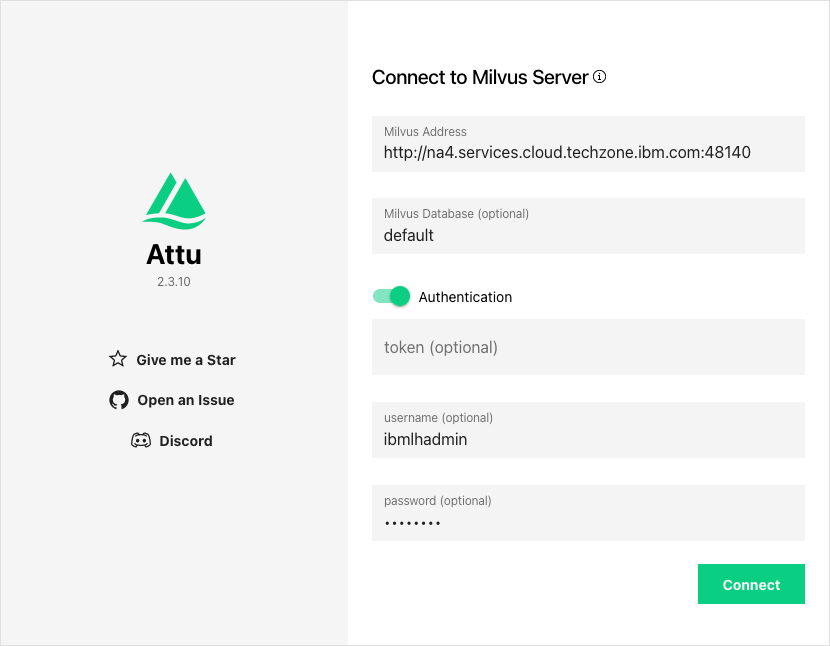
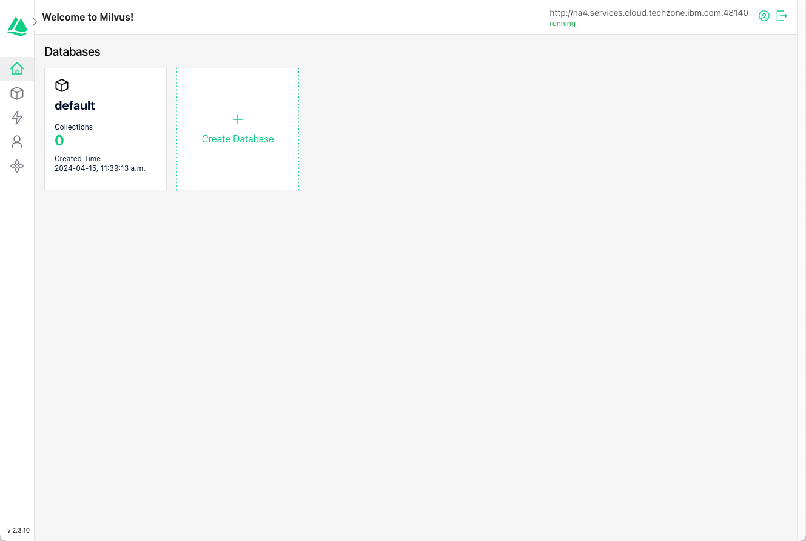

# Milvus Console

The Milvus vector database does not ship with a console in watsonx.data. If you want to use the supported console you will need to use these instructions to start up the Attu console. Details on the Milvus console (Attu) can be found at the [Github](https://github.com/zilliztech/attu) site<sup style="color: blue;">1</code></sup>.

<p style="font-size: small;line-height: 0.4;"><sup>1. Thanks to Zineddine Gherari and Julien Pradier for help on getting the settings to work.</p>

## Credentials and Server Addresses
The Attu console requires the name or address of the server that will be running the console, along with the Milvus database. This value will be different for each user of this system. Gather the following information from your server reservation:

* Watsonx Server URL - This will be the URL at the beginning of all service addresses. For example: `useast.services.cloud.techzone.ibm.com`.
* Milvus External Port - The port number that the Milvus database is exposed to the outside world
* Attu External Port 1 - Open port #1 in the reservation. If you are using Open port #1, choose #2 instead.
* Attu Internal Port - Use 10000 for open port #1 or 10001 for open port #2

Fill in the values in the next cell and execute it.

!!! abstract "Required Settings"
      ```
      export WATSONX_SERVER_URL="useast.services.cloud.techzone.ibm.com"
      export MILVUS_EXTERNAL_PORT="48410"
      export ATTU_EXTERNAL_PORT="40422"
      export ATTU_INTERNAL_PORT="10000"
      export ATTU_URL="http://$WATSONX_SERVER_URL:$ATTU_EXTERNAL_PORT"
      export MILVUS_URL="http://$WATSONX_SERVER_URL:$MILVUS_EXTERNAL_PORT"
      ```

### Start the Attu Service
The next command will remove any existing Attu console and restart it with the settings you have provided above. Make sure to use the Attu version which is compatible with the version of Milvus that is running. In this case we need to use v.2.4.0.

!!! abstract "Start"
      ```
      sudo docker stop attu
      sudo docker rm attu
      sudo docker run --name attu -d -p $ATTU_INTERNAL_PORT:3000 -v /certs:/app/certs -e HOST_URL=$ATTU_URL -e MILVUS_URL=$MILVUS_URL -e ROOT_CERT_PATH=/app/certs/presto.crt zilliz/attu:v2.4.0
      ```

Check that the service is running.

!!! abstract "Check System Status"
      ```
      sudo docker ps | grep attu
      ```
### Connect to the Console
The next command will print the URL for the Attu console and the Milvus service. Copy the ATTU URL into a browser to connect to the service. You will need the Milvus URL for the settings in the login dialog.

!!! abstract "Attu and Milvus URLs"
      ```
      echo ATTU URL   : $ATTU_URL
      echo MILVUS URL : $MILVUS_URL
      ```

You must fill in the following fields.



Use the following values in the login dialog.

| Field         | Value     |
|:------------- | :-------- |
|Milvus Address | Milvus URL from previous command 
|Milvus Database| default
|Authentication | on
|Token          | empty
|Username       | ibmlhadmin
|Password       | password

!!! alert "The Milvus URL should already be populated on the log in screen. If not, use the value that was shown in the previous command."

Once you authenticate you will see the main Attu console. Note that you may get an authentication error, but this doesn't prevent you from using the console.

At this point you can explore the various features found in the console.



## Stop the Attu Console

Use the following command to stop the console.

!!! abstract "Stop and remove the ATTU Console"
      ```
      sudo docker stop attu
      sudo docker rm attu
      ```
