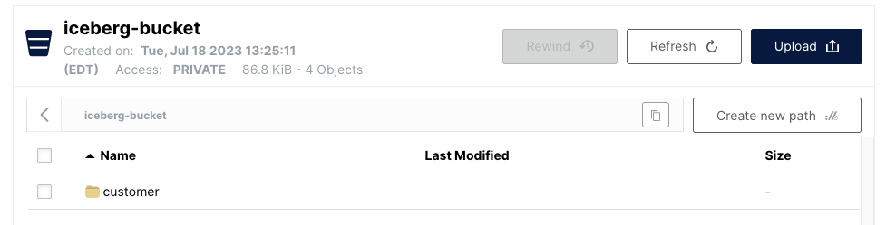

# Using the MinIO console UI
MinIO is a high-performance, S3 compatible object store. Rather than connect to an external S3 object store, we are going to use MinIO locally to run with  watsonx.data.

To connect to MinIO, you will need to extract the MinIO credentials by querying the docker container. You must be the `root` user to issue these commands.
```
export LH_S3_ACCESS_KEY=$(docker exec ibm-lh-presto printenv | grep LH_S3_ACCESS_KEY | sed 's/.*=//')
export LH_S3_SECRET_KEY=$(docker exec ibm-lh-presto printenv | grep LH_S3_SECRET_KEY | sed 's/.*=//')
echo "MinIO Userid  : " $LH_S3_ACCESS_KEY
echo "MinIO Password: " $LH_S3_SECRET_KEY
```
<pre style="font-size: small; color: darkgreen; overflow: auto">
MinIO Userid  :  c4643026087cc21989eb5c12
MinIO Password:  93da45c5af87abd86c9dbc83
</pre>

You can get all passwords for the system when you are logged in as the <code style="color:blue;font-size:medium;">watsonx</code> user by using the following command.
```
cat /certs/passwords
```
Your TechZone reservation will include the server name and port number to use when connecting to the MinIO. The default port number is 9001, while the server will be referred to as <tt style="font-size: large; color: darkgreen;">region.techzone-server.com</tt>. Replace these values with those found in your reservation.

Open your browser and navigate to:

   * Minio console - http://region.techzone-server.com:port
   * **Note**: Firefox on OSX occasionally freezes when connecting to the MinIO console. The Safari browser is much more reliable.
   


Login with object store credentials found above (These will be different for your system). You should see current buckets in MinIO.


We are going to examine these buckets after we populate them with some data.
 
## Creating Schemas and Tables

Not all catalogs support creation of schemas - as an example, the TPCH catalog is not writeable. We will use the iceberg_data catalog for this exercise. We will need to get some details before we continue.

Make sure you are connected as the root user and are in the proper directory.

```
cd /root/ibm-lh-dev/bin
```

Login to the Presto CLI.
```
./presto-cli --catalog iceberg_data
```
Create schema <code style="color:blue;font-size:medium;">workshop</code> in catalog<code style="color:blue;font-size:medium;">iceberg_data</code>. Note how we are using the <code style="color:blue;font-size:medium;">iceberg-bucket</code> bucket which you should have seen in the MinIO object browser.
```
CREATE SCHEMA IF NOT EXISTS workshop with (location='s3a://iceberg-bucket/');
```
Show the schemas available.
```
show schemas;
```
<pre style="font-size: small; color: darkgreen; overflow: auto">
  Schema  
----------
 workshop
(1 row)
</pre>

Use the workshop schema.
```
use workshop;
```
### Creating tables

Create a new Apache Iceberg table using existing data in the sample Customer table as part of the TPCH catalog schema called TINY.
```
create table customer as select * from tpch.tiny.customer;
```

Show the tables.
```
show tables;
```
<pre style="font-size: small; color: darkgreen; overflow: auto">
  Table   
----------
 customer 
(1 row)
</pre>

Quit Presto.
```
quit;
```
 
Refresh the Minio screen (see button on the far-right side).


 
You should now see new objects under <code style="color:blue;font-size:medium;">iceberg-bucket</code> Click on the bucket name and you will see the customer table.


 
Selecting the <code style="color:blue;font-size:medium;">customer</code> object will show that there is data and metadata in there.


 
How do we know that this data is based on Apache iceberg? If you open the file under <code style="color:blue;font-size:medium;">metadata</code>, you should see metadata information for the data we are storing in parquet file format. 


 
### Do I really need Apache Iceberg?

YES, YOU DO! However, it is good to understand why? Metadata is also stored in the Parquet file format but only for the single parquet file. If we add more data/partitions, the data is split into multiple Parquet files, and we don’t have a mechanism to get the table to parquet files mapping. Run the following example to understand this better.

You need to get the access keys for MinIO before running the following lab. Make sure you are still connected as `root`.
```
export LH_S3_ACCESS_KEY=$(docker exec ibm-lh-presto printenv | grep LH_S3_ACCESS_KEY | sed 's/.*=//')
export LH_S3_SECRET_KEY=$(docker exec ibm-lh-presto printenv | grep LH_S3_SECRET_KEY | sed 's/.*=//')
```
Open the developer sandbox to connect to MinIO, download the selected parquet file and inspect the parquet file contents.
```
./dev-sandbox.sh
```

Update the Python files to be executable (makes our commands more convenient).
```
chmod +x /scripts/*.py
```

List all files in the object store (MinIO).
```
/scripts/s3-inspect.py --host ibm-lh-minio-svc:9000 --accessKey $LH_S3_ACCESS_KEY --secretKey $LH_S3_SECRET_KEY --bucket iceberg-bucket
```

<pre style="font-size: small; color: darkgreen; overflow: auto">
iceberg-bucket b'customer/data/e9536a5e-14a1-4823-98ed-cc22d6fc38db.parquet' 2023-06-06 14:31:47.778000+00:00 6737d7268fcb3eb459b675f27f716f48 75373 None
iceberg-bucket b'customer/metadata/00000-e26c56e0-c4d7-4625-8b06-422429f6ba8d.metadata.json' 2023-06-06 14:31:48.629000+00:00 2e722c7dd83c1dd260a7e6c9503c0e04 3272 None
iceberg-bucket b'customer/metadata/7cb074a4-3da7-4184-9db8-567383bb588a-m0.avro' 2023-06-06 14:31:48.401000+00:00 655a5568207cc399b8297f1488ef77e7 6342 None
iceberg-bucket b'customer/metadata/snap-6143645832277262458-1-7cb074a4-3da7-4184-9db8-567383bb588a.avro' 2023-06-06 14:31:48.445000+00:00 0c3714299d43ae86a46eabdcaac1351e 3753 None
</pre>

You can extract the string with the following command.
```
PARQUET=$(/scripts/s3-inspect.py --host ibm-lh-minio-svc:9000 --accessKey $LH_S3_ACCESS_KEY --secretKey $LH_S3_SECRET_KEY --bucket iceberg-bucket | grep -o -m 1 ".*'customer.*parquet" | sed -n "s/.*b'//p")
```

The file name that is retrieved is substituted into the next command.
Note: The file name found in $PARQUET will be different on your system.
```
/scripts/s3-download.py --host ibm-lh-minio-svc:9000 --accessKey $LH_S3_ACCESS_KEY --secretKey $LH_S3_SECRET_KEY --bucket iceberg-bucket --srcFile $PARQUET --destFile /tmp/x.parquet
```
 
Describe the File Contents.
```
/scripts/describe-parquet.py /tmp/x.parquet
```
<pre style="font-size: small; color: darkgreen; overflow: auto">
----------------------
metadata: 
  <pyarrow._parquet.FileMetaData object at 0x7f8a80353e50>
  created_by: 
  num_columns: 8
  num_rows: 1500
  num_row_groups: 1
  format_version: 1.0
  serialized_size: 851
----------------------

----------------------
schema:  
 custkey: int64
name: binary
address: binary
nationkey: int64
phone: binary
acctbal: double
mktsegment: binary
comment: binary
----------------------

----------------------
row group 0:  
 <pyarrow._parquet.RowGroupMetaData object at 0x7f8a80374090>
  num_columns: 8
  num_rows: 1500
  total_byte_size: 74555
----------------------

----------------------
row group 0, column 1:  
 <pyarrow._parquet.ColumnChunkMetaData object at 0x7f8a7fb36310>
  file_offset: 0
  file_path: 
  physical_type: BYTE_ARRAY
  num_values: 1500
  path_in_schema: name
  is_stats_set: True
  statistics:
    <pyarrow._parquet.Statistics object at 0x7f8a7fb36360>
      has_min_max: False
      min: None
      max: None
      null_count: 0
      distinct_count: 0
      num_values: 1500
      physical_type: BYTE_ARRAY
      logical_type: None
      converted_type (legacy): NONE
  compression: GZIP
  encodings: ('DELTA_BYTE_ARRAY',)
  has_dictionary_page: False
  dictionary_page_offset: None
  data_page_offset: 112
  total_compressed_size: 599
  total_uncompressed_size: 2806
----------------------
</pre>

**Note**: In this instance we used an `insert into select * from customer` with no partitioning defined there was only 1 parquet file and only 1 row group. This is not the norm, and we deliberately did this to show you the value of using Apache Iceberg file format which can be used by multiple runtimes to access Iceberg data stored in parquet format and managed by hive metastore.

Exit from the Sandbox.
```
exit
```

## MinIO CLI

The MinIO Client `mc` command line tool provides an alternative to UNIX commands like `ls`, `cat`, `cp`, `mirror`, and `diff` with support for both file systems and Amazon S3-compatible cloud storage services.

The `mc` commandline tool is built for compatibility with the AWS S3 API and is tested with MinIO and AWS S3 for expected functionality and behavior. Complete details and restrictions around the use of the CLI command can be found on the [MinIO Client](https://min.io/docs/minio/linux/reference/minio-mc.html) page.

You can use the MinIO CLI from a variety of clients. The MinIO ports are open in the developer edition image, which provides an alternative to loading data directly from your workstation rather than using the MinIO UI interface.

### Minio System Alias

Before running commands against the MinIO server, an alias must be created that includes the access and secret key. The values can be extracted from the system by listing the contents of the `/certs/passwords` file or by running the `passwords` command as the root user.

```
cat /certs/passwords
```

The values for the MinIO access and secret key can also be exported with the following code:

```
export LH_S3_ACCESS_KEY=$(docker exec ibm-lh-presto printenv | grep LH_S3_ACCESS_KEY | sed 's/.*=//')
export LH_S3_SECRET_KEY=$(docker exec ibm-lh-presto printenv | grep LH_S3_SECRET_KEY | sed 's/.*=//')
echo "MinIO Userid  : " $LH_S3_ACCESS_KEY
echo "MinIO Password: " $LH_S3_SECRET_KEY
```

The `alias` command has the following syntax:

<code style="color:blue;font-size:medium;">mc alias set alias-name hostname:port access_key secret_key</code>

For a local connection, we will use the following values:

   * Alias Name - <code style="color:blue;font-size:medium;">watsonxdata</code>
   * Hostname – <code style="color:blue;font-size:medium;">watsonxdata</code>
   * Port – <code style="color:blue;font-size:medium;">9000</code>
   * Access Key – <code style="color:blue;font-size:medium;">$LH_S3_ACCESS_KEY</code>
   * Secret Key - <code style="color:blue;font-size:medium;">$LH_S3_SECRET_KEY</code>

If you are using an external client to connect to the MinIO service, you will need the URL and Port number from the TechZone reservation. The access key and secret key will be the same values that are found above.

   * Hostname –<code style="color:blue;font-size:medium;">region.techzone-server.com</code>
   * Port – <code style="color:blue;font-size:medium;">12345</code>

The alias for local access is found below.

```
mc alias set watsonxdata http://watsonxdata:9000 $LH_S3_ACCESS_KEY $LH_S3_SECRET_KEY
```
<pre style="font-size: small; color: darkgreen; overflow: auto">
Added `watsonxdata` successfully.
</pre>

### List Buckets

The `mc` command provides us with a number of commands that allows us to manage buckets and files within them. The following command checks to see what buckets currently exist in the system. 

```
mc ls tree watsonxdata
```
<pre style="font-size: small; color: darkgreen; overflow: auto">
[2023-09-29 14:38:19 EDT]     0B hive-bucket/
[2023-09-29 14:38:19 EDT]     0B iceberg-bucket/
</pre>

You can view the contents of a bucket by traversing down the path.

```
mc ls tree watsonxdata/hive-bucket
```
<pre style="font-size: small; color: darkgreen; overflow: auto">
[2023-10-13 10:34:36 EDT]     0B gosalesdw/
[2023-10-13 10:34:36 EDT]     0B hive_sql/
[2023-10-13 10:34:36 EDT]     0B ontime/
[2023-10-13 10:34:36 EDT]     0B taxi/
</pre>

### Create a Bucket

At this point we will create a new bucket to hold some data. Use the `mb` (make bucket) command. The command requires the alias name for the MinIO connection followed by the name of the bucket.

<code style="color:blue;font-size:medium;">
mc mb alias-name/new-bucket
</code>

The following code will create a new bucket in the system called `sampledata`.

```
mc mb watsonxdata/sampledata
```
<pre style="font-size: small; color: darkgreen; overflow: auto">
Bucket created successfully `watsonxdata/sampledata`.
</pre>

We can double check that the bucket it there.
```
mc ls tree watsonxdata
```
<pre style="font-size: small; color: darkgreen; overflow: auto">
[2023-09-29 14:38:19 EDT]     0B hive-bucket/
[2023-09-29 14:38:19 EDT]     0B iceberg-bucket/
[2023-10-13 10:39:47 EDT]     0B sampledata/
</pre>

### Loading Data

One of the most powerful features of the MinIO CLI is its ability to load data directory from your workstation into the bucket, rather than having to use the MinIO UI. It is also significantly faster than using the UI interface.

The next example will load data into the bucket that was just created. The directory that we will be using to load data from is called `/sampledata` and found in the root directory of the watsonx.data server.

```
ls /sampledata/csv
```
<pre style="font-size: small; color: darkgreen; overflow: auto">
gosales  ontime  taxi
</pre>

Next we will load the data from each one of these directories into the `sampledata` bucket. The `mc` command allows you to select which files to place into a bucket, or an entire directory with recursion. In this case we are loading all three directories the files into the bucket. Note the use of the
`/` at the end of the directory name to prevent the directory name `csv` from being used as the high-level directory name in the target bucket.

```
mc cp --recursive /sampledata/csv/ watsonxdata/sampledata/
```
<pre style="font-size: small; color: darkgreen; overflow: auto">
...data/csv/taxi/taxi.csv: 306.16 MiB / 306.16 MiB ━━━━━━━━━━━━━━━━━━ 147.91 MiB/s 2s
</pre>

We can double-check that our files are there with the `--files` option:

```
mc tree --files watsonxdata/sampledata/
```
<pre style="font-size: small; color: darkgreen; overflow: auto">
watsonxdata/sampledata/
├─ gosales
│  ├─ DIST_INVENTORY_FACT.csv
│  ├─ DIST_PRODUCT_FORECAST_FACT.csv
│  ├─ DIST_RETURNED_ITEMS_FACT.csv
│  ├─ DIST_RETURN_REASON_DIM.csv
....
│  ├─ EMP_EMPLOYEE_DIM.csv
│  ├─ SLS_SALES_TARG_FACT.csv
│  ├─ gosales_createtable.sql
│  └─ gosales_load_postgres.sql
├─ ontime
│  ├─ aircraft.csv
│  ├─ airline_id.csv
│  ├─ airport_id.csv
│  ├─ cancellation.csv
│  └─ ontime.csv
└─ taxi
   └─ taxi.csv
</pre>

### Delete a File or Bucket

Use the `rb` (Remove bucket) command to remove a bucket and its contents. You can remove individual objects by using the `rm` (Remove) command by fully qualifying the object. The next command will remove the `ontime.csv` file from the `ontime` folder.

```
mc rm watsonxdata/sampledata/ontime/ontime.csv
```
<pre style="font-size: small; color: darkgreen; overflow: auto">
Removed `watsonxdata/sampledata/ontime/ontime.csv`.
</pre>

The delete bucket command will fail if you still have data in the bucket.
```
mc rb watsonxdata/sampledata
``` 
<pre style="font-size: small; color: darkgreen; overflow: auto">
mc: <ERROR> `watsonxdata/sampledata` is not empty. 
Retry this command with ‘--force’ flag if you want to remove 
`watsonxdata/sampledata` and all its contents 
</pre>

Adding the `--force` option will remove the bucket and all the data in it. Use with caution!
```
mc rb --force watsonxdata/sampledata
``` 
<pre style="font-size: small; color: darkgreen; overflow: auto">
Removed `watsonxdata/sampledata` successfully.
</pre>