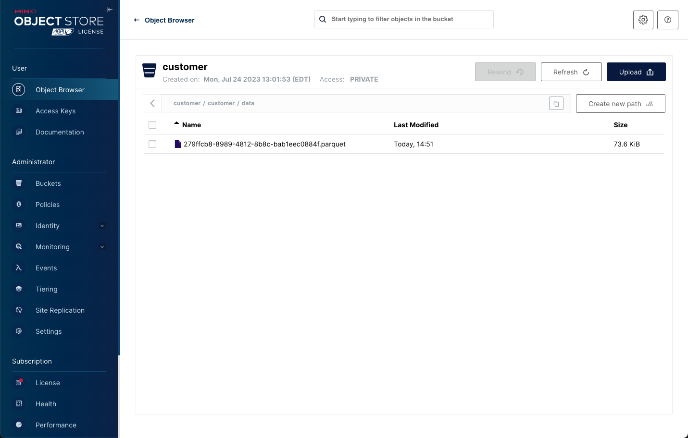

# Working with Object Store Buckets

In this lab, we will run through some exercises to understand how the watsonx.data can be configured to work with multiple buckets, using IBM COS, in addition to the out of the box MinIO bucket. 
In the GA version, there will be a user experience to facilitate such setup, however this lab will help you understand some service-service interactions & configurations.

### Why do we need to do this?

   * In this lab, we will use multiple buckets as this is also how we can illustrate compute-storage separation.
   * Out of the box, both in SaaS and Software, a tiny Object Store bucket is allocated, primarily for getting started use cases.  
     * Customers would need to point to their own bucket for their data. 
   * The use of a remote bucket (in this example, MinIO) also showcases the "open" aspect of the watsonx.data system.  
     * Customers _own their data_ and can physically access the iceberg-ed bucket using other applications or engines, even custom ones that they build themselves.
   * Customers would also have requirements to place (data sovereignty) buckets in specific locations.
     * Compute/analytics engines may need to run in different locations, say closer to applications and connect to buckets in other networks/geos.
   * There will also be situations where the same engine federates data across multiple buckets (and other database connections).
     * As part of the GA release, there will also be authorization & data access rules that will control which user/group can access buckets even within the same engine.
   * In Enterprise/Production environments, engines are expected to be ephemeral or there can be multiple engines. 
     * These engines when they come up will connect to different object store buckets.  The list of engines will include Db2, NZ, IBM Analytics Engine for Spark, apart from Presto.
     * The _shared_ meta-store is critical in all of this as it helps provide relevant schema information to the engines.

### Create new bucket in MinIO
Open your browser and navigate to the MinIO console.
   
Check to see if the MinIO credentials exist in your terminal session.
```
printf "\nAccess Key: $LH_S3_ACCESS_KEY \nSecret Key: $LH_S3_SECRET_KEY\n"
```
<pre style="font-size: small; color: darkgreen; overflow: auto">
Userid  : fcf1ec270e05a5031ca27bc9 
Password: a671febd9e1e3826cf8cdcf5
</pre>
If these values are blank, you need to run the following command.
```
export LH_S3_ACCESS_KEY=$(docker exec ibm-lh-presto printenv | grep LH_S3_ACCESS_KEY | sed 's/.*=//')
export LH_S3_SECRET_KEY=$(docker exec ibm-lh-presto printenv | grep LH_S3_SECRET_KEY | sed 's/.*=//')
```
Click on the Buckets tab to show the current buckets in the MinIO system.


 
You can see that we have two buckets used for the labs. We need to create a new bucket to use for our schema. Press the "Create Bucket +" option on the right side of the screen. **Note**: The size and contents of the existing buckets will be different on your system.
 

 
Enter a bucket name (customer) and then press Create Bucket. 


 
You should now see your new bucket below.


 
Open your browser and connect to the watsonx.data UI:
   
Navigate to the Infrastructure manager by clicking on the icon below the Home symbol.


  
Get the S3 bucket credentials.
```
printf "\nAccess Key: $LH_S3_ACCESS_KEY \nSecret Key: $LH_S3_SECRET_KEY\n"
```

Click on the Add component menu and select Add bucket.


 
Fill in the dialog with the following values.

   * Bucket type – <code style="color:blue;font-size:medium;">MinIO</code>
   * Bucket name – <code style="color:blue;font-size:medium;">customer</code>
   * Display name – <code style="color:blue;font-size:medium;">customer</code>
   * Endpoint – <code style="color:blue;font-size:medium;">http://ibm-lh-minio-svc:9000</code>
   * Access key – $LH_S3_ACCESS_KEY (contents of this value)
   * Secret key –  $LH_S3_SECRET_KEY (contents of this value)
   * Activate now – <code style="color:blue;font-size:medium;">Yes</code>
   * Catalog type - <code style="color:blue;font-size:medium;">Apache Iceberg</code>
   * Catalog name - <code style="color:blue;font-size:medium;">customer</code>
   
   
   
When done press Add and Activate now. Your UI should change to display the new bucket (Your screen may be slightly different). **Note**: This step may take a minute to complete.

   
 
At this point you need to Associate the bucket with the Presto engine. When you hover your mouse over the Customer catalog and the Associate icon will display.

   

If you do not see the Associate icon, refresh the browser page.
 
Press the associate button and the following dialog will display.

  
 
Select the <code style="color:blue;font-size:medium;">presto-01</code> engine and then press the **Save and restart engine** button. Associate button and wait for the screen to refresh. 

  

**Note**: Your display will be different.

## Exploring the Customer bucket

First check to make sure that the Presto engine has finished starting. While the watsonx.data UI has restarted the Presto process, it takes a few seconds to become available.

```
check_presto
```

Switch to the bin directory as the root user.

```
sudo su -
cd /root/ibm-lh-dev/bin
```
 
Connect to Presto using the new customer catalog.
``` 
./presto-cli --catalog customer
```
We will create a schema where we store our table data using the new catalog name we created for the customer bucket.
```
CREATE SCHEMA IF NOT EXISTS newworkshop with (location='s3a://customer/');
```
Switch to the new schema.
```
use newworkshop;
```
Use the following SQL to create a new table in the customer bucket.
```
create table customer as select * from tpch.tiny.customer;
```
<pre style="font-size: small; color: darkgreen; overflow: auto">
CREATE TABLE: 1500 rows
</pre>
Quit Presto.
```
quit;
```
You can use the Developer sandbox (bin/dev-sandbox.sh), as described in [MinIO UI](wxd-minio.md#do-i-really-need-apache-iceberg), to inspect the Customer bucket with the s3-inspect utility.

It's easier to use the MinIO console to view the bucket instead. Open your browser and navigate to the MinIO console.

From the main screen select Object Browser and view the contents of the customer bucket.

 

**Note**: You can continue to add new buckets when working with the watsonx.data UI. However, if you delete the catalog or bucket in the UI, you may find that you may not be able to re-catalog it. If you find that this happens, create another bucket, or rename the original one if that is possible.
