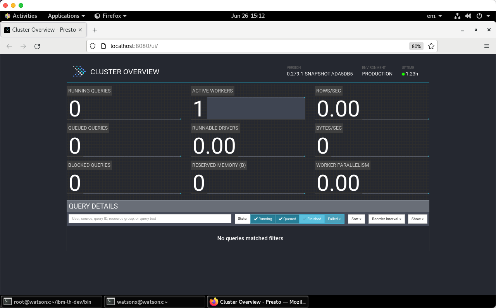

# Using the Presto console UI
Your TechZone reservation will include the server name and port number to use when connecting to the Presto UI. The default port number is 8443 and the server will be referred to as <tt style="font-size: large; color: darkgreen;">region.techzone-server.com</tt>. Replace these values with those found in your reservation.

   * Presto console - https://region.techzone-server.com:port
   * Credentials: username: <code style="color:blue;font-size:medium;">ibmlhadmin</code> password: <code style="color:blue;font-size:medium;">password</code>

The Presto console allows you to do the following:

   * Monitor state of the cluster
   * Queries being executed
   * Queries in queue
   * Data throughput 
   * Query details (text and plan)

**Note**: The Presto console is very valuable when it comes to diagnosing problems with any queries you run in the watsonx.data environment. If a query fails you can find more details in the Presto console using the instructions below.
   

 
On the main Presto screen, click the Finished Button (middle of the screen).

 
A list of finished queries will display below the tab bar. You can scroll through the list of queries and get details of the execution plans. If you scroll through the list, you should see the test query "select * from customer limit 5". If you had a query that failed, look for the SQL in this list and continue on with the next step.

 
Click on the query ID to see details of the execution plan that Presto produced.

 
You can get more information about the query by clicking on any of the tabs that are on this screen. For instance, the Live Plan tab will show a visual explain of the stages that the query went through during execution. Scrolling to the bottom of this screen will also display any error messages that may have been produced by the SQL.

Take time to check out the other information that is available for the query including the stage performance.