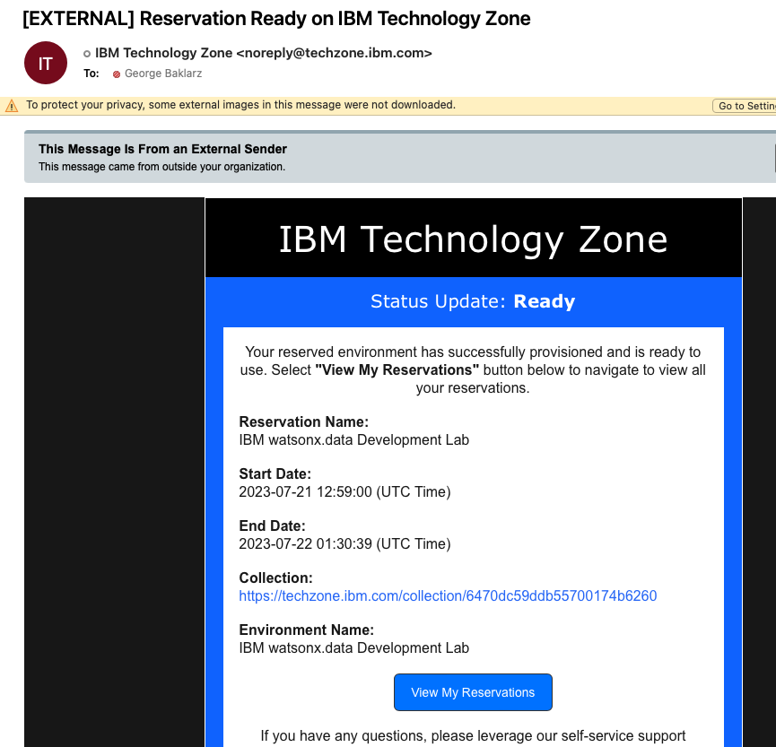
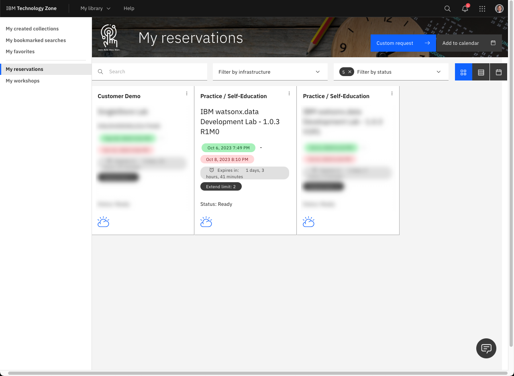
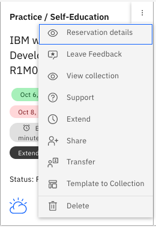
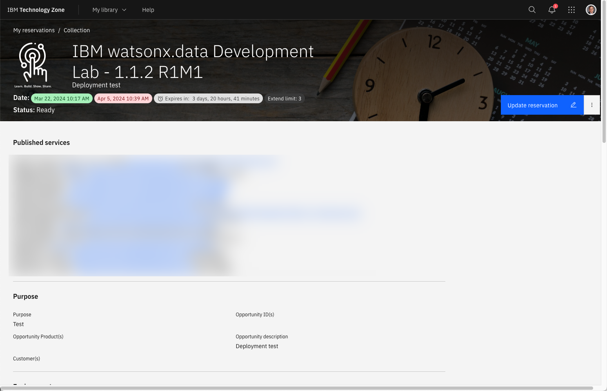

# Accessing the watsonx.data TechZone Image

The reservation email from TechZone is extremely important since it provides a link to your reservation. 

Click on the **View My Reservations** to access your reservations.

Click on the reservation that corresponds to the watsonx.data reservation. The menu button that is beside the arrow provides options to extend or delete the reservation.

When you click on reservation details option, or the reservation box, the browser will display the details of your image.

Scroll down to the bottom of the web page to access the VM Remote Console.

You can access the logon screen of the virtual machine by pressing the VM Remote Console button. It is not necessary to use the VM console except unless you want to use the dBeaver program. 

Select the <code style="color:blue;font-size:medium;">watsonx</code> user and use <code style="color:blue;font-size:medium;">watsonx.data</code> as the password.

Refer to the section on [VM Remote Console](wxd-reference-vnc.md) for more details.
