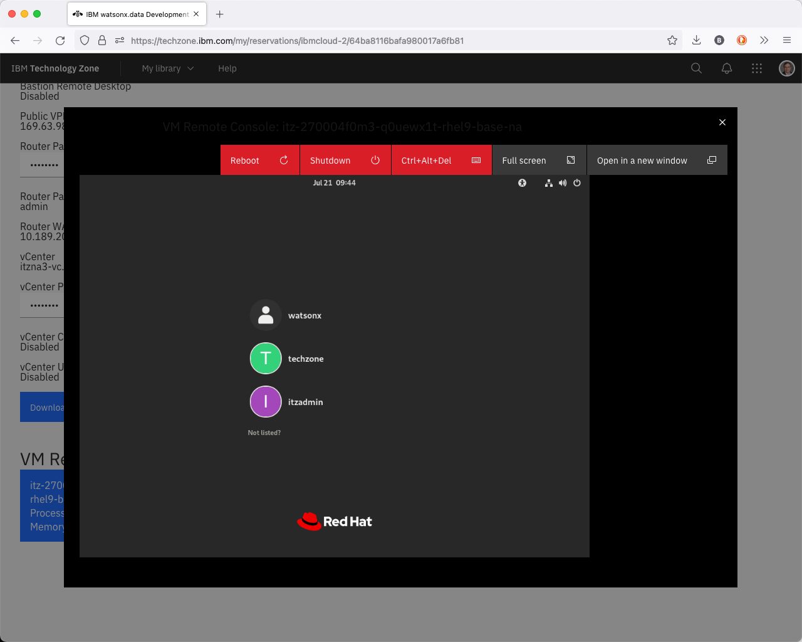
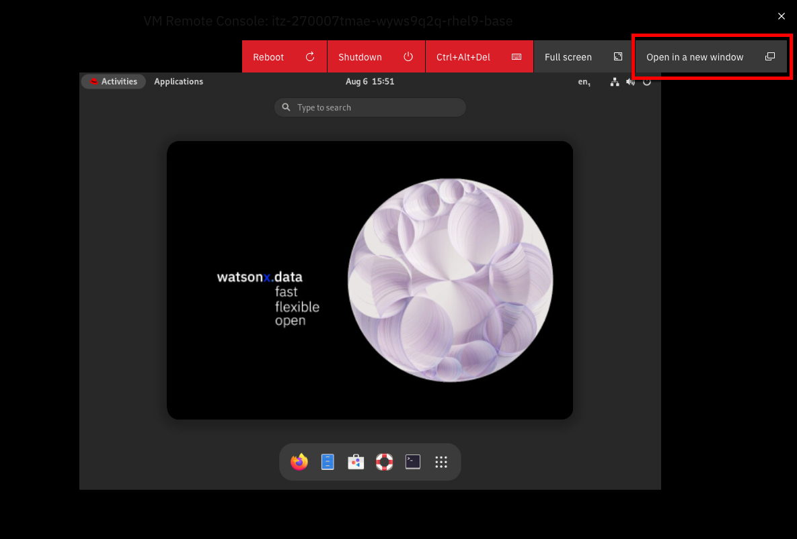

# Using the VM Remote Console

The watsonx server that has been provisioned has no physical monitor attached to it (headless is what it is commonly referred to) and so we need to use a different technique to view the desktop of the main user or the system (watsonx).

The first thing to consider is whether you need to use the VM Remote Console at all. All the services like the watsonx.data UI, MinIO, Presto, Apache Superset and Portainer, are all web-based servers which means you just need to use your own browser to access these programs. 

Connecting into the watsonx virtual machine can be done using the secure shell command (ssh) which provides access to all the low-level commands you might need to use like starting the Apache Superset service. Note that Apache Superset is not up and running by default, so you will need to start it before attempting to connect to it.

So what's the VM Remote Console required for? One program that has been provided to view the database schemas is dBeaver, a community edition of software that provides a query interface to 100's of data sources, including the watsonx.data environment. You can only use this program using the VM Remote Console. You do have the option of installing this software on your own machine if you wish.

Find your email message that contains details of your reservation. Details of what the reservations and the page containing details of the reservation can be found in the [Accessing the reservation](wxd-reference-access.md) or [Accessing a workshop](wxd-reference-workshop.md) section. 

Once the details appear, scroll down to the bottom of the web page, and you will see the VM Remote Console button.

You can access the logon screen of the virtual machine by pressing the VM Remote Console button. 

Clicking on this button will display the logon screen for the server.

Select the <code style="color:blue;font-size:medium;">watsonx</code> user and use <code style="color:blue;font-size:medium;">watsonx.data</code> as the password.

You can open this window in a separate browser window, or place it into full-screen mode. Note that you may need to increase the size of your browser window (or change the scaling in the browser) to see all the virtual desktop.

At this point you have access to the desktop of the watsonx user and can issue commands from within this environment. As mentioned previously, you do not need to use this interface to use the lab.