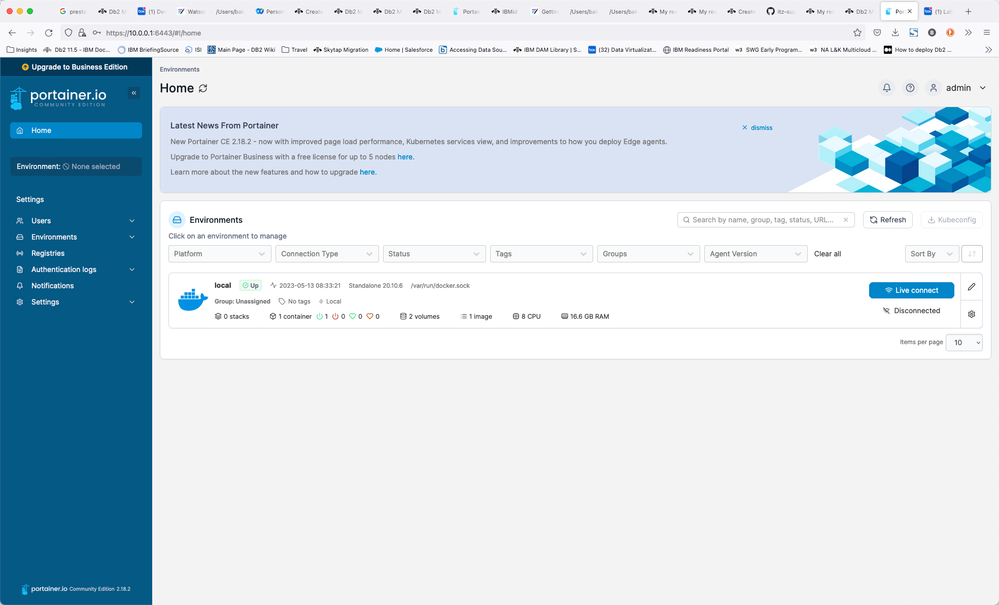

# Portainer

This lab system has Portainer installed. Portainer provides an administrative interface to the Docker images that are running on this system. You can use this console to check that all the containers are running and see what resources they are using. 

Your TechZone reservation will include the server name and port number to use when connecting to Portainer. 

Open your browser and navigate to:

   * Portainer console - https://region.techzone-server.com:port
   * Credentials: userid:<code style="color:blue;font-size:medium;">admin</code> password: <code style="color:blue;font-size:medium;">watsonx.data</code>

Once you have logged in, you should select "Get Started".

The next screen displays the main control panel for Portainer.

Select the Local server.

This screen provides details on the containers, images, volumes, and networks that make up your docker installation. To view the containers that are running, select the container icon.

 
From within this view, you can view the details of any container, including the environment settings, the current logs, and allow you to shell into the environment. 
For more details on Portainer, see the [Portainer documentation](https://docs.portainer.io/user/home).