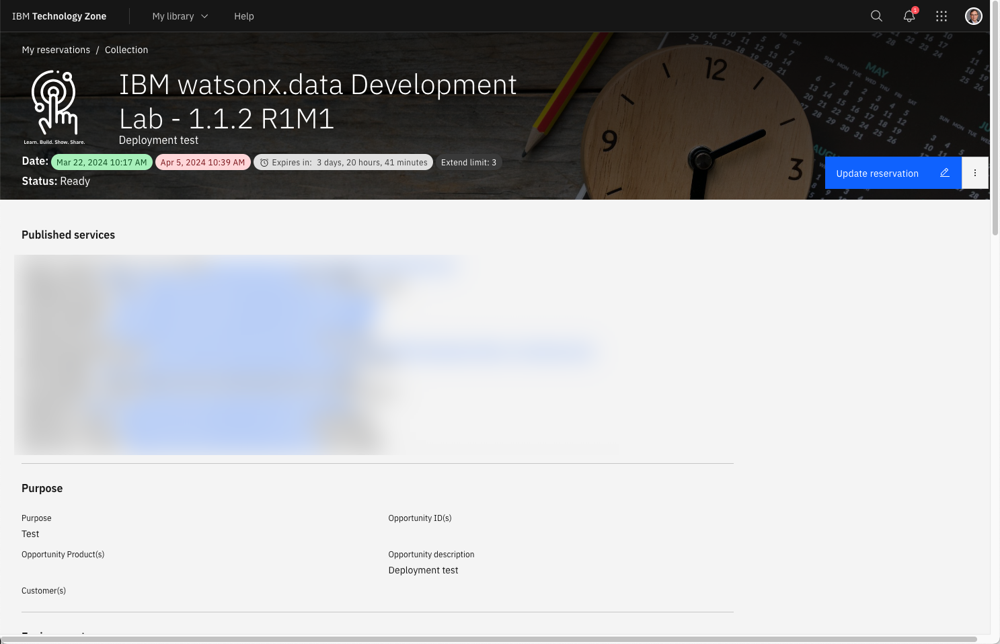

# Watsonx.data Ports

The top of your TechZone reservation will contain a list of published services at the top of the details page.



These URLs and Port numbers are needed to access the watsonx.data services. The list will contain the following information: 

* SSH for watsonx userid - ssh -p 20200 watsonx@region.techzone-services.com
* MySQL Port - Server: region.techzone-services.com Port: 21409
* PostgreSQL Port - Server: region.techzone-services.com Port: 38052
* VNC Service - vnc://region.techzone-services.com:38725
* Portainer console - https://region.techzone-services.com:44449
* Apache Superset - http://region.techzone-services.com:41471
* Presto console - https://region.techzone-services.com:49618
* Presto Port - Server: region.techzone-services.com Port: 49618
* Jupyter Notebook - Server: http://region.techzone-services.com:25490/notebooks/Table_of_Contents.ipynb
* Minio Endpoint - Server: region.techzone-services.com Port: 29652
* Minio console - http://region.techzone-services.com:45050
* Hive Thrift URL - thrift://region.techzone-services.com:22211
* Watsonx UI - https://region.techzone-services.com:37997
* Db2 Port - Server: region.techzone-services.com Port: 21361

There are two additional ports which are available for use with any service you install in the system. These ports are:

* Open Port 1 - Server: region.techzone-services.com: Port: 45779
* Open Port 2 - Server: region.techzone-services.com: Port: 43151

The server URL will be different for each region and data center that your machine is provisioned on. The server name is usually in the format:
```bash
region.techzone-services.com:port
```
The `port` number that is provided in the reservation is mapped to the proper port number in the server. For instance, the Db2 Port number is 50000 in the server, but the reservation above shows a port number of 21361. Use the following rules for determining what server name and port number to use when connecting to the databases:

* If you are using a program "inside" the watsonx server, the host is `watsonxdata` or `localhost`. Some systems will require the watsonx service name (ibm-lh-postgres) and these are highlighted in the documentation. The port number will always be the native port (i.e. 5432 for PostgreSQL).
* If you are using a program "outside" the watsonx server, the host is the one provided in your reservation `region.techzone-services.com` and the port will the one that is included as part of the URL (i.e. 49618 in the example above).

## Watsonx.data Open Ports

The following URLs and Ports are used to access the watsonx.data services. Most browsers will work with these URLs. 

**Note**: Mac OSX users should be aware that accessing the MinIO console may occasionally cause Firefox and Chrome to lock up. If you find that this occurs, try using Safari which appears to work fine.

The ports that are used in the lab listed below, including their available when you first access the lab. The internal port number is always the same when running in the VMware image using the VM Remote Console. When using your workstation's browser, you will need to use the server name and port number supplied in the TechZone reservation. 

|Service|Port|Active|
|-------|------|----|
| watsonx.data management console|9443|Yes
| Presto console|8443|Yes
| MinIO console (S3 buckets)|9001|Yes
| MinIO S3 Endpoint|9000|Yes
| Portainer (Docker container management)|6443|Yes
| Apache Superset (Query and Graphing)|8088|**No**
| Jupyter Notebook|8888|Yes
| Presto External Port|8443|Yes
| Hive metadata Port|9043|Yes
| MySQL External Port|3306|Yes
| Postgres External Port|5432|Yes
| Db2 Database Port|50000|Yes
| VNC Port |5901|**No**

**Note**: The following ports are not active unless the service is started:

* Apache Superset (8088)
* VNC Terminal Display (5901)

There are three https links will result in a Certificate error in Firefox:

* watsonx.data UI
* Presto UI
* Portainer UI

Follow these steps to ignore the error when accessing these URLs.


 
Select Advanced.


 
Choose "Accept the Risk and Continue". If you are using Google Chrome, you can bypass the error message by typing in "thisisunsafe" or clicking on the "Proceed to 192.168.252.2 (unsafe)" link.

