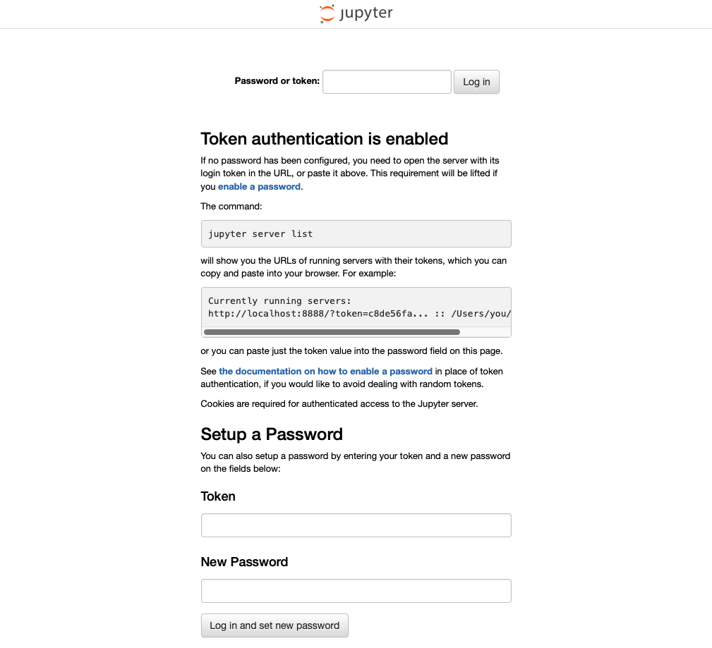
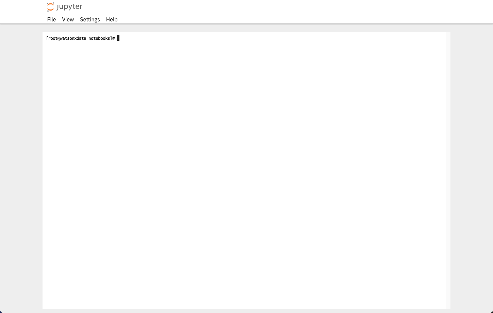

# SSH Access

All the commands in the lab will require you execute commands in a terminal window. Access to a terminal window can be accomplished in the three ways as described below:

* [Use the SSH Command Locally](#ssh-command)
* [Use SSH Browser Window](#web-browser-terminal)
* [Terminal window in the VM](#terminal-window-in-the-vm)

If you are unable to use `ssh` because of connection restrictions, the Browser Window SSH option is the easiest one to use.

## SSH Command

Your TechZone reservation will include the server name and port number to use when connecting using ssh. The port number is referred to as <tt style="font-size: large; color: darkgreen;">port</tt> in the command below, while the server will be referred to as <tt style="font-size: large; color: darkgreen;">region.services.cloud.techzone.ibm.com</tt>. Replace these values with those found in your reservation.

You have the choice of using the VM Remote console and logging in as the watsonx user to issues commands, or using a local terminal shell (iTerm, Hyper, terminal) to run commands against the watsonx.data server. You can have multiple connections into the machine at any one time. 

It will be easier to cut-and-paste commands into a local terminal shell. The VM Remote Console does not support cut-and-paste operation from outside the virtual console environment.

Open a terminal window and use the following syntax to connect as the <code style="font-size: medium;color:blue;">watsonx</code> userid.

```
ssh -p port watsonx@region.services.cloud.techzone.ibm.com
```

The port number and server name are provided as part of the TechZone reservation details.

To become the root user, issue the following command.
```
sudo su -
```
Password for both users is <code style="color:blue;font-size:medium;">watsonx.data</code>.

## Web Browser Terminal

An SSH service in a browser window is provided in this image. As part of the reservation, you will see a URL with the following description:

 * SSH Browser - http://region.services.cloud.techzone.ibm.com:port/terminals/1

When you first click on this link, the browser will display a login prompt.



The password is `watsonx.data`. Once you press the `Log in` button, you will be connected to a terminal session inside the watsonx.data server. 



The system will log you in as the `root` user. There is no need to use the `sudo su -` command to become the root user. Note that you are not in the correct directory to run commands. You must issue the following command to be in the command directory.

!!! abstract "Switch to the command directory"
    ```bash
    cd /root/ibm-lh-dev/bin
    ```

!!! info "Cut and Paste"

    The Browser SSH screen supports full cut and paste operations. This makes it easy to copy scripts into this window without having to retype the commands.

All the commands in the lab can now be run from within this browser rather than using the VM Remote console. If at any time you accidentally close this window, you can open another one using the SSH browser link in the reservation.

## Terminal Window in the VM

If you use the [Remote VM Console](wxd-reference-vnc.md), you can log into the watsonx.data user and use a Terminal shell to run commands against the watsonx.data server. 

Select the Terminal application in the virtual machine to issue commands. 


This will open up the terminal window.


At this point you are connected as the watsonx user. You can ignore any lab instructions that ask you to `ssh` into the watsonx server. To become the root user, you must enter the following command in the terminal window.

!!! abstract "Become the root user"
    ```bash
    sudo su -
    ```

Now as the root user you will be ready to run the commands found in the lab.

!!! warning "Cut and Paste"

    The VM Remote Console does **not** support cut and paste operations from outside the VM environment. Cut and paste is supported inside the virtual machine, but attempting to paste something from you workstation into the VM Console will fail.

## Copying Files

If you need to move files into or out of the virtual machine, you can use the following commands.

To copy a file into the virtual machine use the following syntax:

```
scp -P port myfile.txt watsonx@region.services.cloud.techzone.ibm.com:/tmp/myfile.txt
```

The filename `myfile.txt` will be copied to the `/tmp` directory. The temporary directory is useful since you can copy the file to multiple places from within the Linux environment.

Multiple files can be moved by using wildcard characters using the following syntax:

```
scp -P port myfile.* watsonx@region.services.cloud.techzone.ibm.com:/tmp
```

To move files from the image back to your local system requires you reverse the file specification.

```
scp -P port watsonx@region.services.cloud.techzone.ibm.com:/tmp/myfile.txt /Downloads/myfile.txt
```

You can also use wildcards to select more than one file.