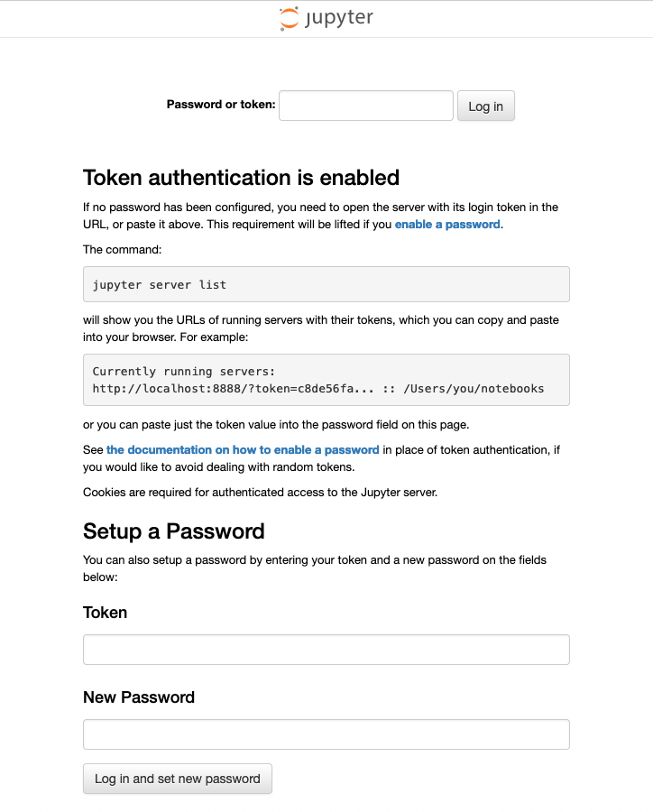
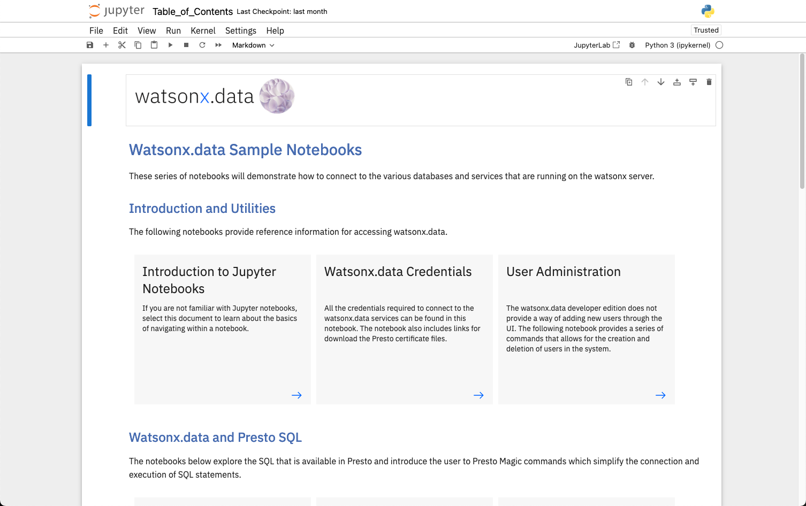
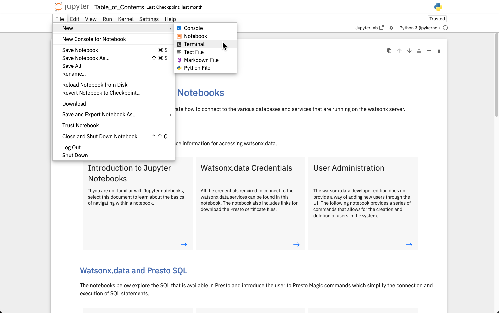
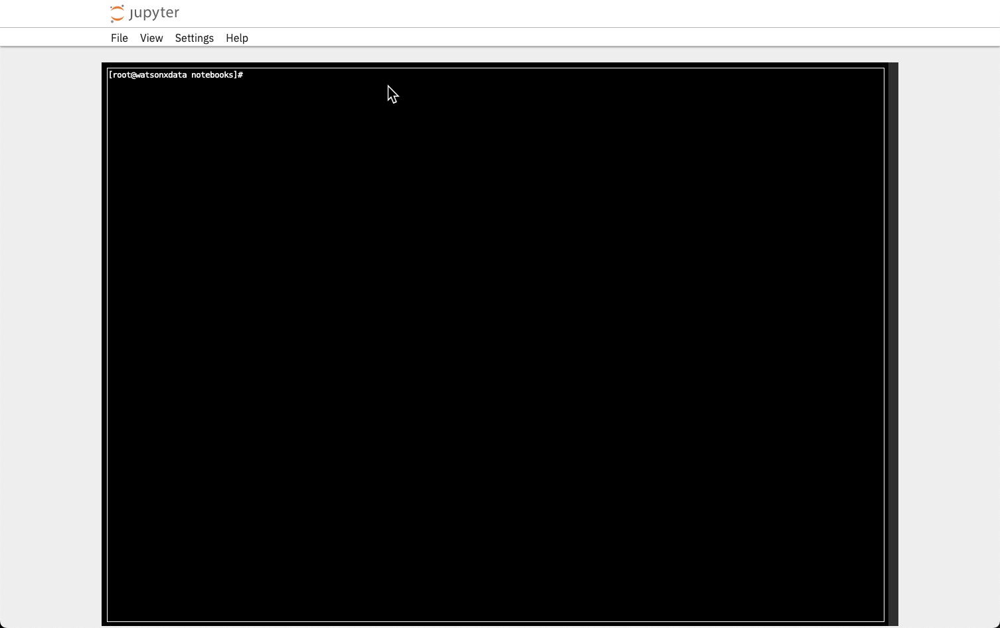

# SSH Access

All the commands in the lab will require you execute commands in a terminal window. Access to a terminal window can be accomplished in the three ways as described below:

* [Use the SSH Command Locally](#ssh-command)
* [Use Jupyter notebook terminal](#jupyter-notebook-terminal)
* [Terminal window in the VM](#terminal-window-in-the-vm)

If you are unable to use `ssh` because of connection restrictions, the Jupyter notebook option is the easiest one to use.

## SSH Command

Your TechZone reservation will include the server name and port number to use when connecting using ssh. The port number is referred to as <tt style="font-size: large; color: darkgreen;">port</tt> in the command below, while the server will be referred to as <tt style="font-size: large; color: darkgreen;">region.techzone-server.com</tt>. Replace these values with those found in your reservation.

You have the choice of using the VM Remote console and logging in as the watsonx user to issues commands, or using a local terminal shell (iTerm, Hyper, terminal) to run commands against the watsonx.data server. You can have multiple connections into the machine at any one time. 

It will be easier to cut-and-paste commands into a local terminal shell. The VM Remote Console does not support cut-and-paste operation from outside the virtual console environment.

Open a terminal window and use the following syntax to connect as the <code style="font-size: medium;color:blue;">watsonx</code> userid.

```
ssh -p port watsonx@region.techzone-server.com
```

The port number and server name are provided as part of the TechZone reservation details.

To become the root user, issue the following command.
```
sudo su -
```
Password for both users is <code style="color:blue;font-size:medium;">watsonx.data</code>.

## Jupyter Notebook Terminal

The Jupyter Notebook lab environment provided as part of lab also provides a way of issuing terminal commands. To access this environment, you must find the Jupyter notebook URL provided in the lab reservation.


When you initially open the link, it will request a password to view the Table of Contents:



The default password for the notebook is `watsonx.data`. Once you enter the password, the Table of Contents will be displayed.



Select the File menu at the top of the screen and then select New - Terminal.



A terminal window will be displayed in the browser.



You are now using a terminal session inside the watsonx.data server. By default, you are already the `root` user, so there is no need to run a `sudo su -` command. Note that you are not in the correct directory to run commands. You must issue the following command to be in the command directory.

```bash
cd /root/ibm-lh-dev/bin
```

All the commands in the lab can now be run from within this browser rather than using the VM Remote console. If at any time you accidentally close this window, you can open another one using the Jupyter notebook File menu.

## Terminal Window in the VM

If you use the [Remote VM Console](wxd-reference-console.md), you can log into the watsonx.data user and use a Terminal shell to run commands against the watsonx.data server. 

Select the Terminal application in the virtual machine to issue commands. 


This will open up the terminal window.


At this point you are connected as the watsonx user. You can ignore any lab instructions that ask you to `ssh` into the watsonx server. To become the root user, you must enter the following command in the terminal window.
```
sudo su -
```

Now as the root user you will be ready to run the commands found in the lab.


## Copying Files

If you need to move files into or out of the virtual machine, you can use the following commands.

To copy a file into the virtual machine use the following syntax:

```
scp -P port myfile.txt watsonx@region.techzone-server.com:/tmp/myfile.txt
```

The filename `myfile.txt` will be copied to the `/tmp` directory. The temporary directory is useful since you can copy the file to multiple places from within the Linux environment.

Multiple files can be moved by using wildcard characters using the following syntax:

```
scp -P port myfile.* watsonx@region.techzone-server.com:/tmp
```

To move files from the image back to your local system requires you reverse the file specification.

```
scp -P port watsonx@region.techzone-server.com:/tmp/myfile.txt /Downloads/myfile.txt
```

You can also use wildcards to select more than one file.