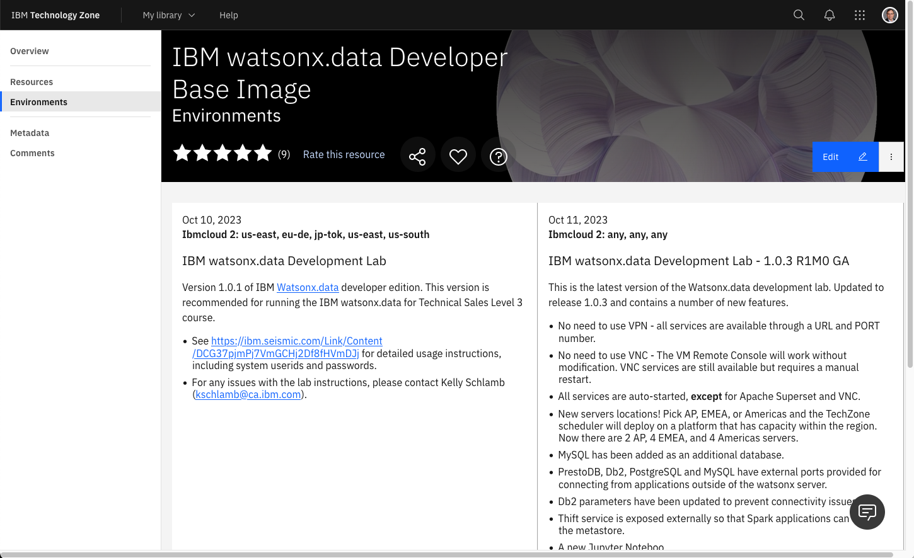
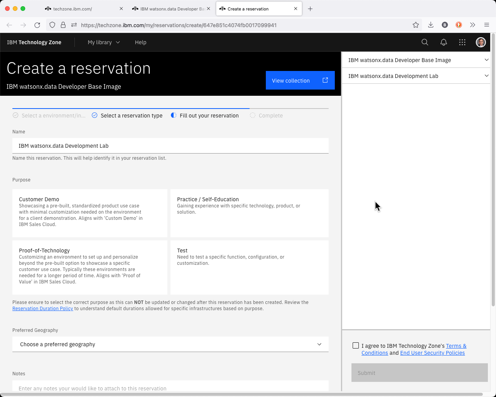
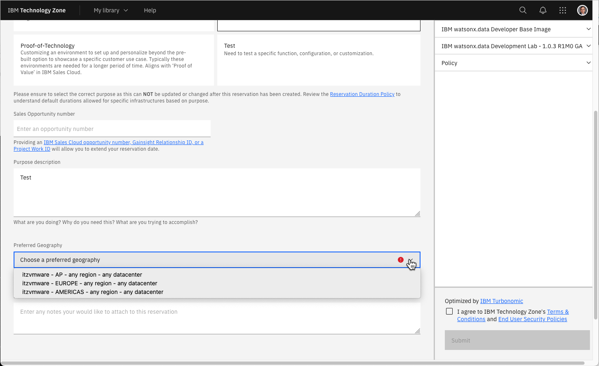
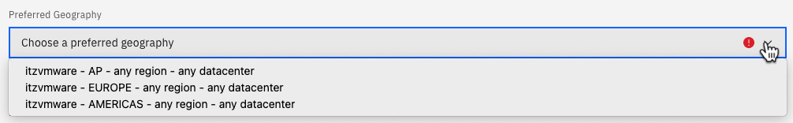
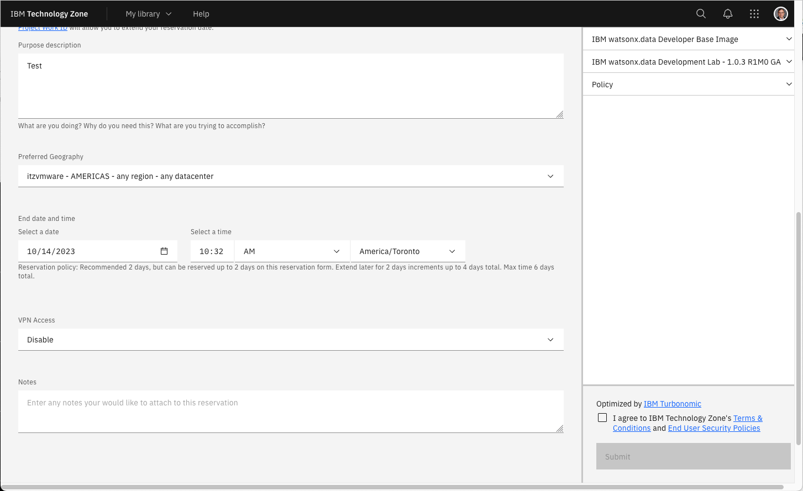
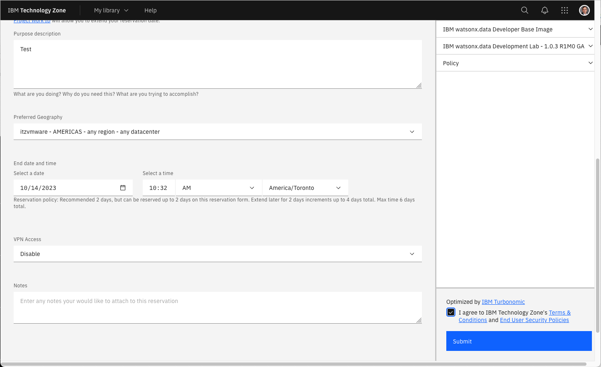
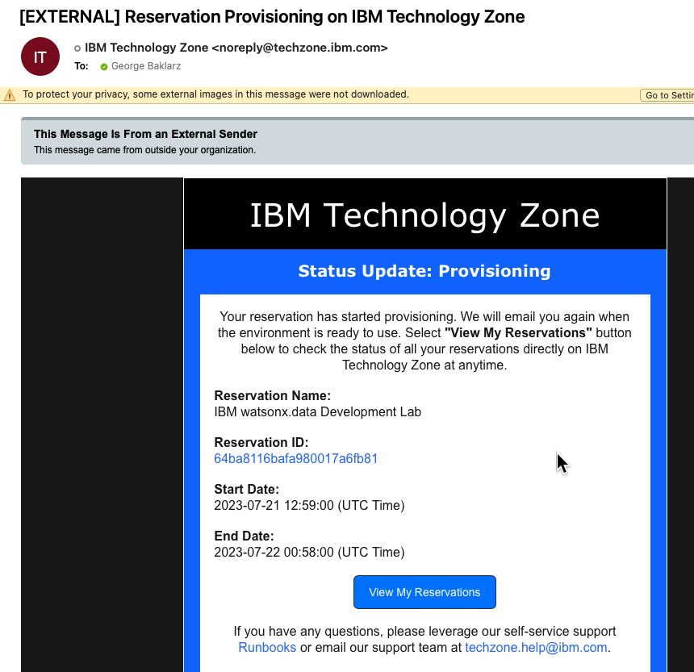

# Requesting a TechZone image

If you are part of a workshop, you do not have to request a reservation. Instead, go to the [Accessing a Workshop](wxd-reference-workshop.md) section.

Log into TechZone (<a href="https://techzone.ibm.com" target="_blank">https://techzone.ibm.com</a>) and search for the watsonx.data
Developer Base Image or use the following link.

[https://techzone.ibm.com/collection/ibm-watsonxdata-developer-base-image](https://techzone.ibm.com/collection/ibm-watsonxdata-developer-base-image)

If you have not logged into the IBM Cloud site, you will be asked to
authenticate with your IBM userid. If you do not have an IBM userid, you will
need to register for one. This lab is open to IBMers and Business Partners. Once
you have logged in, you should see the following.

 
Select the Environment tab on the far-left side. 

**Note**: There may be more than one environment available. Choose the one best suited for your requirements.

 
Press the Reserve button.

 
Select "reserve now" (why wait?).

 
For "Purpose" select Self Education. This will expand to request additional information.

 
Fill in the purpose field with something meaningful (watsonx.data
education). Next select preferred Geography for the image.

Choose any of the regions that are closest to your location. 

**Note**: The TechZone scheduler will pick a location in your region that has capacity to deploy your image. Previously you needed to pick a physical location (DAL10, WDC04, TOK02, etc...). The number of locations has expanded to 4 North American, 4 European and 2 AP locations which will hopefully provide more capacity to deploy the lab.

If you find that your reservation is not being provisioned, check the status of the TechZone environment by referring to the TechZone status page at <a href="https://techzone.status.io" target="_blank">https://techzone.status.io</a>.

Next select the end date for the lab.

Make sure you select enough time for you to use the lab! It defaults to 2 days, but you can extend the reservation! **You do not need to enable VPN Access**.

Once you have completed the form, check the box indicating that you agree to the terms and conditions of using TechZone, and click SUBMIT on the bottom right-hand corner.

At this point you will need to wait patiently for an email that acknowledges that your request has been placed into Provisioning mode.

Eventually you will receive an email confirming that the system is ready to be used. Note that this can take a number of hours depending on the load on the TechZone servers.

You may also get a message telling you that the system provisioning has Failed.

Ignore the reason field since it is usually related to an environment failure caused by lack of resources. Check the status of TechZone first (<a href="https://techzone.status.io" target="_blank">https://techzone.status.io</a>). If the systems appear to be okay, try requesting another image or using a different server location if possible. Contact TechZone support if you are having difficulties provisioning a system.