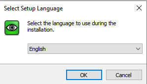
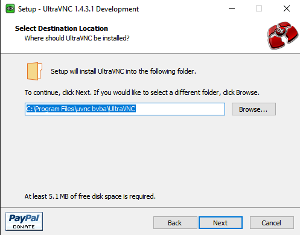
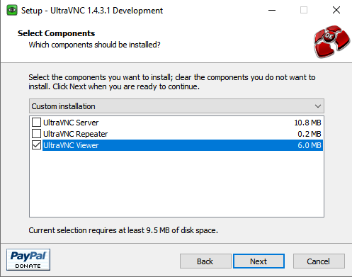
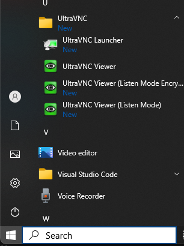

# Using the VM Remote Console

The watsonx server that has been provisioned has no physical monitor attached to it (headless is what it is commonly referred to) and so we need to use a different technique to view the desktop of the main user or the system (watsonx).

The first thing to consider is whether you need to use the VM Remote Console at all. All the services like the watsonx.data UI, MinIO, Presto, Apache Superset and Portainer, are all web-based servers which means you just need to use your own browser to access these programs. 

Connecting into the watsonx virtual machine can be done using the secure shell command (ssh) which provides access to all the low-level commands you might need to use like starting the Apache Superset service. Note that Apache Superset is not up and running by default, so you will need to start it before attempting to connect to it.

So what's the VM Remote Console required for? One program that has been provided to view the database schemas is dBeaver, a community edition of software that provides a query interface to 100's of data sources, including the watsonx.data environment. You can only use this program using the VM Remote Console. You do have the option of installing this software on your own machine if you wish.

Find your email message that contains details of your reservation. Details of what the reservations and the page containing details of the reservation can be found in the [Accessing the reservation](wxd-reference-access.md) section. 

Once the details appear, scroll down to the bottom of the web page, and you will see the VM Remote Console button.


You can access the logon screen of the virtual machine by pressing the VM Remote Console button. 


Clicking on this button will display the logon screen for the server.


Select the <code style="color:blue;font-size:medium;">watsonx</code> user and use <code style="color:blue;font-size:medium;">watsonx.data</code> as the password.


You can open this window in a separate browser window, or place it into fullscreen mode. Note that you may need to increase the size of your browser window (or change the scaling in the browser) to see all the virtual desktop.

At this point you have access to the desktop of the watsonx user and can issue commands from within this environment. As mentioned previously, you do not need to use this interface to use the lab.

## Enabling VNC Access

The watsonx.data image has port `5901` exposed for use with VNC browsers. If you want to use VNC instead of the VM Remote Console access, you must do the following:

* Make sure you are not currently logged in using the VM Virtual Console
* You have suitable VNC software (Mac OSX includes this). Use RealVNC or UltraVNC on a Windows box. 
* You have a Terminal Shell open to issue root commands

In a terminal window, ssh into the watsonx.data virtual machine as the watsonx user. Then you will need to become the root user and issue the following commands:
```
sudo su -
systemctl enable vncserver@:1
systemctl start vncserver@:1
systemctl daemon-reload 
```

After these commands complete, you will not be able to use the VM Remote Console to connect to the watsonx userid. Instead, you will need to use your VNC software to connect to the server.

If at any time you want to turn off VNC support, issue the following commands:
```
sudo su -
systemctl disable vncserver@:1
systemctl stop vncserver@:1
systemctl daemon-reload 
```

## Access watsonx.data on a Mac OSX system

Once the VNC service has been started, you can connect to the machine using the VNC service by using the URL provided in your reservation document (sample URL below):

* VNC Service - vnc://region.techzone-server.com:28314

Use the Mac screen sharing app to connect to watsonx.data. You can connect using the OSX Safari browser by using the URL provided above. It will automatically start the screen sharing application.

**Note**: The VNC URL format is only valid in Safari and may not work in other browsers.
 
When the service connects to the server it will prompt for the password of the <code style="color:blue;font-size:medium;">watsonx</code> user - <code style="color:blue;font-size:medium;">watsonx.data</code>.


 
Once connected you will see the console of the watsonx user.


You may also want to consider making the screen size larger. Use the drop-down menu (Applications) at the top of the screen to select Other -> Settings. 


In the Devices section of the Setting menu, select Displays and choose a resolution that is suitable for your environment.


## Access watsonx.data on a Windows system

Windows does not supply a native VNC browser. You will need to install a program like RealVNC or UltraVNC to access the console. Directions for installing UltraVNC are shown below. 

**Note**: This software has not been officially approved for use on Windows, although it has been tested against the watsonx.data server.

### UltraVNC

UltraVNC is a VNC browser for the Windows environment. This is an open-source offering that can be found on Github in the [UltraVNC project](https://github.com/ultravnc/ultravnc).

The developers of this code have additional offerings that they sell for a fee and use advertising on their site to support their work on this and other projects. Because of the way the website has been designed, there are a number of ads and buttons that might distract you from the actual product you want to download.

The official web page of UltraVNC is <a href="https://uvnc.com/" target="_blank">https://uvnc.com/</a>. Instead of going through all the menus, 
use the following link to go directly to the download screen:

* <a href="https://uvnc.com/component/jdownloads/summary/453-ultravnc-1431-x64-setup.html" target="_blank">UltraVNC Download Link</a>

The website will display an initial download page that will wait for 10 seconds before you can do anything. This gives you time to read the advertising or make a voluntary donation to their coding efforts.


Once the wait time has expired, you will see the following screen:


Make sure to check that you accept the above conditions and press the download button. You should see the download progress in your browser.


Click "Open File" against the downloaded file. 


Once the installer starts it will ask for you to approve changes to the system.


Press Yes and then select the language you want.



Press OK.


Select Accept the license agreement and press Next.


The summary of what it is going to install is shown on this screen. You will then have to provide the installation location or use the default location for the code.



The next panel asks which components you want to install. **Only** install the viewer.



Then it requests the name of the Shortcut folder. Just keep the name it recommends.


Press Next. The next panel comes up that asks if you want a desktop shortcut. Probably a good idea if you are going to use it for a long period of time. Notice how they make this install take longer than expected to get you to donate?


After all of that you will see the final installation screen.


Click on Install and eventually you will get the completion notice.


Pressing Finish will give you one final chance to donate. Make sure to unselect "Show latest releases" or else you will be directed back to their website.


### Using UltraVNC

Start UltraVNC viewer by scrolling through your applications on your desktop. Choose the UltraVNC Viewer (not the listen mode ones **unless** you want to watch someone else using the desktop). 



When the service starts, it will ask for the server and port (Example below). 

* VNC Service - vnc://region.techzone-server.com:28314

For the server you would enter `region.techzone-server.com` and the port would be `28314`. The examples below assume the IP address of `192.168.252.2` with a port number of `5901`.


Before hitting enter, you may want to select the options button and change the setting in Miscellaneous to prevent advertising from being displayed while working with this program. 

Press connect when done.


The password for the service is `watsonx.` which is `watsonx` with a period `.` at the end.


At this point you should see the desktop of the virtual machine.


You are now connected and can work on the watsonx.data desktop.

If you find that performance is sluggish, this may be due to network latency. In the settings toolbar of the UltraVNC window, change the color resolution from `Full` to `256`. Your screen may look a bit washed out, but this will reduce the amount of data that needs to be sent over the network to render your screen.

