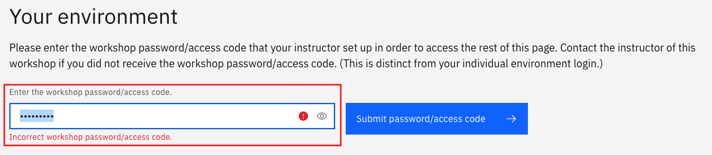
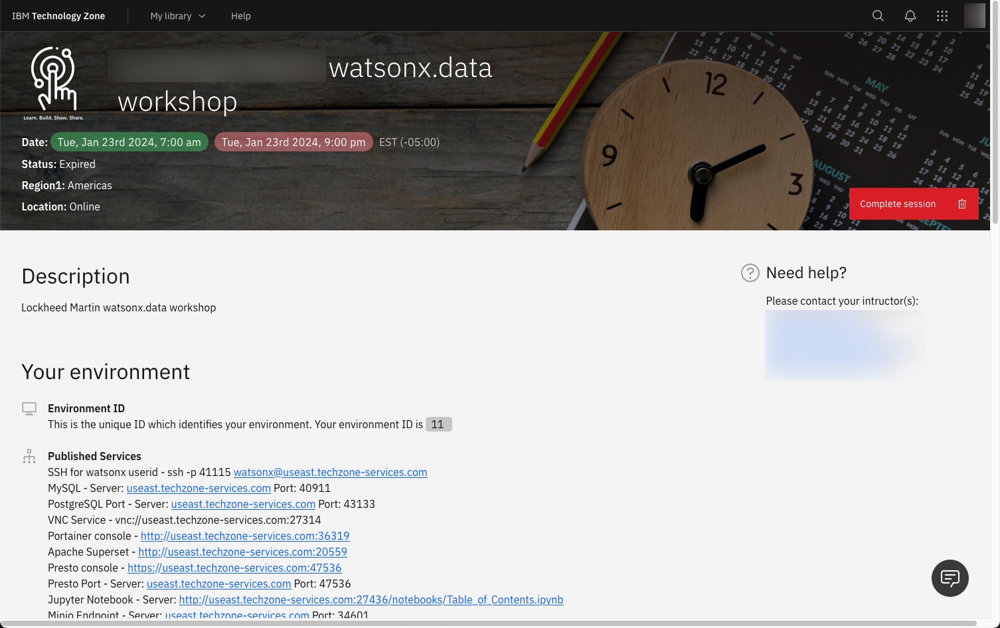
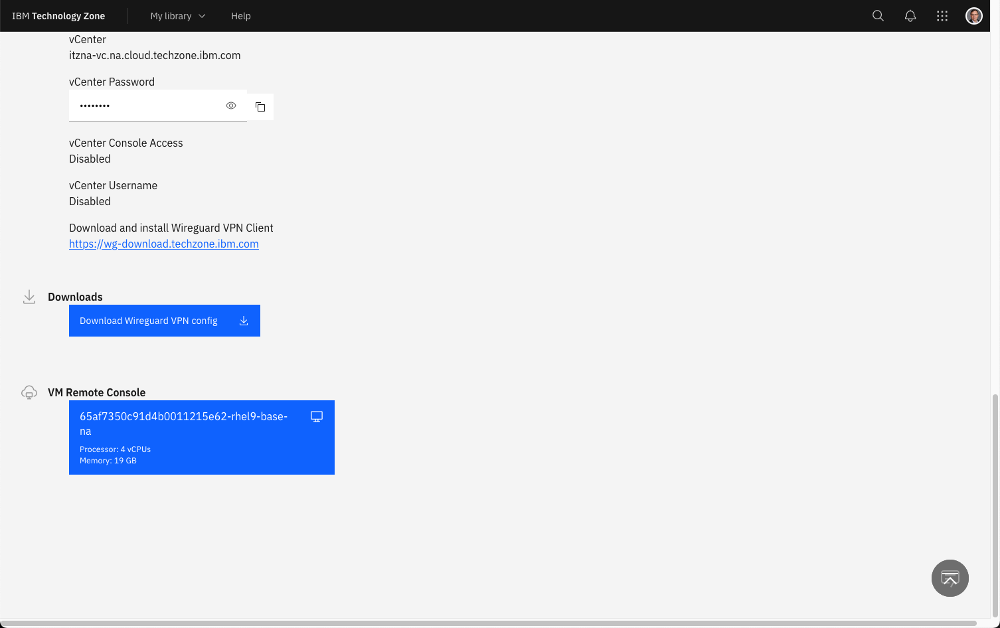

# Accessing a Workshop

To access a watsonx.data workshop, you will need to have an IBM userid and a link provided to your class instructor. This link will first ask you to log into the system using your IBM userid, and then a screen similar to the following will be displayed:

The title of the workshop may be different, but the steps to access the lab will remain the same. The class instructor will have provided a unique password for the course. Enter that value into the password/access code box and click on the Submit button.

When the connection is successful, the details over your environment will be shown in the browser.

The top of the page contains all the published services that you will use during the lab. For instance, if the lab requires that you access the Presto console, you would click on the link in this browser which says:

* Presto console - `https://useast.techzone-services.com:xxxxx`

At the bottom of the reservation you will find a button that provides access to the machine console.

The large blue button labelled VM Remote Console will provide access to the Linux operating system that the watsonx.data server is running on. See the section on [VM Remote Console](wxd-reference-vnc.md)
