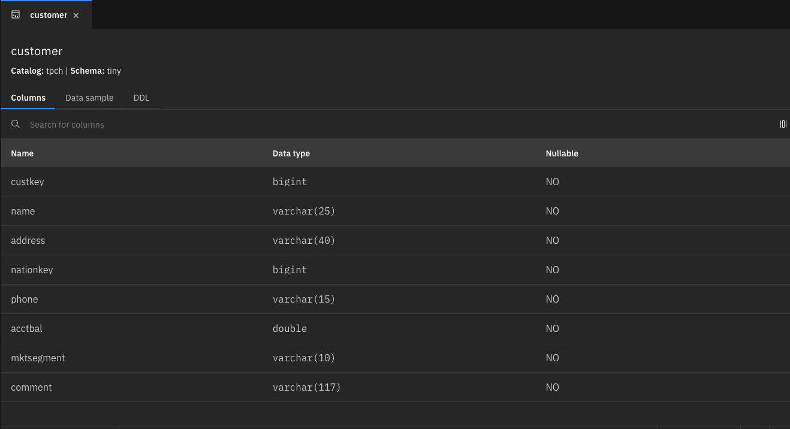
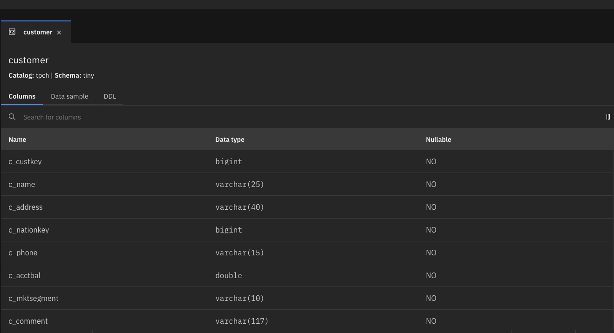
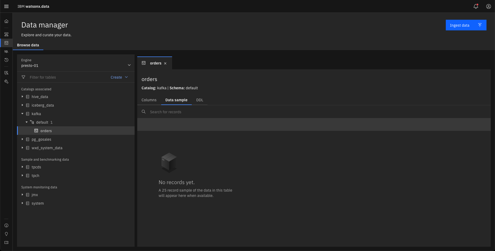

# Image Revisions

### March 5th, 2025 (2.1.1)

* Updated the lab to GA watsonx.data 2.1.1 code

* Detected defects
    - Column names changed in TPCH tables
    
        All TPCH tables have their column names changed to include the first letter of the base table they are in. For instance, the "name" column in the "customer" table is now "c_name". This caused considerable breakage in the examples used in this lab and the reasoning behind this disruptive change is currently unknown. 
        
        The SQL has been updated to work with the new names, but the column names shown in the results were not updated. If you want to use the 2.1.0 versions of the SQL, please refer to the Jupyter notebooks which contain a version for 2.1.0 and 2.1.1.
        
        TPCH 2.1.0 Table
        

        TPCH 2.1.1 Table
        

    - Kafka Queue Sample Data not available in Data Manager
    
        The Data sample tab does not display any data for the Kafka queue, even though there is data in the queue. Using the Query Workspace, you are able to view the data.

        

    - Kafka Query JSON Descriptor fails on upload of OSX files

        If you have multiple copies of a JSON descriptor for a Kafka queue, the upload of the descriptor will fail if the filename contains any special characters. For instance, in OSX, downloading a file multiple times will result in the file name containing brackets to indicate a version (i.e., my-data(2).json). Uploading this file will result in a failure. The fix is to rename the file to remove the brackets from the name.

* Updated System Status and Utilities

    The section on System Status and Utilities has been updated to include the new Diagnostic console. This console makes it easier to view the current status of your watsonx.data system and to restart services if necessary. See [Diagnostic Console](wxd-status.md#diagnostic-console) for more details.

* Port Updates

    * Port 3306 (MySQL) has been removed.

    * Port 8088 (Apache Superset) has been removed. The service is still available if you use the Virtual Machine console and use `localhost:8088` to connect to it.
    
    * Port 9091 has been opened up for calling the Milvus REST interface.

    * Port 5432 (Postgres) is back. Did you miss it? I forgot it when creating the 2.1.0 image.

* See updates for 2.1.1 at [IBM watsonx.data 2.1.x Documentation](https://www.ibm.com/docs/en/watsonx/watsonxdata/2.1.x?topic=overview-whats-new-in-watsonxdata)    

### December 23rd, 2024 (2.1.0)

* Updated the lab to GA watsonx.data 2.1.0 code

* New diagnostic console for restarting Presto, watsonx.data, and obtaining certificates and credentials.

* New Thrift Service replaces the Hive metastore. Note that a new port (8380) replaces the Hive port (9083).

* See updates for 2.1.0 at [IBM watsonx.data 2.1.x Documentation](https://www.ibm.com/docs/en/watsonx/watsonxdata/2.1.x?topic=watsonxdata-whats-new-in)

### June 30, 2024 (2.0.0)

* Updated the lab to GA watsonx.data 2.0.0 code

* See updates for 2.0.0 at [IBM watsonx.data 2.0.x Documentation](https://www.ibm.com/docs/en/watsonx/watsonxdata/2.0.x?topic=watsonxdata-whats-new-in-watsonxdata)

### May 3, 2024 (1.1.4)

* Updated the lab to GA watsonx.data 1.1.4 code

* New Jupyter notebooks to demonstrate:

    - Kafka queue creation and usage (update to 1.1.3 because the process changed)
    - Kafka console installation and usage
    - Watsonx.data RESTful API usage

* SSH over Browser support improvements (it works better now!)

* Additional shortcut commands added for managing the system

### April 24, 2024 (1.1.3)

* Updated the lab to GA watsonx.data 1.1.3 code

* Added Milvus support and opened port 19530

* New Jupyter notebooks to demonstrate:

    - Milvus usage for RAG generation
    - Milvus ATTU Console
    - Kafka queue creation and usage
    - Presto RESTful API Usage example

### February 29, 2024 (1.1.2)

* Updated the lab to GA watsonx.data 1.1.2 code

* Exposing Hive metastore port details (Developer edition)
    
    You can now expose the Hive metastore port details outside the watsonx.data developer edition's host to facilitate connection from external applications (services outside of docker or Podman), such as the integration with Db2, and Spark to watsonx.data.

### January 25, 2024 (1.1.1)

* Updated Lab Documentation

    - [Instructions for using a Workshop environment](wxd-reference-workshop.md)
    - [New section on user administration and creating policies](wxd-useradmin.md)
    - [Update to running terminal commands uses Jupyter notebook shell](wxd-reference-ssh.md#jupyter-notebook-terminal)

### January 8, 2024 (1.1.1)

* Updated the lab to GA watsonx.data 1.1.1 code

    - [What's new in watsonx.data version 1.1.1 Reference](https://www.ibm.com/docs/en/watsonxdata/1.1.x?topic=watsonxdata-whats-new-in)

 
### January 3, 2024 (1.1.0)

* Added two open ports to the image

    Sometimes there is a requirement to add another service to the watsonx.data image. For instance, you may want to add MongoDB or MSSQL to the system in order to demonstrate federations with these data source. Since we do not know what your requirements are, we have opened up two ports that can be assigned to any service. The documentation has been updated to describe what steps are needed to use these open up and use these ports.

### December 6, 2023 (1.1.0)

* Updated the lab to GA 1.1.0 code

    - [What's new in watsonx.data version 1.1.0 Reference](https://www.ibm.com/docs/en/watsonxdata/1.1.x?topic=watsonxdata-whats-new-in)

    - Time-travel and roll-back queries

        You can now run the following time-travel queries to access historical data in Apache Iceberg tables:

        <pre style="font-size: small; color: darkgreen; overflow: auto">
        SELECT &lt;columns&gt; FROM &lt;iceberg-table&gt; FOR TIMESTAMP AS OF TIMESTAMP &lt;timestamp&gt;
        SELECT &lt;columns&gt; FROM &lt;iceberg-table&gt; FOR VERSION AS OF &lt;snapshotId&gt;
        </pre>

        You can use time-travel queries to query and restore data that was updated or deleted in the past.

        You can also roll back an Apache Iceberg table to any existing snapshot.

    - Capture historical data about Presto queries
      
        The Query History Monitoring and Management (QHMM) service captures historical data about Presto queries and events. The historical data is stored in a MinIO bucket and you can use the data to understand the queries that were run and to debug the Presto engine.

    - Improved query performance with Metastore, File list, and File metadata caching
      
    - You can now capture and track the DDL changes in watsonx.data by using    an event listener.

    - Ingest data by using Spark
      
        You can now use the IBM Analytics Engine powered by Apache Spark to run ingestion jobs in watsonx.data.

    - Integration with Db2 and Netezza Performance Server
      
        You can now register Db2 or Netezza Performance Server engines in watsonx.data console.

    - New connectors
      
        You can now use connectors in watsonx.data to establish connections to the following types of databases:

        -  Teradata
        -  Delta Lake
        -  Elasticsearch
        -  SAP HANA
        -  SingleStoreDB
        -  Snowflake
        -  Teradata

- Db2 Upgraded to 11.5.9

    - [What's new in Db2 11.5.9 Reference](https://www.ibm.com/docs/en/db2/11.5?topic=new-1159)

    

### October 6, 2023 (1.0.3)

* Updated the lab to GA 1.0.3 code

    - [What's new in watsonx.data version 1.1.0](https://www.ibm.com/docs/en/watsonxdata/1.0.x?topic=watsonxdata-version-103)

* Image now available in 10 data centers with simpler provisioning

    - [Requesting an Image](wxd-reference-techzone.md)

* Removed VPN Requirement
* External URLs and Ports for all UI Services

    - [watsonx.data Ports](wxd-reference-ports.md)

* Added PostgreSQL and MySQL databases

    - [Postgres Connection](wxd-connections.md#postgresql-access)
    - [MySQL Connection](wxd-connections.md#mysql-access)

* Added Jupyter notebook examples

    - [Jupyter Notebook support](wxd-jupyter.md)

* Fixed Presto certificate to support TechZone addresses without updating`/etc/hosts`

    - [Watsonx.data Connection Certificate](wxd-connections.md#watsonxdata-connection-certificate)

* Added standalone Spark server to show connectivity to the Presto database

    - [Accessing watsonx.data with Spark](wxd-jupyter.md#accessing-watsonxdata-with-spark)

* Added watsonx.data Client code

    - [Watsonx.data client utilities](https://www.ibm.com/docs/en/watsonxdata/1.0.x?topic=utilities-lh-client-commands-usage)

* Added MinIO CLI interface

    - [MinIO CLI](wxd-minio.md)

* Exposed external ports for MinIO, Db2, MySQL, PostgreSQL, Hive, PrestoDB

    - [watsonx.data Ports](wxd-reference-ports.md)

* VNC Interface disabled by default

    - [Enabling VNC Access](wxd-reference-vnc#enabling-vnc-access.md)

* Added Ingesting data chapter

    - [Ingesting Data](wxd-ingest.md)

### July 25, 2023 (1.0.1)

* Updated the lab to GA 1.0.1 code
* Automated start of watsonx.data and simplification of many of the sections
* Removed the Ingest section until a new version is available
* Added Db2 and PostgreSQL connection details

### June 12, 2023 (1.0.0)

Clarified some commands and added an Appendix on common issues.

### June 6, 2023 (1.0.0)

Updated instructions for new TechZone image and added Ingest lab instructions.

### May 25th, 2023 (1.0.0)

Initial publication.

