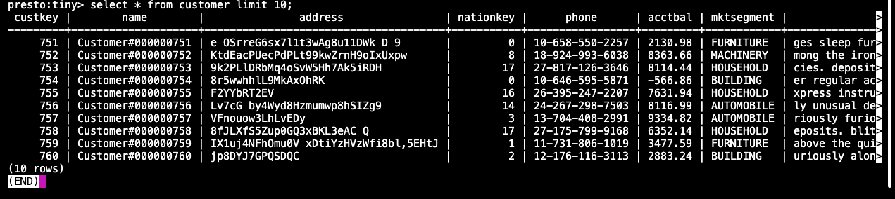

# Lab Instructions

## URL Conventions

Your TechZone reservation contains a number of URLs for the services provided in the watsonx.data server. The URL will contain the name of the server and the corresponding port number for the service. Throughout the documentation, the server name will be referred to as <tt style="font-size: large; color: darkgreen;">region.techzone-server.com</tt>and port number is referred to as <tt style="font-size: large; color: darkgreen;">port</tt>. Where you see these URLS, replace them with the values found in your reservation.

## Commands

Throughout the labs, any command that needs to be executed will be highlighted in a grey box:
```
cd /root/ibm-lh-dev/bin
```
A copy icon is usually found on the far right-hand side of the command box. Use this to copy the text and paste it into your command window. You can also select the text and copy it that way. 

Note that some commands may span multiple lines, so make sure you copy everything in the box. 

## System Check

Your TechZone reservation will include the server name and port number to use when connecting using ssh. The port number is referred to as <tt style="font-size: large; color: darkgreen;">port</tt> in the command below, while the server will be referred to as <tt style="font-size: large; color: darkgreen;">region.techzone-server.com</tt>. Replace these values with those found in your reservation.

Make sure that you have an open terminal session and use the following command to connect to the watsonx.data server.

```bash
ssh -p port watsonx@region.techzone-server.com
```
Password is <code style="color:blue;font-size:medium;">watsonx.data</code>.
Next switch to the root userid.
```
sudo su -
```

Switch to the development code bin directory.
```
cd /root/ibm-lh-dev/bin
```

Once you have switched to the development directory, you can start running watsonx.data commands. You can check the status with the following command.
```bash
./status.sh --all
```
Output will look similar to:
<pre style="font-size: small; color: darkgreen; overflow: scroll"">
using /root/ibm-lh-dev/localstorage/volumes as data root directory for user: root/1001 
infra config location is /root/ibm-lh-dev/localstorage/volumes/infra
lhconsole-ui				running			0.0.0.0:9443->8443/tcp, :::9443->8443/tcp
lhconsole-nodeclient-svc		running			3001/tcp
lhconsole-javaapi-svc			running			8090/tcp
lhconsole-api				running			3333/tcp, 8081/tcp
ibm-lh-presto				running			0.0.0.0:8443->8443/tcp, :::8443->8443/tcp
ibm-lh-hive-metastore			running			
ibm-lh-postgres				running			5432/tcp
ibm-lh-minio				running			
</pre>

To confirm that the software is working, run the following commands to validate the installation.

## Presto Engine Test
Check the Presto engine by connecting to a schema. First, we need to make sure that the Presto engine has completed all startup tasks. The following command is not part of watsonx.data, but has been included to simplify checking the status of the Presto service.
```
check_presto
```
<pre style="font-size: small; color: darkgreen">
Waiting for Presto to start.
...........................
Ready
</pre>

**Note**: If the starting message may take up to 5 minutes when the system first initializes. 

Once the command returns "Ready" you can connect to the presto CLI.
```
./presto-cli --catalog tpch --schema tiny
```
Check the record count of the customer table. 

**Note**: If the Presto engine has not yet started (you didn't run the check_presto script), the next command may result in a useless Java error message. You may need to wait for a minute for attempting to run the statement again.
```
select * from customer limit 10;
```

All Presto commands end with a semi-colon. The result set should include the a number of rows (the results will be random).

<pre style="font-size: small; color: darkgreen; overflow: auto">
 custkey |        name        |                address                | nationkey |      phone      | acctbal | mktsegment |                                                      comment                                                      
---------+--------------------+---------------------------------------+-----------+-----------------+---------+------------+-------------------------------------------------------------------------------------------------------------------
       1 | Customer#000000001 | IVhzIApeRb ot,c,E                     |        15 | 25-989-741-2988 |  711.56 | BUILDING   | to the even, regular platelets. regular, ironic epitaphs nag e                                                    
       2 | Customer#000000002 | XSTf4,NCwDVaWNe6tEgvwfmRchLXak        |        13 | 23-768-687-3665 |  121.65 | AUTOMOBILE | l accounts. blithely ironic theodolites integrate boldly: caref                                                   
       3 | Customer#000000003 | MG9kdTD2WBHm                          |         1 | 11-719-748-3364 | 7498.12 | AUTOMOBILE |  deposits eat slyly ironic, even instructions. express foxes detect slyly. blithely even accounts abov            
       4 | Customer#000000004 | XxVSJsLAGtn                           |         4 | 14-128-190-5944 | 2866.83 | MACHINERY  |  requests. final, regular ideas sleep final accou                                                                 
       5 | Customer#000000005 | KvpyuHCplrB84WgAiGV6sYpZq7Tj          |         3 | 13-750-942-6364 |  794.47 | HOUSEHOLD  | n accounts will have to unwind. foxes cajole accor                                                                
       6 | Customer#000000006 | sKZz0CsnMD7mp4Xd0YrBvx,LREYKUWAh yVn  |        20 | 30-114-968-4951 | 7638.57 | AUTOMOBILE | tions. even deposits boost according to the slyly bold packages. final accounts cajole requests. furious          
       7 | Customer#000000007 | TcGe5gaZNgVePxU5kRrvXBfkasDTea        |        18 | 28-190-982-9759 | 9561.95 | AUTOMOBILE | ainst the ironic, express theodolites. express, even pinto beans among the exp                                    
       8 | Customer#000000008 | I0B10bB0AymmC, 0PrRYBCP1yGJ8xcBPmWhl5 |        17 | 27-147-574-9335 | 6819.74 | BUILDING   | among the slyly regular theodolites kindle blithely courts. carefully even theodolites haggle slyly along the ide 
       9 | Customer#000000009 | xKiAFTjUsCuxfeleNqefumTrjS            |         8 | 18-338-906-3675 | 8324.07 | FURNITURE  | r theodolites according to the requests wake thinly excuses: pending requests haggle furiousl                     
      10 | Customer#000000010 | 6LrEaV6KR6PLVcgl2ArL Q3rqzLzcT1 v2    |         5 | 15-741-346-9870 | 2753.54 | HOUSEHOLD  | es regular deposits haggle. fur                                                                                   
(10 rows)
</pre>

The output on your screen will look similar to the following:



The arrows on the far right side indicate that there is more output to view. Press the right and left arrows on your keyboard to scroll the display.


If the result set is small, all of the results will display on the screen and no scrolling will be available unless the results are wider than the screen size. 

When thje display shows <code style="color:blue;font-size:medium;">(END)</code> you have reached the bottom of the output. If the display shows a colon (<code style="color:blue;font-size:medium;">:</code>) at the bottom of the screen, you can use the up and down arrow keys to scroll a record at a time, or the Page Up and Page Down keys to scroll a page at a time. To quit viewing the output, press the Q key.

Quit the Presto CLI. The Presto quit command can be used with or without a semicolon.
```
quit;
```

Congratulations, your system is now up and running!