# Watsonx.data System Status and Utilities

There are two options available for monitoring the status of the watsonx.data system. The system includes a URL in the reservation that points to a Diagnostic console:

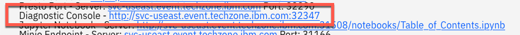

The other option is to use a terminal shell in the image to issue commands to check the system. Both options are described below.

## Diagnostic Console

The watsonx.data development system includes a diagnostic console to help you quickly check the status of the system and allow you to restart watsonx.data and Presto without using a command line.

To access the Diagnostic console, find the URL in your reservation which points to the console.

8

The diagnostic console requires that you log in:

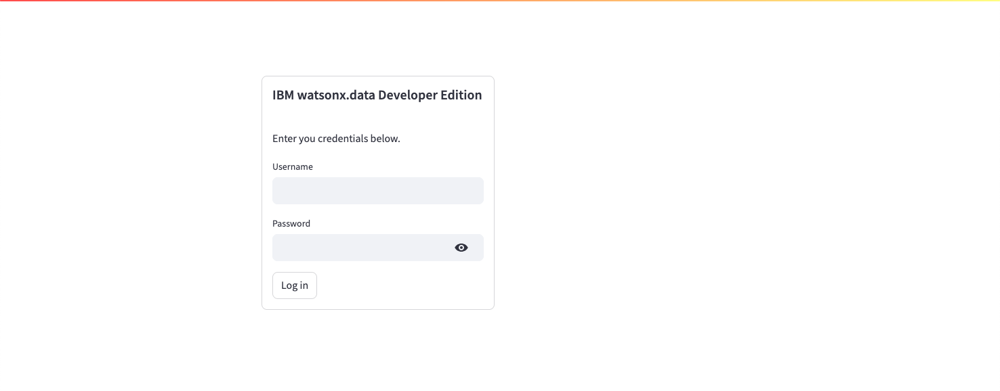

The credentials for the console are:

* Userid: `watsonx`
* Password: `watsonx.data`

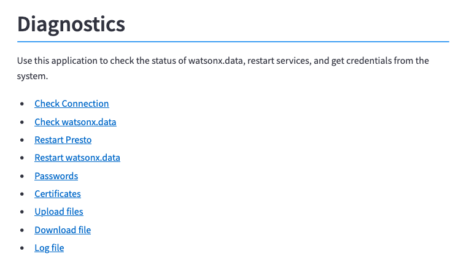

The main menu provides 9 options:

* Check Connection
* Check watsonx.data
* Restart Presto
* Restart watsonx.data
* Passwords
* Certificates
* Upload files
* Download file
* Log file

### Main Screen

The main screen provides links to all the services in the dialog. Click on the name of the service you want, and the screen will scroll to that option.


### Presto Status

You can use this option to check on the status of the Presto engine. If your watsonx.data system appears to be unresponsive, or you are receiving connection errors when accessing Presto, check the status of Presto first before restarting the watsonx.data services. 

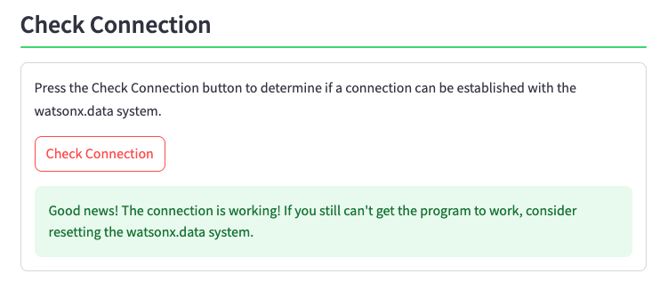

If the engine is not available, the system will display an error message.

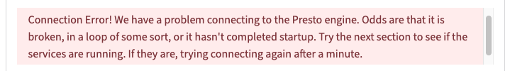

### Watsonx.data System Status

The watsonx.data system status screen shows all the components (containers) that are running in the system. If all the services are available, the dialog will show a green status.

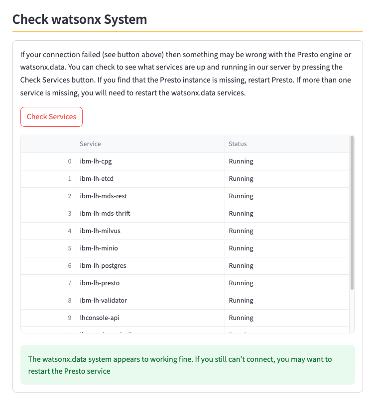

In the event one of the services is not available, an error message will be displayed. The services that have failed will either have "Unknown" or "Failed" as the status message.

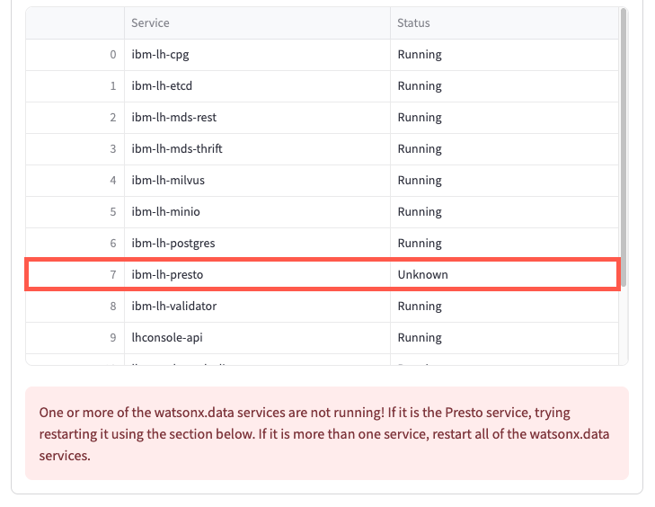

In the event of failed services, you will need to restart the cluster, or only Presto if that has failed.

### Restart Presto

If the Presto engine has failed, use the Restart Presto button to restart the service.

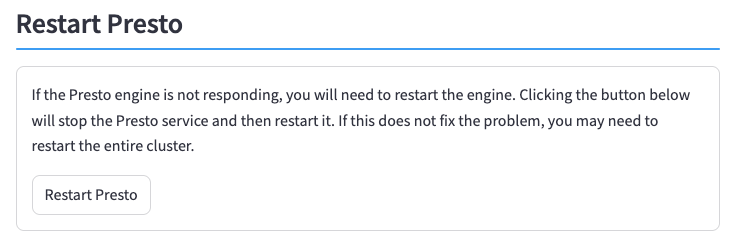

The first step will stop the Presto service and then restart it.

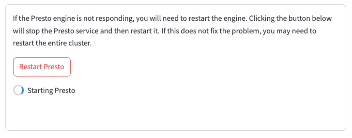

Once the Presto engine has been started, the system will wait until the initialization step has completed.

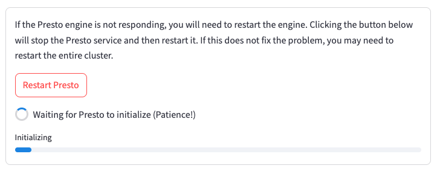

When the initialization is complete, the system will show a success message.

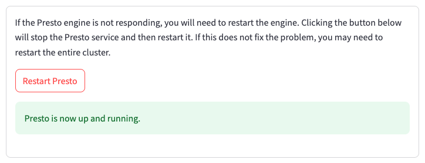

### Restart watsonx.data

If a number of watsonx.data services are unavailable, you will need to restart all the services. This process will take a log period of time to complete.

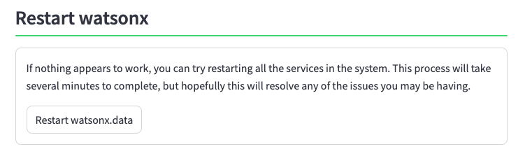

The first step will stop the Milvus service.

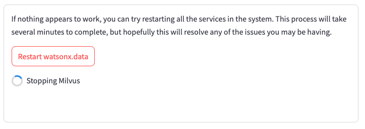

The system will then stop all of the watsonx.data services.

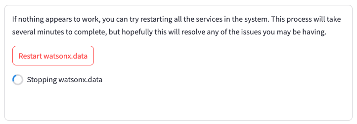

The system will them restart the watsonx.data services.

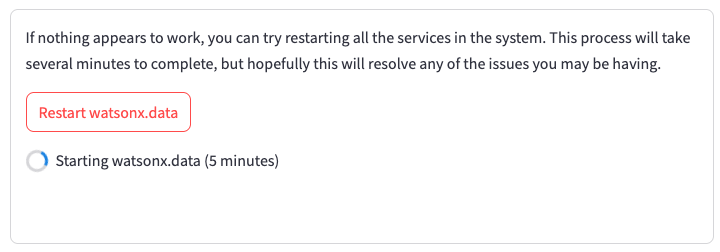

After watsonx.data has started, the Milvus vector database will be restarted.

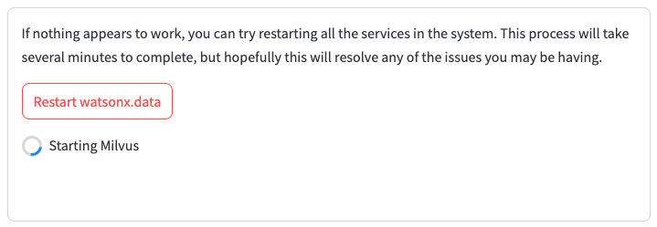

Finally, the system will wait for the Presto service to complete initialization.

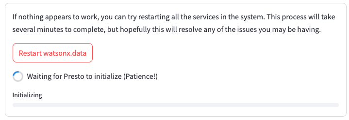

If everything completed successfully, the system will display a success message.

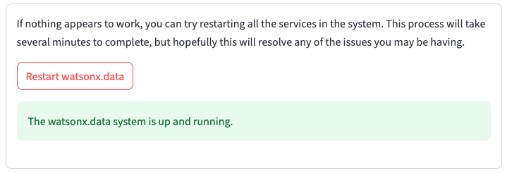

### Passwords

The password section displays all the Userids and passwords used in the watsonx.data system.

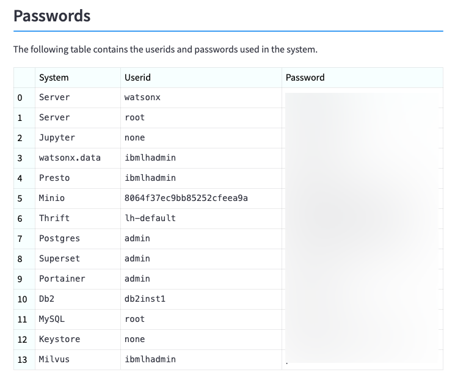

### Certificates

You can use any of the buttons below to download certificates used to connect to watsonx.data. 

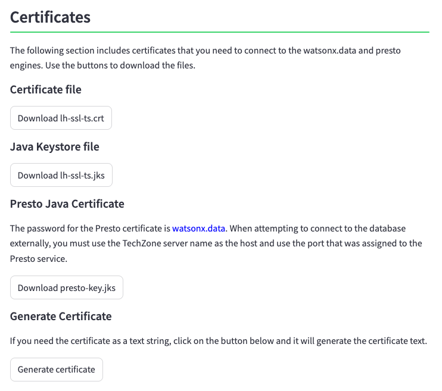

If you want to generate the certificate to "cut and paste" the value into an application, use the Generate Certificate button.

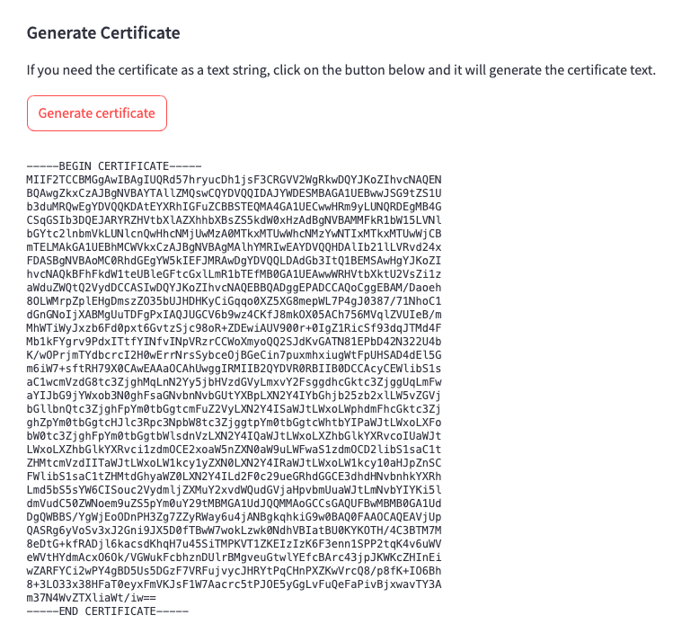

### Upload File

If you need to upload a file into the system, drag and drop the file onto this dialog, or select the file using the local file manager. Note that only one file can be uploaded at a time and is limited in size. The dialog will display the file size limit.

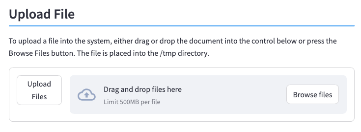

### Download File

You can download a file from the image by using this dialog. There are two steps involved. First enter the name of the file in the dialog and press the Check File button. 

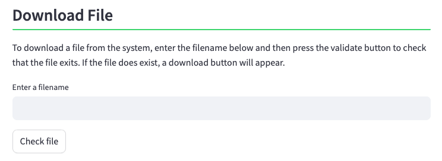

If the file can be found on the system, it will generate a link to that file. For instance, the following displays the download link that is generated when requesting the `presto-key.jks` file which is found in the `/certs` directory.

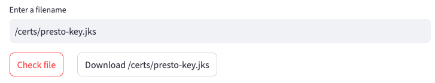

You can download the file using the `Download` button that generated.

### System Log

The commands that were used to start and stop the watsonx.data services are recorded in the log file. You can view the contents of the log in this dialog and clear the log if it becomes too large to view.

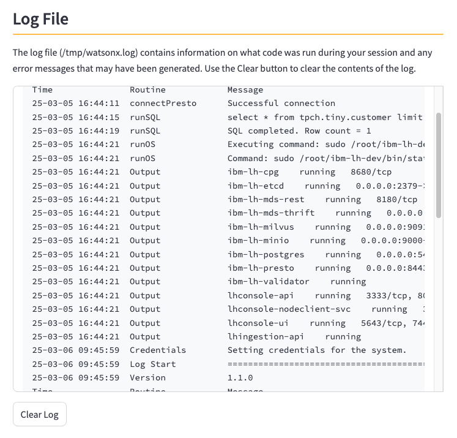

## System Status

The watsonx.data server is started as part of the lab. To make sure that the services are running, open a terminal session and use the following command to connect to the watsonx.data server.

!!! abstract "SSH into the watsonx.data server"
      ```bash
      ssh -p port watsonx@region.services.cloud.techzone.ibm.com
      ```

Password is <code style="color:blue;font-size:medium;">watsonx.data</code>.
Next switch to the root userid and change to the watsonx.data bin directory.

!!! abstract "Switch to the root user"
      ```bash
      sudo su -
      ```

!!! abstract "Change to the bin directory"
      ```bash
      cd /root/ibm-lh-dev/bin
      ```

You can check the watsonx.data system status with the following command.

!!! abstract "Watsonx.data status"
      ```bash
      ./status.sh --all
      ```

Output will look similar to:
<pre style="font-size: small; color: darkgreen; overflow: scroll">
using /root/ibm-lh-dev/localstorage/volumes as data root directory for user: root/1001 
infra config location is /root/ibm-lh-dev/localstorage/volumes/infra
lhconsole-ui				running			0.0.0.0:9443->8443/tcp, :::9443->8443/tcp
lhconsole-nodeclient-svc		running			3001/tcp
lhconsole-javaapi-svc			running			8090/tcp
lhconsole-api				running			3333/tcp, 8081/tcp
ibm-lh-presto				running			0.0.0.0:8443->8443/tcp, :::8443->8443/tcp
ibm-lh-hive-metastore			running			
ibm-lh-postgres				running			5432/tcp
ibm-lh-minio				running			
</pre>

## Presto Engine Test
Check the Presto engine by running an SQL statement. 

!!! warning "Java Error Messages"
      If the Presto engine has not yet started (you didn't run the check-presto command), the next command may result in a useless Java error message. You may need to wait for a minute before attempting to run the statement again.

Check the record count of the customer table. 

!!! abstract "Get record count from customer table"

      ```bash
      ./presto-run  --catalog=tpch <<< "select * from tiny.customer limit 10;"
      ```

The result set should include 10 rows (the results will be random).

<pre style="font-size: small; color: darkgreen; overflow: auto">
presto> select * from tiny.customer limit 10;
 custkey |        name        |                address                 | nationkey |      phone      | acctbal | mktsegment |                                                  comment                                                   
---------+--------------------+----------------------------------------+-----------+-----------------+---------+------------+------------------------------------------------------------------------------------------------------------
    1126 | Customer#000001126 | 8J bzLWboPqySAWPgHrl4IK4roBvb          |         8 | 18-898-994-6389 | 3905.97 | AUTOMOBILE | se carefully asymptotes. unusual accounts use slyly deposits; slyly regular pi                             
    1127 | Customer#000001127 | nq1w3VhKie4I3ZquEIZuz1 5CWn            |        10 | 20-830-875-6204 | 8631.35 | AUTOMOBILE | endencies. express instructions wake about th                                                              
    1128 | Customer#000001128 | 72XUL0qb4,NLmfyrtzyJlR0eP              |         0 | 10-392-200-8982 | 8123.99 | BUILDING   | odolites according to the regular courts detect quickly furiously pending foxes? unusual theodolites use p 
    1129 | Customer#000001129 | OMEqYv,hhyBAObDjIkoPL03BvuSRw02AuDPVoe |         8 | 18-313-585-9420 | 6020.02 | HOUSEHOLD  | pades affix realms. pending courts haggle slowly fluffily final requests. quickly silent deposits are. iro 
    1130 | Customer#000001130 | 60zzrBpFXjvHzyv0WObH3h8LhYbOaRID58e    |        22 | 32-503-721-8203 | 9519.36 | HOUSEHOLD  | s requests nag silently carefully special warhorses. special accounts hinder slyly. fluffily enticing      
    1131 | Customer#000001131 | KVAvB1lwuN qHWDDPNckenmRGULDFduxYRSBXv |        20 | 30-644-540-9044 |  6019.1 | MACHINERY  | er the carefully dogged courts m                                                                           
    1132 | Customer#000001132 | 6dcMOh60XVGcGYyEP                      |        22 | 32-953-419-6880 | 4962.12 | AUTOMOBILE | ges. final, special requests nag carefully carefully bold deposits. ironic requests boost slyly through th 
    1133 | Customer#000001133 | FfA0o cMP02Ylzxtmbq8DCOq               |        14 | 24-858-762-2348 | 5335.36 | MACHINERY  | g to the pending, ironic pinto beans. furiously blithe packages are fina                                   
    1134 | Customer#000001134 | 79TYt94ty a                            |         9 | 19-832-924-7391 | 8458.26 | HOUSEHOLD  | riously across the bold instructions. quickly                                                              
    1135 | Customer#000001135 | cONv9cxslXOefPzhUQbGnMeRNKL1x,m2zlVOj  |        11 | 21-517-852-3282 | 3061.78 | FURNITURE  | regular frays about the bold, regular requests use quickly even pin                                        
(10 rows)

Query 20240508_171644_00060_egvws, FINISHED, 1 node
Splits: 21 total, 21 done (100.00%)
[Latency: client-side: 0:06, server-side: 0:06] [1.5K rows, 0B] [260 rows/s, 0B/s]

presto> 
</pre>

Congratulations, your system is now up and running!

## System Utilities

There are several commands that have been added to the watsonx.data developer edition to make it easier to manage the system. These commands are not part of the original installation, but are provided as a convenience for managing the system.

All commands require that you connect to the server as the root user. Use the following commands to connect to the watsonx.data system.

!!! abstract "SSH into the watsonx.data server"
      ```bash
      ssh -p port watsonx@region.services.cloud.techzone.ibm.com
      ```

Password is <code style="color:blue;font-size:medium;">watsonx.data</code>.
Next switch to the root userid.

!!! abstract "Switch to the root user"
      ```bash
      sudo su -
      ```

As the root user, switch to the bin directory.

!!! abstract "Switch to the bin directory"
      ```bash
      cd /root/ibm-lh-dev/bin
      ```

### Watsonx.data Shutdown

Use the `stop-watsonx` command to stop the watsonx.data system.

!!! abstract "Watsonx.data shutdown"
      ```bash
      stop-watsonx
      ```

The `stop-watsonx` command will stop the Milvus service before stopping the watsonx.data services. If you stop watsonx.data prior to Milvus, the watsonx.data catalog will not be properly updated with the Milvus status, and error messages will be generated about invalid SQL insert statements. This is caused by the catalog service (hosted in PostgreSQL) becoming unavailable because of it being shutdown.

You can manually stop the service using either of these commands:

!!! abstract "Stop watsonx.data service"
      ```bash
      systemctl stop watsonx.service
      ```

Alternatively, you can use the following commands. You must be in the `/root/ibm-lh-dev/bin` directory to issue these commands.

!!! abstract "Stop watsonx.data using direct commands"
      ```bash
      cd /root/ibm-lh-dev/bin
      ./stop-milvus
      ./stop
      ```

Make sure you follow the exact sequence of commands or else you will get a shutdown error with Milvus.

### Watsonx.data Startup

To start the watsonx.data system, use the `start-watsonx` command.

!!! abstract "Watsonx.data startup"
      ```bash
      start-watsonx
      ```

The `start-watsonx` command will start watsonx.data service before the Milvus service. If you start Milvus prior to starting watsonx.data, the watsonx.data catalog will not be properly updated with the Milvus status, and error messages will be generated about invalid SQL insert statements. 

You can manually start the service using either of these commands:

!!! abstract "Start watsonx.data service"
      ```bash
      systemctl start watsonx.service
      ```

Alternatively, you can use the following commands. You must be in the `/root/ibm-lh-dev/bin` directory to issue these commands.

!!! abstract "Start watsonx.data using direct commands"
      ```bash
      cd /root/ibm-lh-dev/bin
      export LH_RUN_MODE=diag
      ./start 
      ./start-milvus
      ```

!!! warning "Startup time"
      Using the `systemctl` or `start` command will take a few minutes to complete. There will not be any status messages displayed when using the `systemctl` command, so if you want to watch the startup sequence, use the `start` command instead. You must set `LH_RUN_MODE` to `diag` to open up the ports in the various watsonx.data containers. If you do not set this environment variable, you will not be able to access several services externally.

### System Status

You can check the status with the following command.

!!! abstract "System Status"
      ```bash
      ./status.sh --all
      ```

Output will look similar to:
<pre style="font-size: small; color: darkgreen; overflow: scroll">
using /root/ibm-lh-dev/localstorage/volumes as data root directory for user: root/1001 
infra config location is /root/ibm-lh-dev/localstorage/volumes/infra
lhconsole-ui				running			0.0.0.0:9443->8443/tcp, :::9443->8443/tcp
lhconsole-nodeclient-svc		running			3001/tcp
lhconsole-javaapi-svc			running			8090/tcp
lhconsole-api				running			3333/tcp, 8081/tcp
ibm-lh-presto				running			0.0.0.0:8443->8443/tcp, :::8443->8443/tcp
ibm-lh-hive-metastore			running			
ibm-lh-postgres				running			5432/tcp
ibm-lh-minio				running			
</pre>

### Stop and Start Presto

If you need to start or stop the Presto engine, use the following commands.

!!! abstract "Stop Presto"
      ```bash
      stop-presto
      ```

Alternatively, you can use the watsonx.data commands.

!!! abstract "Stop Presto using watsonx.data commmands"
      ```bash
      cd /root/ibm-lh-dev/bin
      ./stop_service ibm-lh-presto
      ```

To start Presto, use the following commands.

!!! abstract "Start Presto"
      ```bash
      start-presto
      ```

Alternatively, you can use the watsonx.data commands.

!!! abstract "Start Presto using watsonx.data commmands"
      ```bash
      cd /root/ibm-lh-dev/bin
      export LH_RUN_MODE=diag
      ./start_service ibm-lh-presto
      ```

To check on the current status of the Presto engine, use the `check-presto` command.

!!! abstract "Check Presto status"
      ```bash
      check-presto
      ```

The command will print out dots while it waits for the service to become available.
<pre style="font-size: small; color: darkgreen">
Waiting for Presto to start.
...........................
Ready
</pre>

