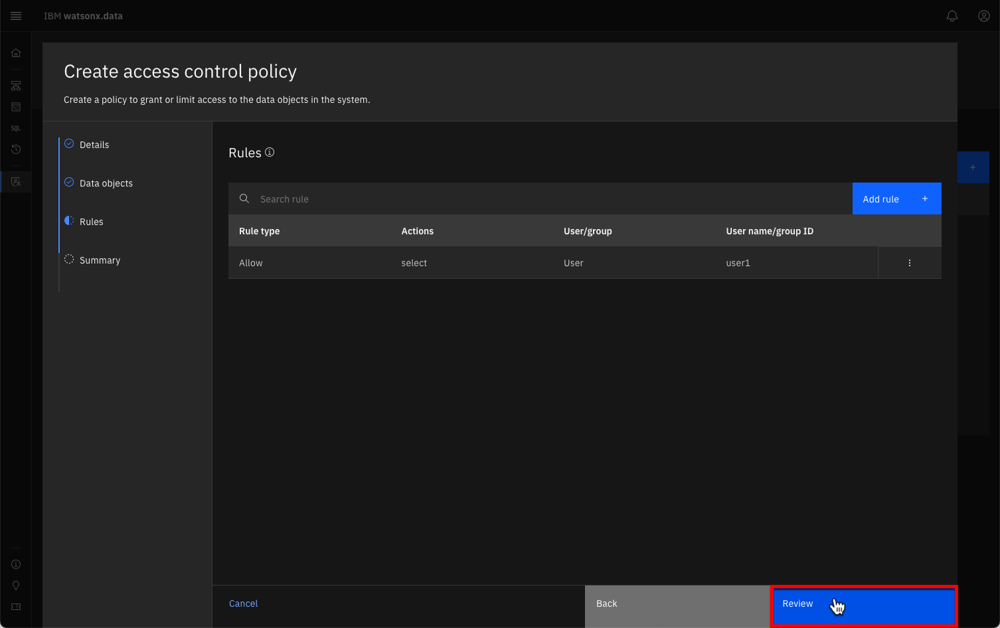
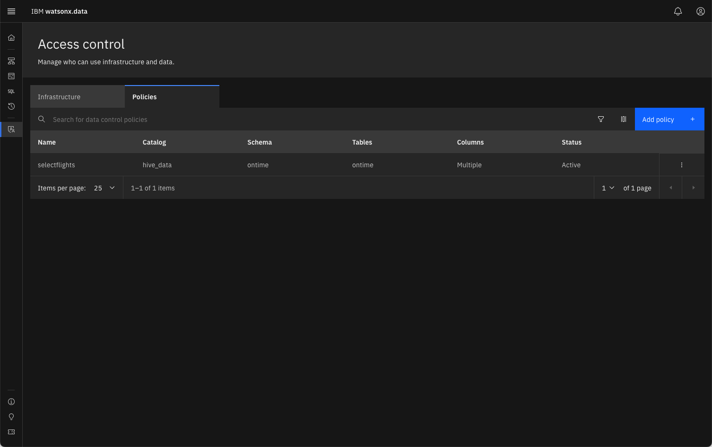
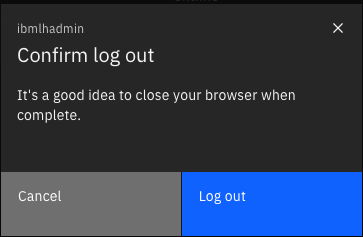
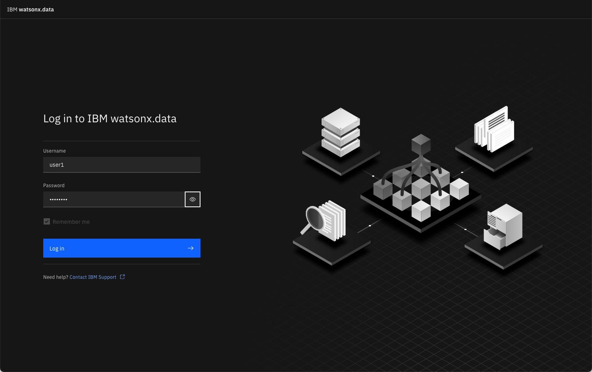
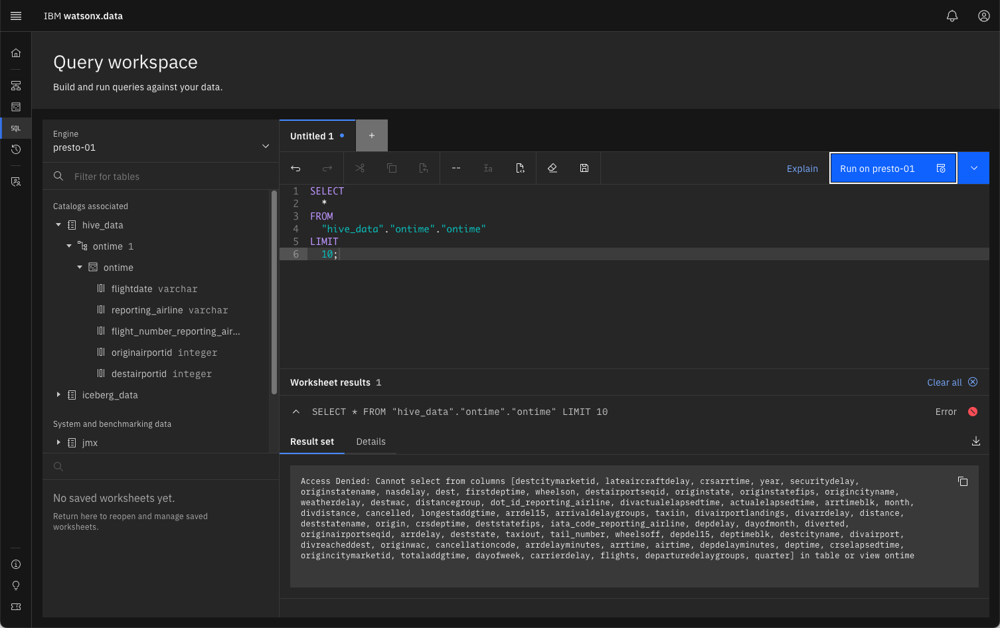

# Watsonx.data User Administration and Roles

Security and access control within watsonx.data are based on roles. A role is a set of privileges that control the actions that users can perform. Authorization is granted by assigning a specific role to a user, or by adding the user to a group that has been assigned one or more roles.

Access control at the infrastructural level allows permissions to be granted on the engines, catalogs, buckets, and databases. Roles for these components include Admin, Manager, User, Writer, and Reader (depending on the component).

Access to the data itself is managed through data control policies. Policies can be created to permit or deny access to schemas, tables, and columns.
User account management and access management varies between the different deployment options for watsonx.data. For instance, in the managed cloud service (SaaS), the service owner would need to invite other users to the environment and give them appropriate service access.

With the standalone software, users can be added within the console’s Access control page. In the Developer Edition, users can be added using a command line tool.

**Credits:** Portions of text found in this section were copied from Kelly Schlamb's watsonx.data L3 course.

## User Administration

This lab is using the Developer edition of the watsonx.data software, which means that the Access control panel is not available. In order to manage users, the `user-mgmt` command will need to be used. The `user-mgmt` command is found in the `/root/ibm-lh-dev/bin` directory. Examples of using the command are found below.

### Add a User
The syntax for adding a user is:
```bash
./user-mgmt add-user <username> [User | Admin] <password>
```
The values are:

* `username` - The name of the user
* `[User|Admin]` - The type of user. Note that the type of user is case-sensitive!
* `password` - The password for the user.

The following command will add the user `watsonx` with a password of `watsonx.data`. This will be a standard user with no privileges. The first step is to make sure you are connected as the root user in watsonx.data server and have switched to the proper directory.

```bash
sudo su -
```
```bash
cd /root/ibm-lh-dev/bin
```

The next command will add a new user to the system.

```bash
./user-mgmt add-user watsonx User watsonx.data
```

### Change a User's Password
The syntax for changing a password is:
```bash
./user-mgmt change-password <username>
```

This command will require that the user enter the new password. You can issue the command and provide the new password at the prompt. The other way to simulate the enter command is to use the Linux `yes` function which repeats a value multiple times.

The following command will change the password of `watsonx` to `hellowatson`.

```bash
yes hellowatson | ./user-mgmt change-password watsonx
```

### Validate a User's Password

You can validate a password by using the following command:

```bash
./user-mgmt test-user-cred <username>
```

The username is the name of the user that you want to check the password for. This command will require that the user enter the existing password to check it. You can use the `yes` function (as described above) to simulate the enter command.

The following command will check that we have changed the password of watsonx to `hellowatson`.

``` bash
yes hellowatson | ./user-mgmt test-user-cred watsonx
```

### Delete a User
To delete a user, use the following command:

```bash
./user-mgmt delete-user <username>
```

The error messages on group ownership can be safely ignored.

The following command will remove our watsonx user.

```bash
./user-mgmt delete-user watsonx
```

## Roles and Policies

In this section you will add a new user and provide them with privileges over the infrastructure and data. First start by adding a new user to the watsonx.data system.

If you haven't already, make sure you are connected to the server as the root user and are in the `/root/ibm-lh-dev/bin` directory. Add `user1` to the system with a password of `password`.

```bash
./user-mgmt add-user user1 User password
```

### Access Control

To view what users are currently authorized to use the system, select the Access control icon found on the left side of the watsonx.data UI.


A list of objects that make up the watsonx.data infrastructure are displayed.


You can see that the objects are made up of:

* Engines
* Catalogs
* Buckets

In a real-world scenario where a user will be querying data from a table, that user will need to be given a minimum of User access to an engine (to be able to run the query), User access for the catalog associated with the data (to be able to see the schema information associated with the table), and Reader access to the bucket associated with the data (to be able to read the data
from object storage).

Additionally, a policy has to be created to permit the user to access the table in question. 

### Granting Access

Select the presto-01 engine (highlighted in red above) to view the current users that have access to the engine. 


At this point, only the administrative user (ibmlhadmin) can use the Presto engine. Click on the Add Access button to add a new authorized user to the list.


The role button has been selected in the dialog to show the role options of Admin, Manager, or User. An Admin user can grant any role to a user, while a Manager can only grant User privileges. For this lab, grant `user1` "user" privileges and then press Add.


Close the dialog by clicking on the [x] on the top right of the screen. Now `user1` needs to be granted access to a catalog. In this case, the `iceberg_data` and `hive_data` catalogs are required for the Presto engine and are implicitly granted to the user.  Click on the `iceberg_data` line to confirm that this is the case.


You should see that `user1` has already been granted access to the catalog. If your version of watsonx.data Developer Edition does **not** have access granted to `user1`, add it manually using the same steps as for engine access.


Close the dialog to return to the Access control screen. The final step is to grant access to the underlying buckets. Because `user` was implicitly granted access to the `iceberg_data` and `hive_data` catalogs, the underlying buckets `iceberg-bucket` and `hive-bucket` were also added to their access list. Click on `iceberg-bucket` to view the access control.


Again, if `user1` does not have access to the bucket, add access using the same steps as adding engine access. When done viewing the screen, close the dialog to return to the Access control dialog.

### Policies

After access has been granted to engines, catalogs, and buckets, the final step is to create a policy to grant access to tables. Click on the Policy tab to display the current policies in place (there should be none).


The Add Policy button is highlighted on the far right side of the screen. Pressing the button will display the new Access Control Policy dialog.


Fill in the following information:

* Policy name: selectflights
* Description: blank
* Policy status: active


You can always activate a policy after you have created it. Click Next.


Here we need to select which schemas that the user will be able to access. For this example, select the `ontime` schema. After selecting the schema, a set of tables associated with the schema will be listed.


You can choose which tables can be searched. If you choose an individual table, you can restrict which columns can be searched. Select the `ontime` table and then select the following columns (you will need to scroll down the page):

* `flightdate`
* `reporting_airline`
* `flight_number_reporting_airline`
* `originairportid`
* `destairportid`


Once you have selected the columns, press the Next button to display the Rules dialog.


The Rules dialog allows you to fine-tune what actions can be done by a user against the data. Press the Add Rule button to display the Add Rule dialog.


Rules can be used to **Allow** actions or to **Deny** actions. In our example, we want to allow `user1` to SELECT data from the data, but with no other options. 

**Note**: In production versions of watsonx.data, you can provide access to a group which makes it simpler to create a set of rules that apply to a group and then add a user to a group. That way a user will inherit the rules that were applied to the group rather than having to create rules for that individual. The developer edition displays GROUP as an option, but it is not implemented.


Once the fields are filled in, press the Add button.



You can continue to add additional rules to the list. Since we only want the one rule, select the Review button.


Once you have confirmed that the data objects and rules look correct, press the Save button.



The `selectflights` policy is now in place and is actively enforced. Before testing the policy enforcement, use the SQL icon on the left side to navigate to the `hive_data` catalog and view the schemas that are associated with it. Expand the `ontime` schema to view the tables and the columns that are available in the `ontime` table.


When you connect as `user1`, you will be able to compare what objects can be accessed from that userid.

### Testing Policy Enforcement

To test whether the rules are enforced, you will need to log out of the current watsonx.data UI session. At the top of the Access Control screen, you will see the user icon on the top right. Clicking on the icon will display the logout dialog.


Log out to the main watsonx.data UI screen. You will be prompted to confirm log out.



Once back to the main log in panel, enter `user` and `password` into the dialog.



Your watsonx.data UI should now display `user1`.


Navigate to the SQL icon and then select `hive_data` -> `ontime` -> `ontime`. 


You should notice that `user1` was restricted to seeing only the `ontime` schema in the `hive_data` catalog. In addition, the user was restricted to accessing one of the tables (`ontime`) and 5 columns. Attempting to run a SELECT statement against all the data will result in a policy error.



Correcting the SQL to include only permitted columns results in an answer set.


The policy rules have been enforced for `user1`, preventing them from viewing any other schemas or tables in the system. In addition, the SQL that they could execute was restricted to specific columns in the table.

Before moving onto any other sections, make sure to log out as `user1` and reconnect as the `ibmlhadmin` user.

