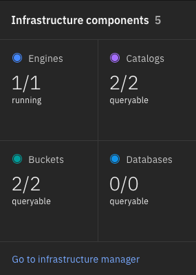
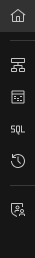
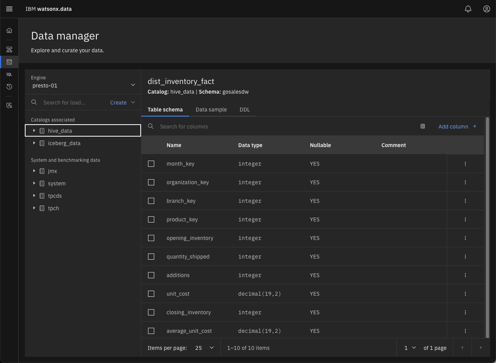

# Using the watsonx.data console UI
Your TechZone reservation will include the server name and port number to use when connecting to the watsonx.data UI. The default port number is 9443, while the server will be referred to as <tt style="font-size: large; color: darkgreen;">region.techzone-server.com</tt>. Replace these values with those found in your reservation.

Open your browser and navigate to:

* Watsonx.data UI - https://region.techzone-server.com:port
* Credentials: username: <code style="color:blue;font-size:medium;">ibmlhadmin</code> password: <code style="color:blue;font-size:medium;">password</code>

Note: You will get a Certificate error in Firefox:

 
Select Advanced.

 
Choose "Accept the Risk and Continue". If you are using Google Chrome, you can bypass the error message by typing in "thisisunsafe" or clicking on the "Proceed to `server name` (unsafe)" link. The `server name` value will be replaced with the name of the TechZone server you are connecting to. 

The watsonx.data UI will display.
  
  

The userid is<code style="color:blue;font-size:medium;">ibmlhadmin</code> with password of <code style="color:blue;font-size:medium;">password</code>.

**Note**: If you see the following screen when first connecting to the UI, this is an indication that the service has not completely initialized.

 
Dismiss all the error messages and then click on the Person icon (far right side above the messages) and Logout. Close the browser window after logging out and open the web page again until you get the proper login screen. At this point you will be connected to the console.

## Watsonx.data UI Navigation

The main screen provides a snapshot of the objects that are currently found in the watsonx.data system. The infrastructure components shows that there is 1 engine, 2 catalogs and 2 buckets associated with the system.

 

You can examine these objects by using the menu system found at the left side of the screen. Click on the hamburger icon.

This will provide a list of items that you can explore in the UI.

You can also access this list by clicking on one of the following icons.

    

You can explore the various menus to see how the UI works. A brief description of the items is found below.

* Infrastructure manager - Displays the current engines, buckets and databases associated with the installation.

 

* Data Manager - Used to explore the various data sources that are catalogued in the system. You can explore the schemas, tables, table layout and view a subset of the data with this option. The display make take a few minutes to show the schemas in the system as it is querying the catalog and populating the descriptions on the screen.

 

* Query Workplace - A SQL-based query tool for accessing the data.

 

* Query History - A list of SQL queries that were previously run across all engines.

 

* Access Control - Control who can access the data.

 

Try using the Data Explorer and Query engine to access some of the data in the pre-defined TPCH schema.